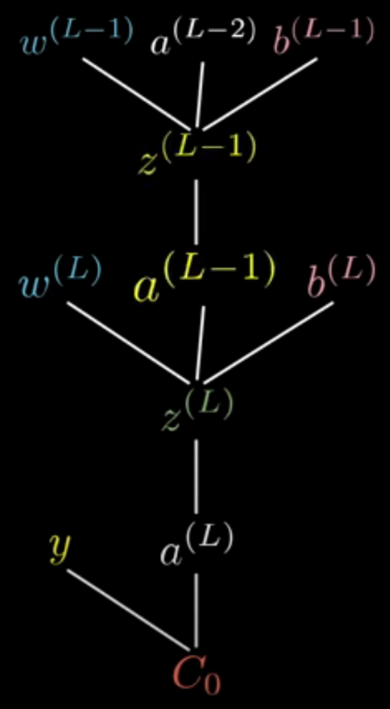

# backpropagation

<!-- @import "[TOC]" {cmd="toc" depthFrom=1 depthTo=6 orderedList=false} -->

<!-- code_chunk_output -->

- [backpropagation](#backpropagation)
    - [理解](#理解)
      - [1.对back propagation的理解](#1对back-propagation的理解)
        - [(1) 一次梯度下降的过程](#1-一次梯度下降的过程)
        - [(2) 数学表示](#2-数学表示)
        - [(3) 整体算法](#3-整体算法)
    - [概述](#概述)
      - [1.backpropagation (计算导数的算法)](#1backpropagation-计算导数的算法)

<!-- /code_chunk_output -->

### 理解

#### 1.对back propagation的理解

一种梯度下降的算法，当参数量过大，传统的梯度下降算法效率太低

* 通过backpropagation的方式，求出 cost function基于**各层参数的导数**，从而知道如何调整各层参数，能够使得cost function最小

##### (1) 一次梯度下降的过程
* 最后一层某个neuron的输出，比如（其中使用sigmoid函数）：$\sigma(w_0a_0 + w_1a_1 + ... + w_{n-1}a_{n-1} + b)$
* 输出的值 与 正确的值相差较大，所以需要**调整**以下参数，使用趋近于正确值
    * 调整b
    * 调整w
        * a值越大的 对应的w，对代价函数的影响越大
    * 调整a，即调整上一层的输出，所以会**向前传递**
        * w值越大的 对应的a，对代价函数的影响越大
* 最后一层的每个neuron都调整 w、b、a三个值，满足自己的期望
    * 每个neuron都有自己的w和b，在一次梯度下降的过程中会有**多个训练数据**时，每个训练数据期期望w和b调整的值也不一样，所以取**期望调整的平均值**，得到最终w和b如何调整，即**w和b此次梯度下降的值**
    * 对于a，即上一层的输出，会将每个neuron对a的期望合并，得到 **期望上一层输出的如何调整**，即 **a此次梯度下降的值**，从而**向前传递**
* 倒数第二层重复上述步骤
* 依次类推

##### (2) 数学表示
* 假设
    * neuron network有4层，每层只有一个neuron，参数分别为$(w_1,b_1),(w_2,b_2),(w_3,b_3)$
    * 最后一层的neuron的activation：$a^{(L)}$，所以倒数第二层的neuron的activation：$a^{(L-1)}$
    * 对于某个训练数据，最后一层的neuron正确值是y
    * 则损失函数: $C_0(...) = (a^{(L)}-y)^2$
    * 其中
        * $z^{(L)} = w^{(L)}a^{(L-1)} + b^{(L)}$
        * $a^{(L)} = \sigma (z^{(L)})$ （sigmoid函数）
* $\frac{\partial C_0}{\partial w^{(L)}} = \frac{\partial z^{(L)}}{\partial w^{(L)}}\frac{\partial a^{(L)}}{\partial z^{(L)}}\frac{\partial C_0}{\partial a^{(L)}} = a^{(L-1)}\sigma'(z^{(L)})2(a^{(L)} - y)$
* $\frac{\partial C_0}{\partial b^{(L)}} = \frac{\partial z^{(L)}}{\partial b^{(L)}}\frac{\partial a^{(L)}}{\partial z^{(L)}}\frac{\partial C_0}{\partial a^{(L)}} = \sigma'(z^{(L)})2(a^{(L)} - y)$
* $\frac{\partial C_0}{\partial a^{(L-1)}} = \frac{\partial z^{(L)}}{\partial a^{(L-1)}}\frac{\partial a^{(L)}}{\partial z^{(L)}}\frac{\partial C_0}{\partial a^{(L)}} = w^{(L)}\sigma'(z^{(L)})2(a^{(L)} - y)$

* 则
    * $\frac{\partial J}{\partial w^{(L)}} = \frac{1}{m}\sum_{i}^{m} \frac{\partial}{\partial w}C_0^{(i)} = \frac{1}{m}\sum_{i=1}^m \frac{\partial}{\partial w}(a^{(L-1)}\sigma'(z^{(L)})2(a^{(L)} - y^{(i)}))$
    * ...

##### (3) 整体算法
一次梯度下降可以使用多个训练数据（batch）
每次虽然下降的斜率不是最优的，但是效率高

***

### 概述

#### 1.backpropagation (计算导数的算法)

* A computation graph simplifies the computation of complex derivatives by breaking them into smaller steps

    * $\frac{\partial J}{\partial a} = \frac{\partial w}{\partial a} \frac{\partial J}{\partial w}$
    * 其他的依次类推

* 当有N个nodes和P个parameters，计算出所有的导数大概需要 N+P 个步骤，而不数N*P个步骤

    * 因为 $\frac{\partial J}{\partial w}$ 和$\frac{\partial J}{\partial c}$ 都可以在 $\frac{\partial J}{\partial b}$ 基础上进行计算，不必从 $\frac{\partial J}{\partial d}$开始

* 结合Adam algorithm，实现learning rate的自动调整