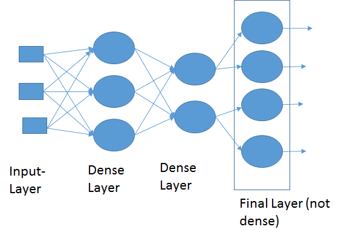

# neural network

<!-- @import "[TOC]" {cmd="toc" depthFrom=1 depthTo=6 orderedList=false} -->

<!-- code_chunk_output -->

- [neural network](#neural-network)
    - [理解](#理解)
      - [1.对neuron network的理解](#1对neuron-network的理解)
    - [概述](#概述)
      - [1.术语](#1术语)
        - [(1) layer](#1-layer)
        - [(2) activation](#2-activation)
        - [(3) activation function](#3-activation-function)
      - [2.常用activation function](#2常用activation-function)
        - [(1) linear (no activation function)](#1-linear-no-activation-function)
        - [(2) sigmoid](#2-sigmoid)
        - [(3) ReLU (rectified linear unit)](#3-relu-rectified-linear-unit)
        - [(4) softmax activation](#4-softmax-activation)
      - [3.activation function的选择](#3activation-function的选择)
        - [(1) output layer](#1-output-layer)
        - [(2) hidden layer](#2-hidden-layer)
      - [4.classification](#4classification)
        - [(1) multiclass](#1-multiclass)
        - [(2) multi-label](#2-multi-label)
      - [5.layer type](#5layer-type)
        - [(1) dense (full connected) layer](#1-dense-full-connected-layer)
        - [(2) convolutional layer](#2-convolutional-layer)
      - [6.backpropagation (计算导数的算法)](#6backpropagation-计算导数的算法)

<!-- /code_chunk_output -->

### 理解

#### 1.对neuron network的理解
* 每一层的每个neuron 用来 **匹配**一个**特征**
* 接收上一层的输入
    * 然后根据设置的**权重w**（即特征，比如某些位置为负数，某些位置为整数），计算出一个值（即进行**特征匹配**）
        * $w_1a_1 + w_2a_2 + ... + w_na_n$
        
            * 绿色区域：权重为正数，红色区域：权重为负数
    * 然后这个值会跟**偏差值b**进行比较，只有大于b，才认为**该特征可能存在**，即这个**neuron被activate**
        * $w_1a_1 + w_2a_2 + ... + w_na_n - b > 0$
    * 然后进行函数映射（比如sigmoid，能够衡量一个正数有多大）
    * 根据输出值，判断该**特征的明显程度**（越接近1,说明该特征越明显）
* 最前面的层，寻找的特征比较**小**（比如一个小直线，一个点等）

* 越往后，根据前面找到的小特征（将小特征组合），判断是否存在比较**大**的特征（比如一个圈、一条垂直线）
    * 还会寻找特征的关联（比如: 一个圈和一个竖线的组合，可能9这个数字）
    

***

### 概述

#### 1.术语

在线代中，大写代笔矩阵，小写代表向量

##### (1) layer
* input layer
* hidden layer
* output layer

* 表示: 
    * `[0]` 表示第0层，即input layer
    * `[1]` 表示layer 1，以此类推
    * $w_1^{[1]}$ 表示layer 1中的参数

##### (2) activation

* 第l层第j个unit的**输出**: $a_j^{[l]} = g(\vec w_j^{[l]} \cdot \vec a^{[l-1]} + b_j^{[l]})$
    * 经过 **activation function** 产生输出
        * g表示使用的sigmoid function作为activation function
    * $\vec a^{[l-1]}$上一层所有的activation

* layer l 所有activation（即所有unit的输出）表示：$\vec a^{[l]}$
    * input layer的activation: $\vec a^{[0]}$

##### (3) activation function

#### 2.常用activation function

##### (1) linear (no activation function)
$g(z) = z$，相当于没有使用activation function
* $a = g(z) = \vec w \cdot \vec x + b$

##### (2) sigmoid
[参考](../ML/overview.md)

##### (3) ReLU (rectified linear unit)

$g(z) = max(0, z)$

##### (4) softmax activation

$z_j = \vec W_j \cdot \vec X + b_j$ &ensp; $j = 1,...,N$
$a_j = \frac{e^{z_j}}{\sum_{k=1}^{N}{e^{z_k}}} = P(y=j|\vec X)$

* N表示分为了N个类
* $a_1 + ... a_N = 1$

#### 3.activation function的选择
不同layer选择不同的activation function

##### (1) output layer
* 二元分类: sigmoid
* regression (有正负): linear
* regression (没有负值，比如房价): ReLU

##### (2) hidden layer
* Relu (最常用)
    * 比sigmoid 训练速度更快
* 不要使用linear activation function，因为相当于没使用neuron network
    * 线性函数的线性函数，还是线性函数
        * layer 1: $a^{[1]} = W_1^{[1]}x + b_1^{[1]}$
        * layer 2 (output layer): $a^{[2]} = W_1^{[2]}a^{[1]} + b_1^{[2]} = W_1^{[1]}W_1^{[2]}x + W_1^{[2]}b_1^{[1]} + W_1^{[2]} = Wx + b$

#### 4.classification

##### (1) multiclass
* 说明：结果属于多个类别中的一个（比如给定一个包含数字0-9的图片，判断图片是数字几）
* 方式：
    * output layer的activation function使用softmax
    * output layer有N个unit
        * N是一共分为多少类别
        * 所有unit的值加起来是1

##### (2) multi-label
* 说明：即结果可能属于多个类别（比如判断图片是否包含汽车、行人、信号灯等）
* 方式：
    * output layer的activation function使用sigmoid
    * output layer有N个unit
        * N是一共分为多少类别
        * 一个unit就是判断属于该类别的概率

#### 5.layer type

##### (1) dense (full connected) layer
* 每个unit的输出 = activation function (上一层所有activation输出)
    * 比如: $\vec a^{[2]} = g(\vec w^{[2]} \cdot \vec a^{[1]} + b^{[2]})$

##### (2) convolutional layer
* each neuron only looks at part of previous layer's outputs

#### 6.backpropagation (计算导数的算法)

* A computation graph simplifies the computation of complex derivatives by breaking them into smaller steps

    * $\frac{\partial J}{\partial a} = \frac{\partial w}{\partial a} \frac{\partial J}{\partial w}$
    * 其他的依次类推

* 当有N个nodes和P个parameters，计算出所有的导数大概需要 N+P 个步骤，而不数N*P个步骤

    * 因为 $\frac{\partial J}{\partial w}$ 和$\frac{\partial J}{\partial c}$ 都可以在 $\frac{\partial J}{\partial b}$ 基础上进行计算，不必从 $\frac{\partial J}{\partial d}$开始

* 结合Adam algorithm，实现learning rate的自动调整