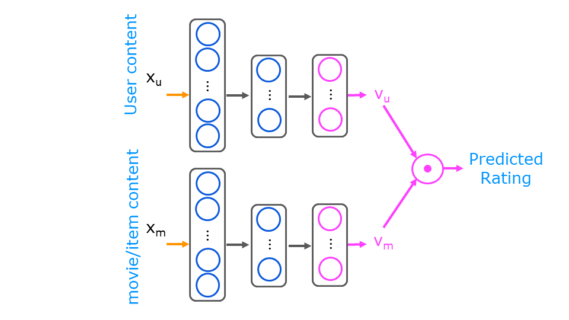
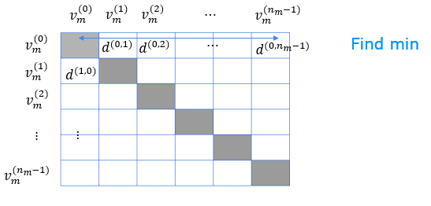

# recommender

<!-- @import "[TOC]" {cmd="toc" depthFrom=1 depthTo=6 orderedList=false} -->

<!-- code_chunk_output -->

- [recommender](#recommender)
    - [collaborative filtering](#collaborative-filtering)
      - [1.符号表示](#1符号表示)
      - [2.算法](#2算法)
        - [(1) 模型](#1-模型)
        - [(2) 代价函数](#2-代价函数)
        - [(3) mean normalization](#3-mean-normalization)
    - [context-based filtering](#context-based-filtering)
      - [1.符号表示](#1符号表示-1)
      - [2.算法](#2算法-1)
        - [(1) 模型](#1-模型-1)
        - [(2) cost function](#2-cost-function)
        - [(3) 算法](#3-算法)

<!-- /code_chunk_output -->

### collaborative filtering

基于和你打类似分数的用户，进行推荐

#### 1.符号表示
* $r(i,j)$
    * 如果用户j 对电影i 评过分了，则为1,否则为0
* $y(i,j)$
    * 用户j 对电影i 的评分（当$r(i,j)=1$时）
* $\vec w^{(j)}$, $b^{(j)}$
    * 用户j 的参数
* $\vec x^{(i)}$
    * 电影i 的特征
* $n_u$ (用户数), $n_m$ (电影数), $n$ (特征数)

#### 2.算法

##### (1) 模型
* 为每个用户，输出一个$\vec w^{(j)}$和$b^{(j)}$（即每个用户一个模型），用于表示该用户的喜好
    * 该用户的参数适用 所有电影
* 为每部电影，输出一个$\vec x^{(i)}$（特征的维度一样），用于表示该电影的特征，从而寻找相似的电影
    * 该电影的特征适用 所有用户
    * 这些特征没有现实的意义，只是构建出的模型，可以用来描述电影的相似度
        * 电影k和电影i的相似度: $\Vert \sum_{l=1}^n(x_l^{(k)}-x_l^{(i)})^2 \Vert$
* 用户j 对电影i 的评分估计
    * $\hat y(i,j) = \vec w^{(j)} \cdot \vec x^{(i)} + b^{(j)}$ 

##### (2) 代价函数

$J(\vec x^{(0)},...,\vec x^{(n)}, \vec w^{(0)},b^{(0)}, ..., \vec w^{(n)}, b^{(n)}) = \frac{1}{2}\sum_{(i,j);r(i,j)=1}(\vec w^{(j)} \cdot \vec x^{(i)} + b^{(j)} - y^{(i,j)})^2 + \frac{\lambda}{2}\sum_{j=0}^{n_u-1}\sum_{k=0}^{n-1}(\vec w_k^{(j)})^2 + \frac{\lambda}{2}\sum_{i=0}^{n_m-1}\sum_{k=0}^{n-1}(\vec x_k^{(i)})^2$

##### (3) mean normalization
* why
    * 比如添加一个新用户，该用户还没给任何电影评过分，所以参数都为0
    * 这样就会导致无法给用户进行任何推荐
* how
    * for i in nm:
        * y[i] - $\mu_i$
    * 预测值: $\vec w^{(j)} \cdot \vec x^{(i)} + b^{(j)} + \mu_i$

***

### context-based filtering

基于 用户特征 和 物品特征 的匹配，进行推荐

#### 1.符号表示
* $r(i,j)$
    * 如果用户j 对电影i 评过分了，则为1,否则为0
* $y(i,j)$
    * 用户j 对电影i 的评分（当$r(i,j)=1$时）
* $\vec x_u^{(j)}$
    * 用户j 的特征
* $\vec x_m^{(i)}$
    * 电影i 的特征
* $n_u$ (用户数), $n_m$ (电影数), $n$ (特征数)

#### 2.算法

##### (1) 模型

* 样本集的格式
    * xtrain、itemtrain、ytrain一一对应，即一个用户对一部电影的评分
        * 所以xtrain和itemtrain这两个集合每个都有 $n_u \times n_m$条数据，所以有重复数据

* model
    * 用户特征和电影特征数不一样，所以需要进行转换
        * $\vec x_u$ -> $\vec v_u$
        * $\vec x_m$ -> $\vec v_m$
            * $\vec v_m$ 可以**提前训练**好
    * 预测用户对电影的评分: $\vec v_u^{(j)} \cdot \vec v_m^{(i)}$
    * 寻找相似的电影：$\Vert \vec v_m^{(k)} - \vec v_m^{(i)} \Vert^2$
        * 构建一个矩阵，描述每个电影之间的相似度
        

##### (2) cost function 

$J = \sum_{(i,j);r(i,j)=1}(\vec v_u^{(j)}\cdot\vec v_m^{(i)} - y^{(i,j)})^2$ + NN regularization term

##### (3) 算法

* retrieval
    * 生成一个待选列表，比如
        * 根据该用户上一次看完的10部电影，找出10部最类似的电影
        * 根据用户看的3中类型，找出这些类型排名最高的10部电影
        * 根据用户所在国家，找出20部电影
    * 然后去除重复的、看过的、不再推荐的等

* ranking
    * 用上述模型对待选列表进行排序，推荐最合适的给用户

* 总结:
    * retrieval越多，性能越好，但是速度越慢，需要进行权衡