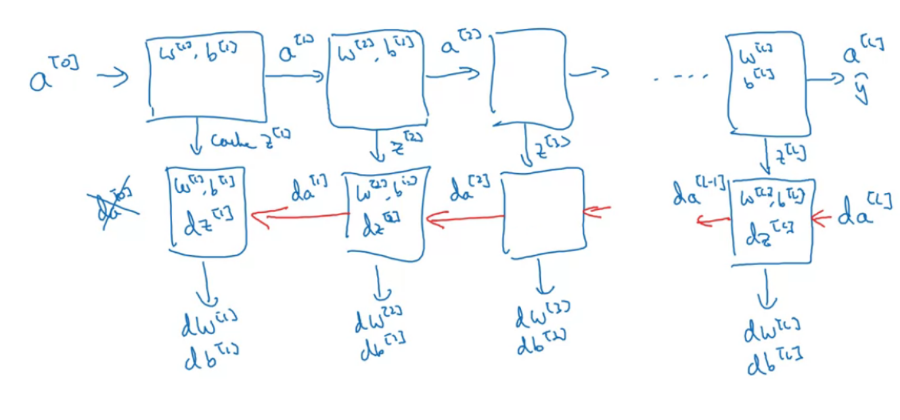

# backpropagation


<!-- @import "[TOC]" {cmd="toc" depthFrom=1 depthTo=6 orderedList=false} -->

<!-- code_chunk_output -->

- [backpropagation](#backpropagation)
    - [理解](#理解)
      - [1.对back propagation的理解](#1对back-propagation的理解)
        - [(1) 一次梯度下降的过程](#1-一次梯度下降的过程)
        - [(2) 数学表示](#2-数学表示)
        - [(3) 整体算法](#3-整体算法)
      - [2.矩阵导数](#2矩阵导数)
    - [概述](#概述)
      - [1.backpropagation (计算导数的算法)](#1backpropagation-计算导数的算法)
        - [(1) 通过chain rule求导数](#1-通过chain-rule求导数)
      - [2.regularization](#2regularization)
        - [(1) L2 regularization](#1-l2-regularization)
        - [(2) inverted dropout](#2-inverted-dropout)
      - [3.graident checking (grad check)](#3graident-checking-grad-check)
        - [(1) numerical approximation of gradient](#1-numerical-approximation-of-gradient)
        - [(2) 算法](#2-算法)

<!-- /code_chunk_output -->


### 理解

#### 1.对back propagation的理解

一种梯度下降的算法，当参数量过大，传统的梯度下降算法效率太低

* 通过backpropagation的方式，求出 cost function基于**各层参数的导数**，从而知道如何调整各层参数，能够使得cost function最小

##### (1) 一次梯度下降的过程
* 最后一层某个neuron的输出，比如（其中使用sigmoid函数）：$\sigma(w_0a_0 + w_1a_1 + ... + w_{n-1}a_{n-1} + b)$
* 输出的值 与 正确的值相差较大，所以需要**调整**以下参数，使用趋近于正确值
    * 调整b
    * 调整w
        * a值越大的 对应的w，对代价函数的影响越大
    * 调整a，即调整上一层的输出，所以会**向前传递**
        * w值越大的 对应的a，对代价函数的影响越大
* 最后一层的每个neuron都调整 w、b、a三个值，满足自己的期望
    * 每个neuron都有自己的w和b，在一次梯度下降的过程中会有**多个训练数据**时，每个训练数据期期望w和b调整的值也不一样，所以取**期望调整的平均值**，得到最终w和b如何调整，即**w和b此次梯度下降的值**
    * 对于a，即上一层的输出，会将每个neuron对a的期望合并，得到 **期望上一层输出的如何调整**，即 **a此次梯度下降的值**，从而**向前传递**
* 倒数第二层重复上述步骤
* 依次类推

##### (2) 数学表示
* 假设
    * neuron network有4层，每层只有一个neuron，参数分别为$(w_1,b_1),(w_2,b_2),(w_3,b_3)$
    * 最后一层的neuron的activation：$a^{(L)}$，所以倒数第二层的neuron的activation：$a^{(L-1)}$
    * 对于某个训练数据，最后一层的neuron正确值是y
    * 则损失函数: $C_0(...) = (a^{(L)}-y)^2$
    * 其中
        * $z^{(L)} = w^{(L)}a^{(L-1)} + b^{(L)}$
        * $a^{(L)} = \sigma (z^{(L)})$ （sigmoid函数）
* $\frac{\partial C_0}{\partial w^{(L)}} = \frac{\partial z^{(L)}}{\partial w^{(L)}}\frac{\partial a^{(L)}}{\partial z^{(L)}}\frac{\partial C_0}{\partial a^{(L)}} = a^{(L-1)}\sigma'(z^{(L)})2(a^{(L)} - y)$
* $\frac{\partial C_0}{\partial b^{(L)}} = \frac{\partial z^{(L)}}{\partial b^{(L)}}\frac{\partial a^{(L)}}{\partial z^{(L)}}\frac{\partial C_0}{\partial a^{(L)}} = \sigma'(z^{(L)})2(a^{(L)} - y)$
* $\frac{\partial C_0}{\partial a^{(L-1)}} = \frac{\partial z^{(L)}}{\partial a^{(L-1)}}\frac{\partial a^{(L)}}{\partial z^{(L)}}\frac{\partial C_0}{\partial a^{(L)}} = w^{(L)}\sigma'(z^{(L)})2(a^{(L)} - y)$

* 则
    * $\frac{\partial J}{\partial w^{(L)}} = \frac{1}{m}\sum_{i}^{m} \frac{\partial}{\partial w}C_0^{(i)} = \frac{1}{m}\sum_{i=1}^m \frac{\partial}{\partial w}(a^{(L-1)}\sigma'(z^{(L)})2(a^{(L)} - y^{(i)}))$
    * ...


##### (3) 整体算法
一次梯度下降可以使用多个训练数据（batch）
每次虽然下降的斜率不是最优的，但是效率高

#### 2.矩阵导数

* $\begin{bmatrix}w_{11}& w_{12}\\ w_{21}&w_{22}\end{bmatrix}\begin{bmatrix}x_{1}^{(1)}& x_{1}^{(2)}\\ x_{2}^{(1)}&x_{2}^{(2)}\end{bmatrix}=\begin{bmatrix}z_1^{(1)}=w_{11}x_1^{(1)}+w_{12}x_2^{(1)}& z_1^{(2)}=w_{11}x_1^{(2)}+w_{12}x_2^{(2)}\\ z_2^{(1)}=w_{21}x_1^{(1)}+w_{22}x_2^{(1)}&z_2^{(2)}=w_{21}x_1^{(2)}+w_{22}x_2^{(2)}\end{bmatrix}$

* 所以$\frac{dz}{dw}=\begin{bmatrix}\frac{dz_1}{dw_{11}}=x_1^{(1)}+x_1^{(2)}& \frac{dz_1}{dw_{12}}=x_2^{(1)}+x_2^{(2)}\\ \frac{dz_2}{dw_{21}}=x_1^{(1)}+x_1^{(2)}&\frac{dz_2}{dw_{12}}=x_2^{(1)}+x_2^{(2)}\end{bmatrix} \div$样本数（这里为2）
* 所以$\frac{dz}{dw}=\begin{bmatrix}1&1\\ 1&1\end{bmatrix} * X.T \div$样本数（这里为2）

***

### 概述

#### 1.backpropagation (计算导数的算法)

* 从后往前，计算出 J关于所有参数的导数
    * 利用chain rule，能够提高计算效率
* 从而进行梯度下降



##### (1) 通过chain rule求导数
* input: $da^{[l]}$
* output: $da^{[l-1]}, dW^{[l]}, db^{[l]}$
* 关系： $a^{[l]} = g(z^{[l]}) = g(W^{[l]}a^{[l-1]} + b^{[l]})$
* 求导过程（这里不是矩阵，矩阵 和 求和平均 需要注意一下运算）:
    * 先求 $dz^{[l]} = da^{[l]} * g^{[l]'}(z^{[l]})$
    * $dW^{[l]} = dz^{[l]} * a^{[l-1]}$
    * $db^{[l]} = dz^{[l]}$
    * $da^{[l-1]} = dz^{[l]} * dW^{[l]}$

#### 2.regularization

##### (1) L2 regularization
* $J = \frac{1}{m}\sum\limits_{i=1}^mL(\hat y^{(i)}, y^{(i)}) + \frac{\lambda}{2m}\sum\limits_{l=1}^L\Vert W^{[l]}\Vert_F^2$

##### (2) inverted dropout

* 将每一层的activation的输出 根据一定的概率（keep-prob） 置0
    * 不同层设置不同的keep-prob，当某层的参数较多时，该值可以设低一点，当某层不需要regularization时，该值可以设为1
    * **每次梯度下降迭代**，都需要随机置0

        * forward propagation
        ```python
        # 以layer 1为例

        # 0-1均匀分布
        D1 = np.random.rand(A1.shape[0], A1.shape[1])

        # 将layer 1的activation置0（有keep_prob的概率不置为0）
        D1 = D1 < keep_prob
        A1 = A1 * D1

        # assure that the result of the cost will still have the same expected value as without drop-out
        A1 = A1/keep_prob
        ```

        * backward propagation
        ```python
        # 以layer 1为例

        # 需要将 同样位置的neuron（forward progation） 置为0
        dA1 = dA1 * D1

        # 需要同样 进行scale（因为一个数进行了scale，其导数也会进行相应的scale）
        dA1 = dA1 / keep_prob
        ```
* 只能在训练中使用，不能在测试等数据集中使用

#### 3.graident checking (grad check)

* 用于debug，训练的时候不要用
* 一般几次迭代使用一次，因为消耗性能
* 如果代价函数使用了regularization，gradient checking也需要 

##### (1) numerical approximation of gradient

求导数的近似值

* one-sided difference
    * $f(x) = \frac{f(x+\epsilon) - f(x)}{\epsilon}$
* two-sided difference (这种方法一般误差更小)
    * $f(x) = \frac{f(x+\epsilon) - f(x-\epsilon)}{2\epsilon}$

##### (2) 算法

* 设置变量
    * $\vec \theta = (W^{[1]}, b^{[1]}, ..., W^{[L]}, b^{[L]})$
    * $\vec {d\theta} = (dW^{[1]}, db^{[1]}, ..., dW^{[L]}, db^{[L]})$

* 计算近似值
    * $d\theta_{appro}[i]= \frac{J(\theta_1,..., \theta_i + \epsilon,...) - J(\theta_1,..., \theta_i + \epsilon,...)}{2\epsilon}$

* 检查
    * $\text {difference}  = \frac{\Vert d\theta - d\theta_{appro} \Vert_2}{\Vert d\theta \Vert_2 + \Vert d\theta_{appro} \Vert_2}$
    * 设$\epsilon = 10^{-7}$，如果
        * difference < $10^{-7}$，大概率没什么问题
        * 偏差越大，就越可能存在问题，需要特别关注

```python
#将参数和及导数分别放入vector中
parameters_values, _ = dictionary_to_vector(parameters)
grad = gradients_to_vector(gradients)

num_parameters = parameters_values.shape[0]
J_plus = np.zeros((num_parameters, 1))
J_minus = np.zeros((num_parameters, 1))
gradapprox = np.zeros((num_parameters, 1))

for i in range(num_parameters):
    theta_plus = np.copy(parameters_values)
    theta_plus[i] = theta_plus[i] + epsilon
    J_plus[i], _ = forward_propagation_n(X, Y, vector_to_dictionary(theta_plus))

    theta_minus = np.copy(parameters_values)
    theta_minus[i] = theta_minus[i] - epsilon
    J_minus[i],_ = forward_propagation_n(X, Y, vector_to_dictionary(theta_minus))

    gradapprox[i] = (J_plus[i] - J_minus[i]) / (2 * epsilon)

numerator = np.linalg.norm(grad - gradapprox)
denominator = np.linalg.norm(grad) + np.linalg.norm(gradapprox)
difference = numerator / denominator
```