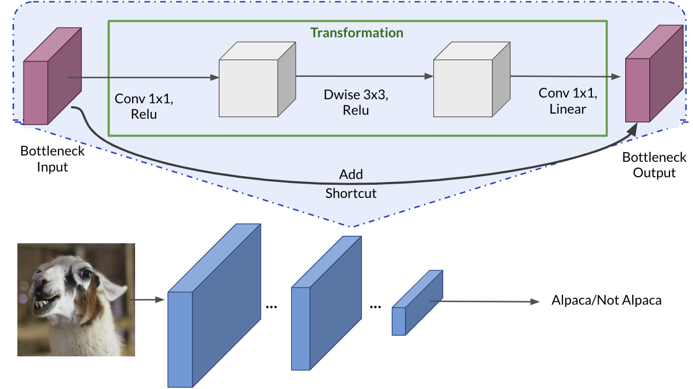

### transfer learning


<!-- @import "[TOC]" {cmd="toc" depthFrom=1 depthTo=6 orderedList=false} -->

<!-- code_chunk_output -->

- [transfer learning](#transfer-learning)
  - [1.加载数据](#1加载数据)
    - [(1) 读取图片](#1-读取图片)
    - [(2) prefetch](#2-prefetch)
  - [2.预处理](#2预处理)
    - [(1) 预处理](#1-预处理)
    - [(2) 实现data augmenter](#2-实现data-augmenter)
  - [3.使用MobileNetV2用于transfer learning](#3使用mobilenetv2用于transfer-learning)
    - [(1) 实现模型](#1-实现模型)
    - [(2) 设置需要训练的层（transfer learning核心）](#2-设置需要训练的层transfer-learning核心)
    - [(3) 进行训练](#3-进行训练)

<!-- /code_chunk_output -->


#### 1.加载数据

##### (1) 读取图片
```python
BATCH_SIZE = 32
IMG_SIZE = (160, 160)
directory = "dataset/"
train_dataset = image_dataset_from_directory(directory,
                                             shuffle=True,
                                             batch_size=BATCH_SIZE,
                                             image_size=IMG_SIZE,
                                             validation_split=0.2,
                                             subset='training',
                                             seed=42)
validation_dataset = image_dataset_from_directory(directory,
                                             shuffle=True,
                                             batch_size=BATCH_SIZE,
                                             image_size=IMG_SIZE,
                                             validation_split=0.2,
                                             subset='validation',
                                             seed=42)
```

##### (2) prefetch
While the model is executing training step s, the input pipeline is reading the data for step s+1
* 利用cpu进行预处理，能够保证gpu一直在运转

```python
AUTOTUNE = tf.data.experimental.AUTOTUNE
train_dataset = train_dataset.prefetch(buffer_size=AUTOTUNE)
```


#### 2.预处理

##### (1) 预处理
因为使用的imagenet模型，需要input在[-1,1]之间等
```python
preprocess_input = tf.keras.applications.mobilenet_v2.preprocess_input
```

##### (2) 实现data augmenter

```python
def data_augmenter():
    '''
    Create a Sequential model composed of 2 layers
    Returns:
        tf.keras.Sequential
    '''
    data_augmentation = tf.keras.Sequential()
    data_augmentation.add(RandomFlip('horizontal'))
    data_augmentation.add(RandomRotation(0.2))
    
    return data_augmentation
```

#### 3.使用MobileNetV2用于transfer learning


##### (1) 实现模型
```python
def alpaca_model(image_shape=IMG_SIZE, data_augmentation=data_augmenter()):
    ''' Define a tf.keras model for binary classification out of the MobileNetV2 model
    Arguments:
        image_shape -- Image width and height
        data_augmentation -- data augmentation function
    Returns:
    Returns:
        tf.keras.model
    '''
    
    
    #image shape是二维的，所以要再加一维
    input_shape = image_shape + (3,)
    
    """
    tf.keras.applications.MobileNetV2 使用imagenet模型
    include_top=False 不加载最后一层
    weights='imagenet' 使用imagenet已经训练好的参数
    """
    base_model = tf.keras.applications.MobileNetV2(input_shape=input_shape,
                                                   include_top=False,
                                                   weights='imagenet')
    
    # freeze the base model by making it non trainable
    base_model.trainable = False 

    # create the input layer (Same as the imageNetv2 input size)
    inputs = tf.keras.Input(shape=input_shape) 
    
    # apply data augmentation to the inputs
    x = data_augmentation(inputs)
    
    # data preprocessing using the same weights the model was trained on
    x = preprocess_input(x) 
    
    """
    MobileNetV2模型，嵌套在当前模型之中

    training=False表示batchnormalization使用inference mode，即保留之前的mean和var，不重新训练
    """
    x = base_model(x, training=False) 
    
    # add the new Binary classification layers
    # use global avg pooling to summarize the info in each channel
    x = tf.keras.layers.GlobalAvgPool2D()(x) 
    # include dropout with probability of 0.2 to avoid overfitting
    x = tf.keras.layers.Dropout(0.2)(x)
        
    # use a prediction layer with one neuron (as a binary classifier only needs one)
    outputs = tf.keras.layers.Dense(1, activation='linear')(x)
        
    model = tf.keras.Model(inputs, outputs)
    
    return model
```

##### (2) 设置需要训练的层（transfer learning核心）

```python
model2 = alpaca_model(IMG_SIZE, data_augmentation)

base_learning_rate = 0.001

# 获取MobileNetV2模型
base_model = model2.layers[4]
base_model.trainable = True

# 冻结MobileNetV2模型的前120层，训练后面的层
fine_tune_at = 120
for layer in base_model.layers[:fine_tune_at]:
    layer.trainable = False

# 创建模型（设置代价函数，优化器等）
model2.compile(optimizer=tf.keras.optimizers.Adam(0.1 * base_learning_rate),
              loss=tf.keras.losses.BinaryCrossentropy(from_logits=True),
              metrics=['accuracy'])
```

##### (3) 进行训练
```python
initial_epochs = 10 
history = model2.fit(train_dataset,
                         epochs=initial_epochs,
                         validation_data=validation_dataset)
```