# NLP

<!-- @import "[TOC]" {cmd="toc" depthFrom=1 depthTo=6 orderedList=false} -->

<!-- code_chunk_output -->

- [NLP](#nlp)
    - [overview](#overview)
      - [1.word embedding](#1word-embedding)
        - [(1) embedding matrix: E](#1-embedding-matrix-e)
        - [(2) 衡量两个词的相似度: cosine similarity](#2-衡量两个词的相似度-cosine-similarity)
        - [(3) t-SNE (t-distributed Stochastic Neighbor Embedding)](#3-t-sne-t-distributed-stochastic-neighbor-embedding)
        - [(4) transfer learning](#4-transfer-learning)
        - [(5) analogy reasoning](#5-analogy-reasoning)
      - [2.learning word embeddings](#2learning-word-embeddings)
        - [(1) word2vec skip gram](#1-word2vec-skip-gram)
        - [(2) negative sampling](#2-negative-sampling)
        - [(3) Glove word vectors](#3-glove-word-vectors)
      - [3.sentiment classification](#3sentiment-classification)
      - [4.debias word embeddings](#4debias-word-embeddings)
        - [(1) identify bias direction](#1-identify-bias-direction)
        - [(2) neutralize](#2-neutralize)
        - [(3) equalization](#3-equalization)
      - [5.beam search](#5beam-search)
        - [(1) 优化](#1-优化)
        - [(2) beam witdth的选择](#2-beam-witdth的选择)
        - [(3) error analysis](#3-error-analysis)
      - [6.blue score (bilingual evaluation understudy)](#6blue-score-bilingual-evaluation-understudy)
      - [7.attetion model](#7attetion-model)
        - [(1) context计算](#1-context计算)
        - [(2) 基于query/key/value的理解](#2-基于querykeyvalue的理解)

<!-- /code_chunk_output -->

### overview

#### 1.word embedding
* embedding: `a token` `--encode-->` `a high-dimensional vector (embedding vector)`
  * vector的一个维度就是该token某一方面的意义（比如：词性、性别、高度等等）
  * 数值表示程度，范围在[-1,1]

* 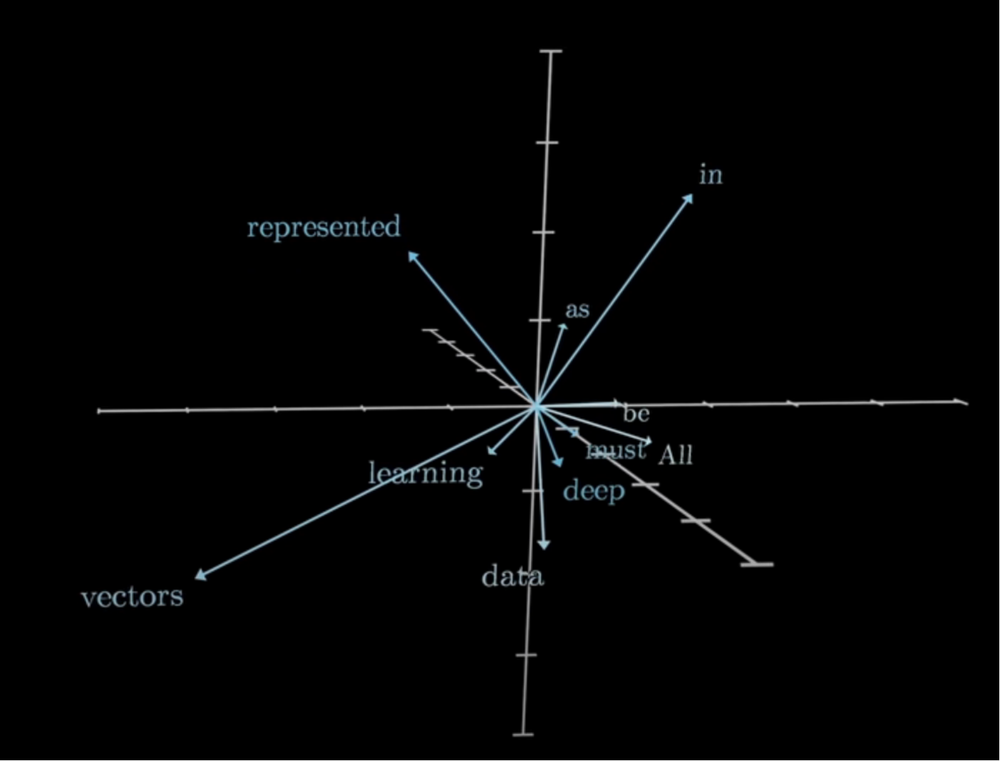
  * 这里只有3个维度

##### (1) embedding matrix: E

* embedding vector: 每个word的特征vector（即图中的一列）
  * $e_{example}$: 表示"example"的embedding vector
* embedding matrix: 由$n_v$个embedding vector组成
* $n_v$: vocabulary的数量
* $n_e$: embedding features的数量
* E: $(n_e,n_v)$
* $W_{example}$: 一个word的one-hot编码，$(n_v,)$
* $EW_{example}=e_{example}$
    * $e_{example}$: $(n_e,)$

##### (2) 衡量两个词的相似度: cosine similarity
* cos_sim(u,v) $=\cos\theta = \frac{u\cdot v}{\Vert u\Vert_2\Vert v\Vert_2}$
  * u、v分别是两个word的embedding vector

##### (3) t-SNE (t-distributed Stochastic Neighbor Embedding)
an unsupervised non-linear dimensionality reduction technique for data exploration and visualizing high-dimensional data
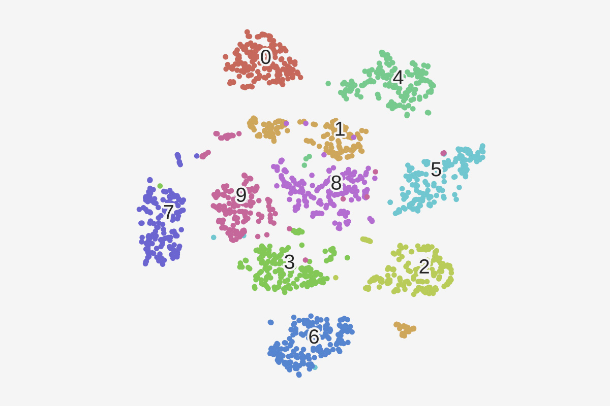
* 每个点是一个word

##### (4) transfer learning
使用别人训练好的word embedding

##### (5) analogy reasoning

比如: 基于 man->woman，进行推理 king -> ?

* 寻找$e_w$使得，maximize $sim(e_{king}-e_w,e_{man}-e_{woman})$，即相似度最高
* 所以maximize $sim(e_w,e_{king}-e_{man}+e_{woman})$
* 可以使用cosine similarity表示相似度

#### 2.learning word embeddings

* 训练出每个word的embedding vector（即embedding matrix）
  * embedding matrix的维度（即特征数）需要设置

##### (1) word2vec skip gram
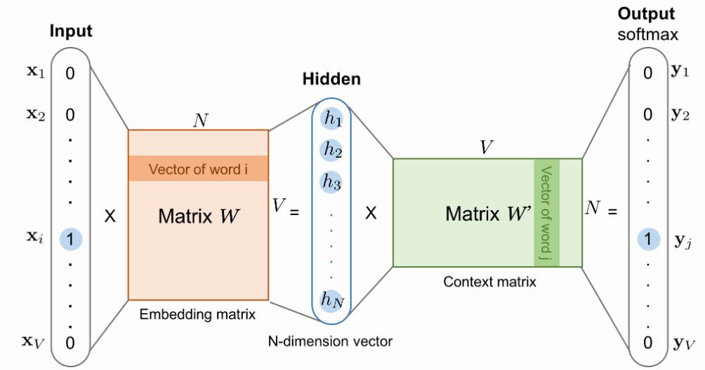
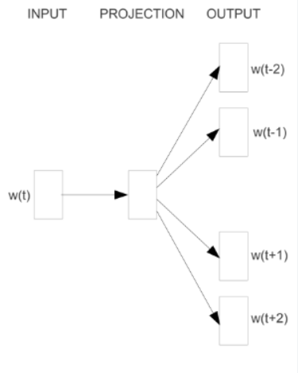

* 给定context，求target word出现的概率
  * 这里context是一个word
  * context的位置不一定，可能离target word前后 $\pm 10$个单词

* projecttion:
  * 是一个embedding matrix，矩阵中的值都是需要训练的参数
    * $e_c$表示 context word的embedding vector

* output(softmax):
  * $p(t|c)=\frac{e^{\theta_t^Te_c}}{\sum\limits_{j=1}^{n_v}e^{\theta_j^Te_c}}$
    * $\theta_t$是softmax的参数，softmax输出每个word是target word的概率，最终结果是一个one-hot vector

##### (2) negative sampling

* 构建训练数据
  * 选择context word，target word，构建一个positive example（即y=1）
  * 选择context word，然后从vocabulary中随机选择一个word，构建一个negative example（即y=0）
  * 构建多个negative example
  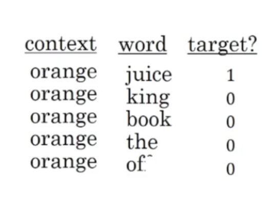

* $p(y=1|c,t)=\sigma(\theta_t^Te_c)$
  * 给定一个context word和一个word，该word是target(y=1)的概率

##### (3) Glove word vectors

* $X_{ij}$: #times j appears in the context of i 
* minimize $\sum\limits_{i=1}^{n_v}\sum\limits_{j=1}^{n_v}f(X_{ij})(\theta_i^Te_j + b_i + b_j'-\log X_{ij})^2$
  * 表示用$\log X_{ij}$来衡量两个词的相似度，所以希望训练出的embedding matrix能够接近这个指标
  * 两个求和是为了所有词 两两都要 进行一次比较
  * $f(X_{ij})$用作权重
    * 当$X_{ij}=0$时，log就会趋近负无穷，所以通过$f(X_{ij})=0$忽略掉
    * 对于经常出现的词（比如: of,is等），给较大的权重
      * 理解：两个词经常同时出现，但不代表这两个词是相似的
    * 对于不经常出现的词，给较小的权重
      * 理解：两个词不经常同时出现，但这两个词可能是相似的

#### 3.sentiment classification
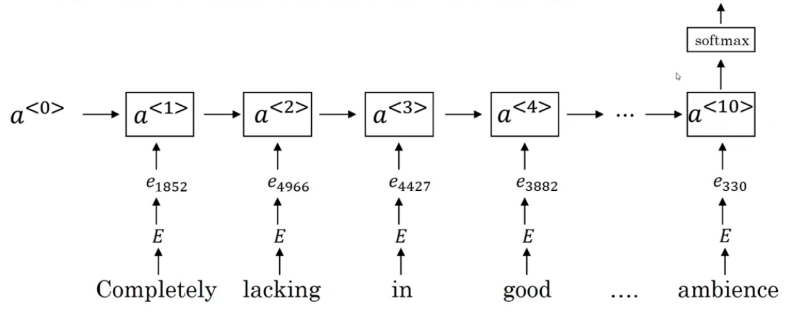

#### 4.debias word embeddings

##### (1) identify bias direction
* $e_{male}-e_{femal}$
* $e_{he}-e_{she}$
* ...（不一定要很多，一个效果就可以很好了）
* average上面的值，能够得到一个vector g，只包含gender信息

* $sim(g, e)$
  * 当值为正数，表示输入的word，与男性有关
  * 当值为负数，表示输入的word，与女性有关
  * 对于actor/actress，与性别有关
  * 对于computure等，则与性别无关，所以希望输出的值为0

##### (2) neutralize

* 输入$e_{receptionist}$，需要清除其bias direction上的分量
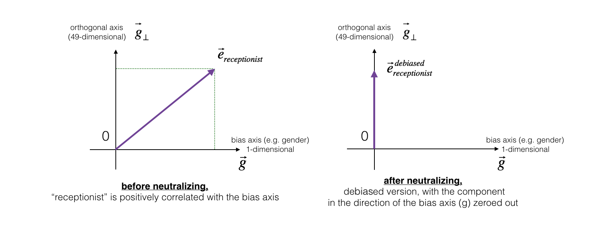

* 先求输入在bias direction上的映射
  * $e^{bias\_component} = \frac{e\cdot g}{\Vert g\Vert_2^2} * g$

* 然后减去bias direction上的分量
  * $e^{debiased} = e - e^{bias\_component}$

##### (3) equalization

* 比如actor和actress只在性别维度有区别，在其他维度没有区别

#### 5.beam search

* beam width = n
* $y^{<1>}$选择 概率$P(y^{<1>}|x)$ 最高的前n个$(y^{<1>},)$
* $y^{<2>}$选择 概率$P(y^{<1>}|x) \times P(y^{<2>}|x,y^{<1>})$ 最高的前n个$(y^{<1>},y^{<2>})$
  * 需要计算所有pair的概率（有$n * \#vocabulary$ 对pairs）
    * 因为一个很大的值乘以一个很小的值 可能大于 一个次大的值乘以另一个值
* 依次类推，直到遇到终止符

##### (1) 优化
* 使用该公式计算概率（而不是整体相乘）：
  * arg max $\frac{1}{T_y^{\alpha}}\sum\limits_{t=1}^{T_y} P(y^{<t>}|x,y^{<1>},...,y^{t-1})$
    * 使用log方面计算机计算，不然容易出现rounding error
    * 除以$T_y$是进行归一化，避免总是选择短的序列
    * $\alpha$没有理论证明，但是在实践中效果更好

##### (2) beam witdth的选择
根据使用场景进行选择，在实际使用中一般设为10左右

##### (3) error analysis
* 一条数据进行比较
  * 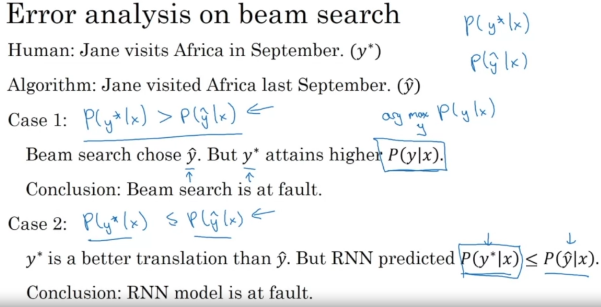

* 对所有训练数据进行判断，能够得到错误比例（RNN的错误还是beam search的错误），从而进行调整

#### 6.blue score (bilingual evaluation understudy)

* 基于参考（提供的翻译结果），给machine transcription打分

* $p_n$ = Bleu score on n-grams only
* combined bleu score: $BP \times \exp(\frac{1}{i}\sum\limits_{n=1}^i p_n)$
  * BP: bervity penality，用于惩罚较短的翻译
    * if MT_output_length > reference_output_length
      * BP=1
    * else
      * BP=exp(1-reference_output_length/MT_output_length)
  
* $p_2$: 就是以两个相连的词为基本单元，计算分数
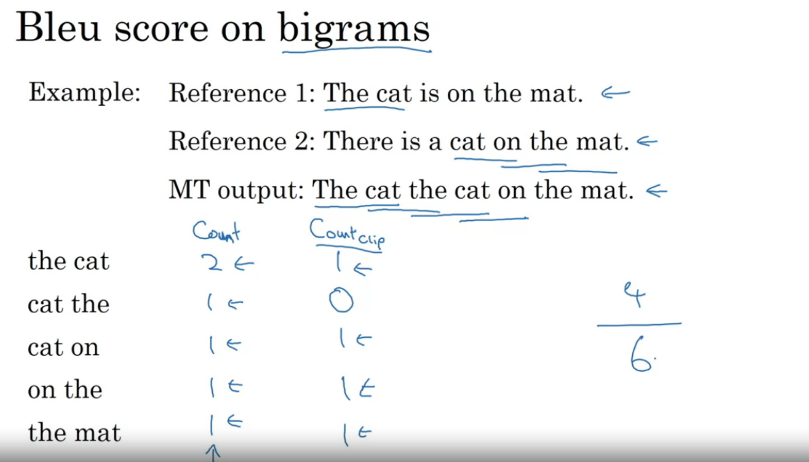

#### 7.attetion model

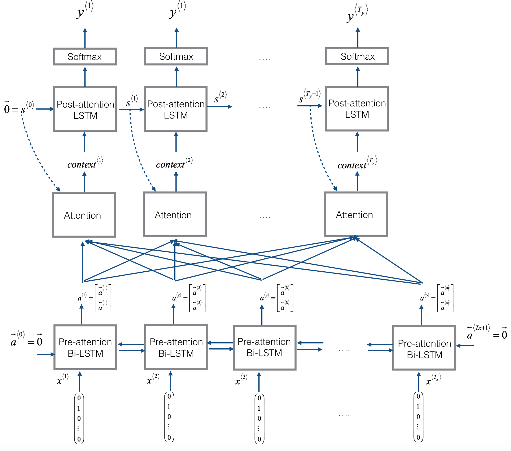

* context: $c^{<t>}$
  * 这里的$c^{<t>}$来自attention layer，作为post-attention LSTM的输入
  * 注意与LSTM内部的cell state $c^{<t>}$进行区分

##### (1) context计算
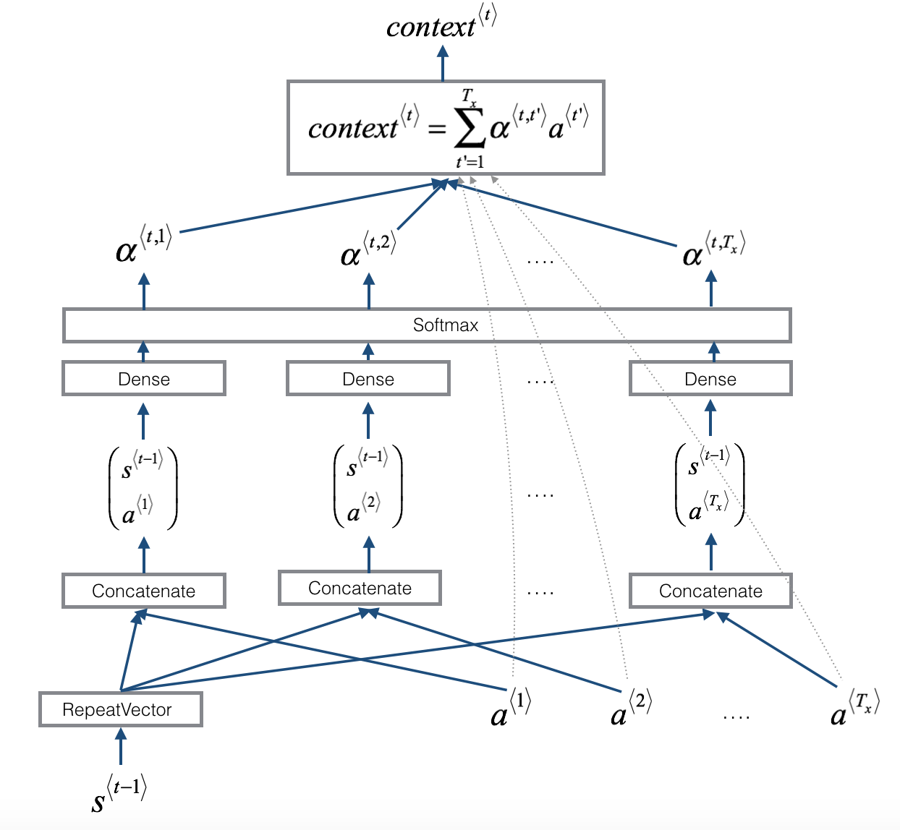

* $c^{<t>}=\sum\limits_{t'}\alpha^{<t,t'>}a^{<t'>}$
* $\alpha^{<t,t'>}$: 表示$y^{<t>}$对$a^{<t'>}$应该关注多少
  * 是一个softmax函数，所以$\sum\limits_{t'}\alpha^{<t,t'>}=1$
  * $\alpha^{<t,t'>} = \frac {\exp(e^{<t,t'>})}{\sum_{t'=1}^{T_x}exp(e^{<t,t'>})}$

* $e^{<t,t'>}$
  * 是一个dense layer
  * 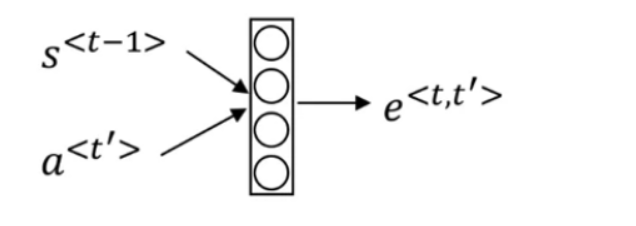

##### (2) 基于query/key/value的理解

* q/k/v
  * the search engine will map your **query** (text in the search bar) against a set of **keys** (video title, description, etc.) associated with candidate videos in their database, then present you the best matched videos (**values**).

* 对attention的理解
  * q: 当前的输入 (即$s^{<t-1>}$)
  * k: 之前输入的每个token的hidden state (即$a^{<1>},a^{<2>},...$)
  * 通过q和k计算权重 (也称attention) (即$\alpha$)
  * v: 之前输入的每个toekn的hidden state (这里的k和v相同，即$a^{<1>},a^{<2>},...$)
    * 乘以权重后，就是对当前的输出的影响 
  * 所有token的v相加 就是context (即$\text {context}^{<t>}$)