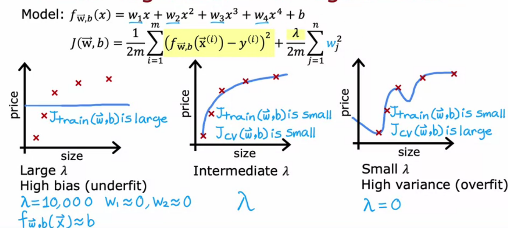

# overview

<!-- @import "[TOC]" {cmd="toc" depthFrom=1 depthTo=6 orderedList=false} -->

<!-- code_chunk_output -->

- [overview](#overview)
    - [概述](#概述)
      - [1.术语](#1术语)
        - [(1) training set](#1-training-set)
        - [(2) x -f-> $\hat{y}$](#2-x--f--haty)
        - [(3) cost function](#3-cost-function)
        - [(4) cost function vs loss function](#4-cost-function-vs-loss-function)
        - [(5) multiple features](#5-multiple-features)
      - [2.两类算法](#2两类算法)
        - [(1) supervised learning](#1-supervised-learning)
        - [(2) unsupervised learning](#2-unsupervised-learning)
      - [3.normal equation (正规方程)](#3normal-equation-正规方程)
      - [4.feature engineering (特征工程)](#4feature-engineering-特征工程)
    - [supervised learning](#supervised-learning)
      - [1.linear regression](#1linear-regression)
        - [(1) univariate linear regression](#1-univariate-linear-regression)
        - [(2) multiple linear regression](#2-multiple-linear-regression)
        - [(3) regularized linear regression (解决overfitting的问题)](#3-regularized-linear-regression-解决overfitting的问题)
      - [2.polynomial regression](#2polynomial-regression)
      - [3.logistic regression (binary classification)](#3logistic-regression-binary-classification)
        - [(1) sigmoid function (logistic function)](#1-sigmoid-function-logistic-function)
        - [(2) decision boundary](#2-decision-boundary)
        - [(3) regularized logistic regression (解决overfitting的问题)](#3-regularized-logistic-regression-解决overfitting的问题)
      - [4.overfitting](#4overfitting)
        - [(1) underfitting](#1-underfitting)
        - [(2) just right](#2-just-right)
        - [(3) overfitting](#3-overfitting)
      - [5.解决overfitting](#5解决overfitting)
        - [(1) collect more training examples](#1-collect-more-training-examples)
        - [(2) use fewer features](#2-use-fewer-features)
        - [(3) regularization](#3-regularization)

<!-- /code_chunk_output -->

### 概述

#### 1.术语

##### (1) training set
用于训练模型的数据集
* x
    * input变量，也叫input feature
* y
    * output变量，也叫output target
* m
    * 没有特别标注 就是 训练集的数目
    * $m_{train}$训练集的数目
    * $m_{test}$测试集的数目
* $(x^{(i)},y^{(i)})$
    * 第i个训练数据
* $(x_{cv}^{(i)},y_{cv}^{(i)})$
    * 第i个cross validaion集数据
* $(x_{test}^{(i)},y_{test}^{(i)})$
    * 第i个测试数据

##### (2) x -f-> $\hat{y}$
* x
    * input feature
* $f_{w,b}(x) = wx + b$
    * f 称为模型
    * w,b称为该模型的参数
    * d: degree of the polynomial
* $\hat{y}$
    * 预测值

##### (3) cost function
* $J(\vec w,b)$
* 描述训练出的模型与真实值的偏差
* 目标：使用cost function的值**最小**，即预测值与真实值偏差最小

##### (4) cost function vs loss function
* loss function
    * $L(\hat y^{(i)}, y^{(i)})$
    * 描述 单个训练数据的实际值与预测值 的偏差

* loss function 和 cost function关系
    * $J(\vec w,b) = \frac{1}{m}\sum_{i=1}^m L(\hat y^{(i)}, y^{(i)})$

##### (5) multiple features

* $x_j$
    * 第j个feature
* n
    * 有n个features
* $\vec x^{(i)}$
    * 第i个训练数据（训练数据是一个向量，因为有多个feature）
* $x^{(i)}_j$
    * 第i个训练数据的第j个feature

#### 2.两类算法

##### (1) supervised learning
* regression
* classification

##### (2) unsupervised learning
训练数据，没有标注输出（即正确答案），算法需要在输入的数据中，自行去做分析
* clusering
* anomaly detection
* dimensionality reduction

#### 3.normal equation (正规方程)

#### 4.feature engineering (特征工程)
创建新的feature，通过 转换或结合 原有的feature

***

### supervised learning

#### 1.linear regression

##### (1) univariate linear regression
* 模型: $f_{w,b}(x) = wx + b$
* 特征: x
* 参数: w,b
* cost function: $J(w,b)$
    * 使用squared error cost function:
    * $J(w,b) = \frac{1}{2m}\sum_{i=1}^m (\hat y^{(i)}-y^{(i)})^2$
* 目标: 寻找w,b，使用cost function值最小

##### (2) multiple linear regression

* 模型: $f_{\vec w,b}(\vec x) = \vec w \cdot \vec x + b = w_1x_1 + w_2x_2 + ... + w_nx_n + b$
* 特征: $\vec x = \begin{bmatrix} x_1 & x_2 & \cdots & x_n\end{bmatrix}$
* 参数: $\vec w = \begin{bmatrix} w_1 & w_2 & \cdots & w_n\end{bmatrix}, b$
* cost function: $J(\vec w,b)$
    * 使用squared error cost function:
    * $J(\vec w,b) = \frac{1}{2m}\sum_{i=1}^m (\hat y^{(i)}-y^{(i)})^2$

##### (3) regularized linear regression (解决overfitting的问题)
* cost function: $J(w,b)$
    * 使用squared error cost function
    * $J(w,b) = \frac{1}{2m}\sum_{i=1}^m (\hat y^{(i)}-y^{(i)})^2 + \frac{\lambda}{2m}\sum_{j}^n w_j^2$
        * n等于特征的数量
            * 由于不知道哪些feature重要，哪些不重要，则代价函数需要考虑所有的features
        * $\lambda$ 决定了如何平衡 fit data（代价函数的第一项） 和 避免overfitting（代价函数的第二项） 这两个目标
            * 当$\lambda$很小时，就会overfitting
            * 当$\lambda$很大时，就会underfitting

#### 2.polynomial regression
* 模型（比如）: $f_{w,b}(x) = w_1x + w_2x^2 b$
* 特征: $x,x^2$
* 参数: $w_1,w_2,b$
* cost function: $J(w,b)$

#### 3.logistic regression (binary classification)

* 模型（比如）: $f_{\vec w,b}(\vec x) = P(y=1|\vec x;\vec w,b) = g(z) = \frac{1}{1 + e^{-z}}$
    * 基于sigmoid function: g(z)
        * 比如: $z = \vec w \cdot \vec x + b$
        * 则$f_{\vec w,b}(\vec x) = g(\vec w \cdot \vec x + b) = \frac{1}{1 + e^{-(\vec w \cdot \vec x + b)}}$
    * $P(y=1|\vec x;\vec w,b)$ 表示y=1的概率
        * 模型的特征是$\vec x$
        * 模型参数是$\vec w, b$

* 特征: $\vec x$
* 参数: $\vec w,b$
* cost function: $J(\vec w,b)$
    * 使用Binary Cross-Entropy Loss:
    * $L(\hat y^{(i)}, y^{(i)}) = -y^{(i)}\log (\hat y^{(i)}) - (1-y^{(i)})\log (1 - \hat y^{(i)})$
    * $J(\vec w,b) = \frac{1}{m}\sum_{i=1}^m L(\hat y^{(i)}, y^{(i)}) = -\frac{1}{m}\sum_{i=1}^m[y^{(i)}\log (\hat y^{(i)}) + (1-y^{(i)})\log (1 - \hat y^{(i)})]$

##### (1) sigmoid function (logistic function)
* $g(z) = \frac{1}{1+e^{-z}}$
    * 能够使得输出范围在 0-1 之间
* $\frac{d}{dx}g(z)=g(z)(1-g(z))$

##### (2) decision boundary
以两类为例，一类是positive class，一类是negtive class
* 确定一个decision boundary，预测的值 >= 这个boundary，则认为是positive class
    * 比如decision bounadry = 0.5，则$z = 0$
        * 如果$z = \vec w \cdot \vec x + b$，则decision boundary是一条直线

##### (3) regularized logistic regression (解决overfitting的问题)
* cost function: $J(\vec w,b)$
    * $J(\vec w,b) = \frac{1}{m}\sum_{i=1}^m L(\hat y^{(i)}, y^{(i)}) + \frac{\lambda}{2m}\sum_{j}^n w_j^2 = -\frac{1}{m}\sum_{i=1}^m[y^{(i)}\log (\hat y^{(i)}) + (1-y^{(i)})\log (1 - \hat y^{(i)})] + \frac{\lambda}{2m}\sum_{j}^n w_j^2$

        * n等于特征的数量
            * 由于不知道哪些feature重要，哪些不重要，则代价函数需要考虑所有的features
        * $\lambda$ 决定了如何平衡 fit data（代价函数的第一项） 和 避免overfitting（代价函数的第二项） 这两个目标
            * 当$\lambda$很小时，就会overfitting
            * 当$\lambda$很大时，就会underfitting

#### 4.overfitting

##### (1) underfitting
不能很好的匹配训练集
* 特点：high bias
    * 数据不拟合，即预测值与实际值偏差较大

##### (2) just right 

* 特点：generalization
    * 数据能很好的匹配样本，也能很好的预测新数据

##### (3) overfitting
能够很好的匹配训练集，但是不能很好的预测新的数据
* 特点：high variance
    * 过拟合，会导致模型不稳定，即添加一个样本，会导致模型变换较大

#### 5.解决overfitting

##### (1) collect more training examples

##### (2) use fewer features
* feature selection

##### (3) regularization
* 降低某些feature的权重（相当于减少了feature，但又不像第二种方式一样，直接减少了feature）

* 代价函数变为
    * $J(\vec w,b) = J_{old}(\vec w,b) + \frac{\lambda}{2m}\sum_{1}^n w_j^2$
        * n等于特征的数量
            * 由于不知道哪些feature重要，哪些不重要，则代价函数需要考虑所有的features
        * 当权重都为0时，值最小，所以这项目标是**减少参数**（**参数越少，拟合度越低**）
        * $\lambda$ 决定了如何平衡 fit data 和 避免overfitting 这两个目标
            * 当$\lambda$很小时，前一项的影响更大，就会overfitting
            * 当$\lambda$很大时，后一项的影响更大，就会underfitting
            * 以线性回归为例
            