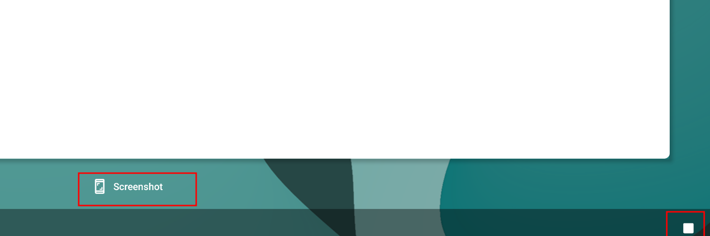

# waydroid


<!-- @import "[TOC]" {cmd="toc" depthFrom=1 depthTo=6 orderedList=false} -->

<!-- code_chunk_output -->

- [waydroid](#waydroid)
    - [deploy](#deploy)
      - [1.要求](#1要求)
      - [2.安装](#2安装)
      - [3.网络要求](#3网络要求)
        - [(1) 简单说明设置](#1-简单说明设置)
        - [(2) DHCP (67)](#2-dhcp-67)
        - [(3) DNS (53)](#3-dns-53)
      - [4.初始化](#4初始化)
        - [(1) 镜像的选择](#1-镜像的选择)
        - [(2) 镜像下载](#2-镜像下载)
        - [(3) 进行初始化](#3-进行初始化)
      - [5.重启机器](#5重启机器)
    - [使用](#使用)
      - [1.shell的使用](#1shell的使用)
      - [2.安装libhoudini（即x86上可运行arm架构）](#2安装libhoudini即x86上可运行arm架构)
      - [3.设置窗口大小](#3设置窗口大小)
      - [4.安装应用](#4安装应用)
        - [(1) 下载apk](#1-下载apk)
        - [(2) 安装apk（注意cpu架构）](#2-安装apk注意cpu架构)
        - [(3) 启动应用](#3-启动应用)
        - [(4) 卸载应用](#4-卸载应用)
      - [5.必备软件](#5必备软件)
        - [(1) 中文输入法: Gboard](#1-中文输入法-gboard)
        - [(2) VPN: shadowsocks](#2-vpn-shadowsocks)
        - [(3) 应用宝](#3-应用宝)
        - [(4) 控屏软件: touchpad for big phone & tab](#4-控屏软件-touchpad-for-big-phone--tab)
      - [6.登陆google play](#6登陆google-play)
        - [(1) 设置谷歌设置认证](#1-设置谷歌设置认证)
        - [(2) 登陆google play](#2-登陆google-play)
      - [7.其他使用](#7其他使用)
        - [(1) 截屏](#1-截屏)
        - [(2) 开启developer mode](#2-开启developer-mode)
    - [配置GPS](#配置gps)
      - [1.制作支持GPS的镜像](#1制作支持gps的镜像)
        - [(1) 选择包含GPS镜像](#1-选择包含gps镜像)
        - [(2)制作镜像](#2制作镜像)
        - [(3) umount镜像](#3-umount镜像)
      - [2.初始化waydroid](#2初始化waydroid)
      - [3.模拟一个gps设备](#3模拟一个gps设备)
        - [(1) 准备nmea文件 (注意要多设几个point)](#1-准备nmea文件-注意要多设几个point)
        - [(2) 创建gps设置](#2-创建gps设置)
      - [4.将gps设备挂载进waydroid容器里](#4将gps设备挂载进waydroid容器里)
    - [Troubleshooting](#troubleshooting)
      - [1.重置](#1重置)
      - [2.Failed to start Clipboard manager service](#2failed-to-start-clipboard-manager-service)
      - [3.查看日志](#3查看日志)

<!-- /code_chunk_output -->

### deploy

#### 1.要求

* 内核要求
    * 需要binder_linux和ashmem_linux
    * 较新的kernel已经将这个模块编译进内核了
        * 注意: 像cloud这些特殊的镜像，不包括这两个模块，应该是内核精简过了

#### 2.安装

[参考](https://docs.waydro.id/usage/install-on-desktops)

```shell
#配置镜像仓库
curl https://repo.waydro.id | sudo bash

sudo apt install waydroid -y
```

#### 3.网络要求

##### (1) 简单说明设置

##### (2) DHCP (67)
* waydroid会启动一个bridge，并设置DHCP，并放行67端口，从而启动的安卓虚拟器，能够获取到ip

* 安卓模拟器中是没有设置默认路由的，可能被隐藏了，命令行无法查看

##### (3) DNS (53)
* waydroid会启动一个dnsmasq，使用`/etc/resolv.conf`文件
* 当宿主机使用systemd-resolved时，防止端口冲突：
  * systemd-resolved只监听127.0.0.53的53端口
  * dnsmasq只监听waydroid bridge地址的53端口

#### 4.初始化

##### (1) 镜像的选择

* 有两个镜像：vendor和system

* 镜像架构选择：
  * 根据宿主机的架构选择镜像的架构
    * 比如宿主机是x86_64的，镜像就要选择x86_64的，选择arm的就无法启动
* 镜像类型选择
  * vendor选择MAINLINE类型的
  * system选择GAPPS类型的（自带Google Play）

##### (2) 镜像下载
默认会自动下载镜像，但是由于下载较慢，按照下面步骤进行手动下载

* 下载system和vendor镜像，[下载地址](https://sourceforge.net/projects/waydroid/files/images/)
    * 注意两者版本和架构要一样，比如:
        * lineage-18.1-20231007-GAPPS-waydroid_x86_64-system
        * lineage-18.1-20231007-MAINLINE-waydroid_x86_64-vendor

* 将镜像解压移动到指定目录
```shell
unzip lineage-18.1-20231007-VANILLA-waydroid_x86_64-system
unzip lineage-18.1-20231007-MAINLINE-waydroid_x86_64-vendor

sudo mkdir -p /etc/waydroid-extra/images/
sudo cp system.img /etc/waydroid-extra/images/
sudo cp vendor.img /etc/waydroid-extra/images/
```

##### (3) 进行初始化
* 进行初始化
```shell
sudo waydroid init -f
```

* 查看初始化状态
```shell
waydroid status
```

#### 5.重启机器

* 因为初始化会设置网络配置（包括iptables等），如果不重启可能不生效
  * 服务: `waydroid-container.service`
    * 网络配置脚本: `/usr/lib/waydroid/data/scripts/waydroid-net.sh`

* 检查网络
```shell
sudo waydroid shell ping 8.8.8.8
```

* 如果网络还是有问题，重启 并 重新进行初始化

***

### 使用

#### 1.shell的使用

```shell
sudo waydroid shell <command>
```

#### 2.安装libhoudini（即x86上可运行arm架构）
[参考](https://github.com/casualsnek/waydroid_script/tree/main)

* 安装成功即可使用arm架构app
  * 直接使用`waydroid app install`即可安装arm架构app
```shell
sudo apt install lzip

git clone https://github.com/casualsnek/waydroid_script

cd waydroid_script
python3 -m venv venv
source venv/bin/activate

sudo pip install -r requirements.txt

#要设置代理，否则相关文件无法下载
HTTP_PROXY="127.0.0.1:1095" HTTPS_PROXY="127.0.0.1:1095" sudo python3 main.py install libhoudini
```

#### 3.设置窗口大小
不设置的话，有些应用（比如微信）显示会有问题，导致不可用
```shell
waydroid prop set persist.waydroid.width 720
waydroid prop set persist.waydroid.height 1270

sudo systemctl restart waydroid-container.service
```

#### 4.安装应用

##### (1) 下载apk
* 常用下载地址
  * [apk mirror](https://www.apkmirror.com/)
  * [apk pure](https://m.apkpure.com/)
  * [应用宝](https://sj.qq.com/) （适合国内的软件） 
* 需要下载符合要求的apk
  * 注意android的版本和cpu架构
  * 在settings -> About Phone中可以查看

##### (2) 安装apk（注意cpu架构）

* 当cpu架构、安卓版本等不符时，无法进行安装，但不会报错
  * 比如：安卓模拟器是x86_64的架构，arm64的apk就无法安装

* 不要使用sudo，使用启动安卓模拟器的用户
```shell
waydroid app install <apk_path>
```

* 查看是否安装成功（注意：有些需要等几分钟才能显示出来）
```shell
waydroid app list
```

##### (3) 启动应用
* 方法一（建议）：
  * 在settings搜索应用名，然后启动即可

* 方法二:
```shell
waydroid launch <package_name>
```

##### (4) 卸载应用
```shell
waydroid remove <package_name>
```

#### 5.必备软件

* 下载相应apk，按照上述方法进行安装

##### (1) 中文输入法: Gboard

* [安装Gboard](https://www.apkmirror.com/apk/google-inc/gboard/gboard-13-4-07-559388404-release/gboard-the-google-keyboard-13-4-07-559388404-release-x86_64-android-apk-download/)，不需要启动
  * Settings -> System -> Languages & Input -> On-screen keyboard -> Manage
    * enable Gboard 
    * disable Android keyboard
  * 输入的时候，在键盘上找到设置图标，添加pinyin输入 

##### (2) VPN: shadowsocks

##### (3) 应用宝
[下载地址](https://sj.qq.com/)

##### (4) 控屏软件: touchpad for big phone & tab
在google play中下载即可
有些app，通过电脑鼠标无法操作，需要利用到这个软件模拟触屏等操作

#### 6.登陆google play

* 需要先开启VPN

##### (1) 设置谷歌设置认证

* 根据下述步骤注册一下机器码
  * [参考](https://docs.waydro.id/faq/google-play-certification)

* 重启模拟器
```shell
sudo systemctl restart waydroid-container.service
```

##### (2) 登陆google play

* 登陆google play

#### 7.其他使用

##### (1) 截屏



##### (2) 开启developer mode

* settings -> About Phone -> Build Number
  * 多次点击`Build Number`就可以开启

***

### 配置GPS

#### 1.制作支持GPS的镜像

##### (1) 选择包含GPS镜像
* cpu架构要一致
* 要包含GNSS相关库
* 比如x86_64架构的就可以选择: 
  * [Bliss-v14.10-x86_64-OFFICIAL-opengapps-20230325.iso](https://sourceforge.net/projects/blissos-dev/files/Beta/Bliss-v14.10-x86_64-OFFICIAL-opengapps-20230325.iso/download)

##### (2)制作镜像

* 对原有镜像进行扩容，因为需要复制一些文件进去
```shell
qemu-img resize <vendor_image> +10M
resize2fs <vendor_image>

qemu-img resize <system_image> +20M
resize2fs <system_image>
```

* 相关准备
```shell
mkdir /mnt/android /mnt/system /mnt/vendor
mount -o loop <bliss_iso> /mnt/android
mount -o loop <vendor_image> /mnt/vendor
mount -o loop <system_image> /mnt/system

mkdir /tmp/android
cp /mnt/android/system.sfs /tmp/android/
cd /tmp/android/
unsquashfs system.sfs
umount /mnt/android
mount -o loop /tmp/android/squashfs-root/system.img /mnt/android
```

* 复制文件

```shell
# 拷贝到vendor镜像
cp /mnt/android/system/vendor/bin/hw/android.hardware.gnss@1.0-service /mnt/vendor/bin/hw/
# 使用权限等都一样
#ls -l /mnt/vendor/bin/hw/
#chown root:2000 /mnt/vendor/bin/hw/android.hardware.gnss@1.0-service

# 拷贝到system镜像
cp /mnt/android/system/vendor/etc/init/android.hardware.gnss@1.0-service.rc /mnt/system/system/etc/init/
cp /mnt/android/system/vendor/lib/hw/android.hardware.gnss@1.0-impl.so /mnt/system/system/lib/hw/
cp /mnt/android/system/vendor/lib64/hw/android.hardware.gnss@1.0-impl.so /mnt/system/system/lib64/hw/
cp /mnt/android/system/lib/hw/gps.default.so /mnt/system/system/lib/hw/
cp /mnt/android/system/lib64/hw/gps.default.so /mnt/system/system/lib64/hw/
```

* 修改配置

```shell
vim /mnt/system/system/etc/vintf/manifest.xml
```
```xml
    <hal format="hidl">
        <name>android.hardware.gnss</name>
        <transport>hwbinder</transport>
        <version>1.0</version>
        <interface>
            <name>IGnss</name>
            <instance>default</instance>
        </interface>
        <fqname>@1.0::IGnss/default</fqname>
    </hal>
```

```shell
vim /mnt/system/system/etc/vintf/compatibility_matrix.legacy.xml
```
```xml
    <hal format="hidl" optional="true">
        <name>android.hardware.gnss</name>
        <version>1.0</version>
        <interface>
            <name>IGnss</name>
            <instance>default</instance>
        </interface>
    </hal>
```

```shell
$ vim /mnt/system/system/build.prop

ro.factory.hasGPS=true
#gps设备名称，这里设置的是/dev/gps，则后续需要将gps设备挂载到/dev/gps上
ro.kernel.android.gps=gps
ro.kernel.android.gps.speed=115200
```

##### (3) umount镜像
```shell
umount /mnt/android /mnt/vendor /mnt/system
```

#### 2.初始化waydroid
使用新的镜像初始化waydroid

#### 3.模拟一个gps设备

##### (1) 准备nmea文件 (注意要多设几个point)

[生成地址](https://www.nmeagen.org/)

* 要多设置几个邻近的point，不然应用可能无法读取到定位

##### (2) 创建gps设置

* 这里使用[virtualgps.py](https://github.com/LiamLea/virtualgps)
```shell
python3 virtualgps.py --nmea /home/liamlea/Downloads/output-4.nmea

# 会返回虚拟的gps设备名称： /dev/pts/11
```

* 设置gps设备权限
  * `virtualgps.py`进行了配置，所以这里无需进行
```shell
chmod 666 <gps_device>
```

#### 4.将gps设备挂载进waydroid容器里

```shell
$ sudo vim /var/lib/waydroid/lxc/waydroid/config_nodes

lxc.mount.entry = /dev/pts/11 dev/gps none bind,create=file,optional 0 0

$ sudo systemctl restart waydroid-container.service
```

* 查看gps设备
```shell
waydroid shell
cat /dev/gps
#如果有数据，证明gps设备创建成功
```

***

### Troubleshooting

#### 1.重置

```shell

sudo systemctl stop waydroid-container.service

#注意在安装waydroid那个用户下执行
sudo rm -rf /var/lib/waydroid /home/.waydroid ~/waydroid ~/.share/waydroid ~/.local/share/applications/*aydroid* ~/.local/share/waydroid

rm -rf /var/lib/waydroid /home/.waydroid ~/waydroid ~/.share/waydroid ~/.local/share/applications/*aydroid* ~/.local/share/waydroid

sudo waydroid init -f
```

#### 2.Failed to start Clipboard manager service
```shell
pip3 install pyclip
```

#### 3.查看日志
* 查看waydroid日志
```shell
waydroid log
```
* 查看android系统运行日志
```shell
waydroid shell
logcat
```