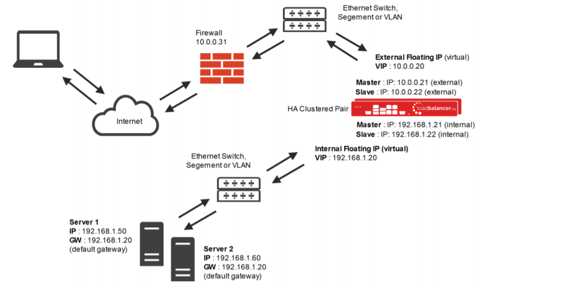

# Load_balance

<!-- @import "[TOC]" {cmd="toc" depthFrom=1 depthTo=6 orderedList=false} -->
<!-- code_chunk_output -->

- [Load_balance](#load_balance)
    - [概述](#概述)
      - [1.常用调度算法](#1常用调度算法)
        - [（1）rr（roundrobin）](#1rrroundrobin)
        - [（2）wrr（weighted roundrobin）](#2wrrweighted-roundrobin)
        - [（3）sh（source hashing）](#3shsource-hashing)
        - [（4）lc（least connections）](#4lcleast-connections)
        - [（5）wlc（weighted least connections）](#5wlcweighted-least-connections)
    - [ip transparency](#ip-transparency)
      - [1.layer 4：ip transparency](#1layer-4ip-transparency)
        - [（1）DR模式](#1dr模式)
        - [（2）NAT模式](#2nat模式)
      - [2.layer 7: 在http头中添加源客户端的信息](#2layer-7-在http头中添加源客户端的信息)
        - [(1)  X-Forwarded-For headers](#1-x-forwarded-for-headers)
      - [3.通用方式：proxy protocol](#3通用方式proxy-protocol)

<!-- /code_chunk_output -->

### 概述

#### 1.常用调度算法

##### （1）rr（roundrobin）
问题:某些服务器的连接已经断开,有些没断开,依旧轮询,没断开的压力会更大

##### （2）wrr（weighted roundrobin）
这个可以设置权重

##### （3）sh（source hashing）
相当于ip_hash

##### （4）lc（least connections）
根据 服务器当前的连接情况 进行负载均衡

##### （5）wlc（weighted least connections）
根据 服务器当前的连接情况 和 权重 进行负载均衡

***

### ip transparency

#### 1.layer 4：ip transparency

##### （1）DR模式
* 真实的服务器需要做额外的设置（参考LVS的DR模式）

##### （2）NAT模式
* 关键点：真实服务器的网关必须设为LB，这样确保所有流量都经过LB，从而能够进行地址的映射（参考nginx的proxy_bind模式）

#### 2.layer 7: 在http头中添加源客户端的信息

##### (1)  X-Forwarded-For headers

#### 3.通用方式：proxy protocol
* 参考nginx的proxy protocol
