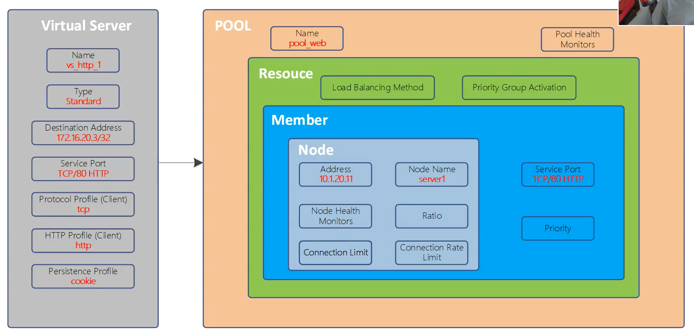

# F5

[toc]

### 概述

#### 1.TMOS
traffic management operating system

#### 2.相关术语

* virtual server
虚拟服务器，用于对外提高服务
 
* profile
分为应用层Profile和协议层Profile，有些是相互排斥的，比如TCP和UDP，有的是相互依赖的，比如HTTP和TCP，在F5上认为所有的HTTP都是在TCP层面上运行的。除了TCP/UDP/SSL以及认证类的以外，其他的都只能够在virtual server上关联一次。
 
* member
指一个应用服务，一般由IP+port来构成
 
* node
表示后台的一个服务IP地址
 
* iRules
在整个数据包通路上进行检测，必须在和HTTP Profile进行关联

#### 3.工作模式

##### （1）Standard
采取full proxy 7层的处理模式，消耗CPU（因为F5需要跟客户端何服务端都建立连接）
* DNAT
* SNAT + DNAT

* 好处
  * 提高了系统的安全性
  比如，当客户遇到SYN攻击的时候，在client端或有大量的连接产生，但是在server端不会有任何的反应。这是因为SYN攻击是发送大量的半连接请求，但是这些请求只是和F5的Client端建立了连接，并没有影响server端
  * server和client端可以使用不同的profile，

##### （2）performance（Layer4）
按照纯4层的处理方式去处理流量，就只看IP和端口
* DNAT
后端服务器需要将默认网关设为F5，不然回复可能无法到达客户端
* SNAT + DNAT

##### （3）performance（http）
* 当client向F5发http请求的时候，可以复用同一条连接
  * 所以就不支持https和会话保持功能

##### （4）路由模式
跟lvs的DR模式一样
