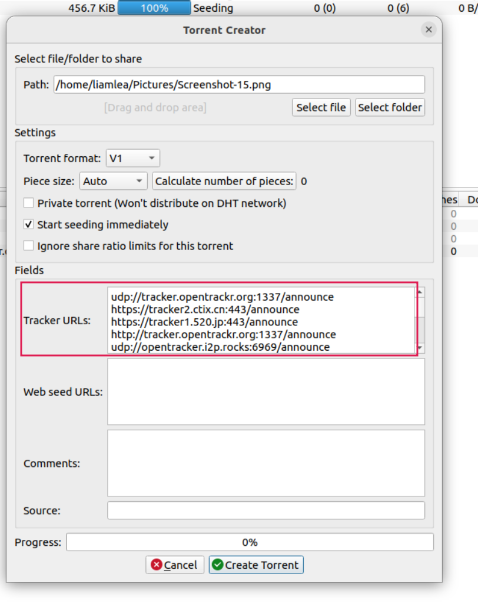

# bittorrent


<!-- @import "[TOC]" {cmd="toc" depthFrom=1 depthTo=6 orderedList=false} -->

<!-- code_chunk_output -->

- [bittorrent](#bittorrent)
    - [概述](#概述)
      - [1.基础概念](#1基础概念)
        - [(1) seed](#1-seed)
        - [(2) peer](#2-peer)
        - [(3) leech](#3-leech)
        - [(4) qbittorrent中的字段解释](#4-qbittorrent中的字段解释)
      - [2.设计](#2设计)
        - [(1) pieces](#1-pieces)
        - [(2) rarest-first strategy](#2-rarest-first-strategy)
      - [3.原理简述](#3原理简述)
      - [4.torrent file文件格式](#4torrent-file文件格式)
    - [使用](#使用)
      - [1.显示torrent file信息](#1显示torrent-file信息)
      - [2.运行tracker (以qbittorrent为例)](#2运行tracker-以qbittorrent为例)
        - [(1) 前提条件](#1-前提条件)
        - [(2) 开启tracer](#2-开启tracer)
        - [(3) 创建torrent file](#3-创建torrent-file)
        - [(4) 使用DHT client根据torrent file进行下载](#4-使用dht-client根据torrent-file进行下载)
      - [3.共享文件 (利用DHT和public trackers)](#3共享文件-利用dht和public-trackers)
        - [(1) 前提条件](#1-前提条件-1)
        - [(2) 创建torrent file](#2-创建torrent-file)
        - [(3) 使用DHT client根据torrent file进行下载](#3-使用dht-client根据torrent-file进行下载)

<!-- /code_chunk_output -->

### 概述

#### 1.基础概念

##### (1) seed
拥有完整文件并上传（可供其他节点下载）的节点

##### (2) peer
正在下载且同时还在上传pieces 的节点

##### (3) leech
正在下载但没有上传的节点

##### (4) qbittorrent中的字段解释

Trackers中个字段的意思
* seeds
    * seed地址数量，即tracker能够发现这个资源的seed的地址数量
* peers
    * peer地址数量，即tracker能够发现这个资源的peer的地址数量
* leeches
    * leech地址数量，即tracker能够发现这个资源的leech的地址数量
* downloaded
    * 这个资源被下载的次数

#### 2.设计

##### (1) pieces
文件被划分为多个**大小相等**的pieces，非顺序下载好后，进行重组，好处:
* 能够加快传输
  * 比如某个节点下载了一个piece，这时他就可以提供这个piece的下载
* 能够实现恢复下载
  * 比如某个节点下载中断，可以继续下载还没有下载的pieces
* 也可以选择顺序下载，这样就可以实现 streaming playback（即一边下载一边观看）

##### (2) rarest-first strategy
优先下载最稀有的pieces（即提供这个piece的peers比较少），这样能加快下载速度

#### 3.原理简述

* 创建torrent文件，上传的文件被分为多个大小相同的pieces，对外提供下载
  * 若提供了tracker，peer会进行tracker announcement，即在tracker中注册信息（包括: 上传的文件hash、peer信息等）
  * 若trackerless，则会先去找**bootstrap peer**去交换DHT peer的信息
    * 然后继续和DHT peer交换信息，从而发现更多的DHT peers

* 客户端添加torrent文件
  * 若提供了tracker，则会去tracker中 根据文件hash查找对应的peer信息
    * 找到peer后，则进行下载
  * 若trackerless，则会先去找**bootstrap peer**去交换DHT peer的信息
    * 然后继续和DHT peer交换信息，从而发现更多的DHT peers
    * 根据文件hash，找到相应的peer

#### 4.torrent file文件格式

* 可以通过torrent file editor工具进行查看
  * bittorrent v2格式有些区别
```
announce: trackers的地址（可以没有）
info: 
  files: 文件信息（因为如果是一个目录，会有多个文件）
    path: 文件路径
    length: 文件大小
  length: 文件或目录大小，单位字节 （是待下载的）
  name: 文件名或目录名 (是待下载的)
  piece length: 每个块的字节数
  pieces: 各个块的hash
```

***

### 使用

#### 1.显示torrent file信息

```shell
aria2c -S <torrent_file>
```

#### 2.运行tracker (以qbittorrent为例)

##### (1) 前提条件

* 需要有公网ip地址

##### (2) 开启tracer

* Preferences -> Advanced -> Enable embedded tracker 并设置port

##### (3) 创建torrent file

这里使用ipv6地址
* Tracker URLs:
    * `http://[240e:479:1020:a42:aac7:4b5b:5c12:6e2e]:9000/announce`

* 指定的文件处于seeding状态
    * 当创建成功后，指定的文件就处于seeding状态中，即可以被其他peer下载

##### (4) 使用DHT client根据torrent file进行下载

* 直接使用
* 转换成magnet link (磁力链接)
    * `aria2c -S <torrent_file>`会显示磁力链接的地址

#### 3.共享文件 (利用DHT和public trackers)

##### (1) 前提条件
* 需要有公网ip地址
* 需要设置几个[public trackers](https://raw.githubusercontent.com/ngosang/trackerslist/master/trackers_all.txt)
    * 因为有些tracker不可达
    * 因为不是所有tracker都能及时更新自己的peer信息

##### (2) 创建torrent file



##### (3) 使用DHT client根据torrent file进行下载
* 直接使用
* 转换成magnet link (磁力链接)
    * `aria2c -S <torrent_file>`会显示磁力链接的地址