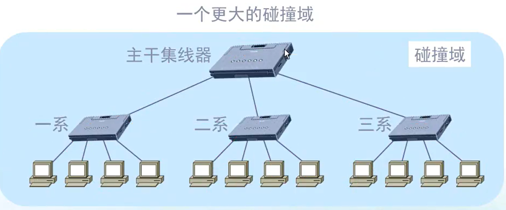

# ethernet（以太网）

<!-- @import "[TOC]" {cmd="toc" depthFrom=1 depthTo=6 orderedList=false} -->
<!-- code_chunk_output -->

- [ethernet（以太网）](#ethernet以太网)
    - [概述](#概述)
      - [1.ethernet帧格式](#1ethernet帧格式)
        - [（1）ethernet type](#1ethernet-type)
      - [2.使用的协议：CSMA/CD](#2使用的协议csmacd)
        - [（1）carrier-sense multiple acces/collision dection](#1carrier-sense-multiple-accescollision-dection)
      - [2.冲突域（碰撞域）](#2冲突域碰撞域)

<!-- /code_chunk_output -->

### 概述

#### 1.ethernet帧格式

##### （1）ethernet type
协议号，用于标识封装的是什么协议（比如：ipv4）

#### 2.使用的协议：CSMA/CD

##### （1）carrier-sense multiple acces/collision dection
带有**冲突检测**的**载波监听**多路访问
* 即**同一时间**，**在同一以太网中** 只能有 **一个机器的信号** 传输
  * 利用 **网桥** 可以 **划分冲突域**，从而**同一时间**，在**同一个冲突域**中 只能有 **一个机器的信号** 传输
  * 利用 **交换机** 可以 **避免冲突**
    * 比如A给B发送数据，A，B，C，D都接在交换机上，交换机只会将数据发送给B，不会发送给C和D
* 每个机器发送信号前，先监听线路上有没有信号，没有信号就发送
* 即使有监听还是会发生冲突，发生冲突后，等待一定时长后再重新发送

#### 2.冲突域（碰撞域）
**同一时间**在**同一冲突域**只能有**一个机器的信号**传输

