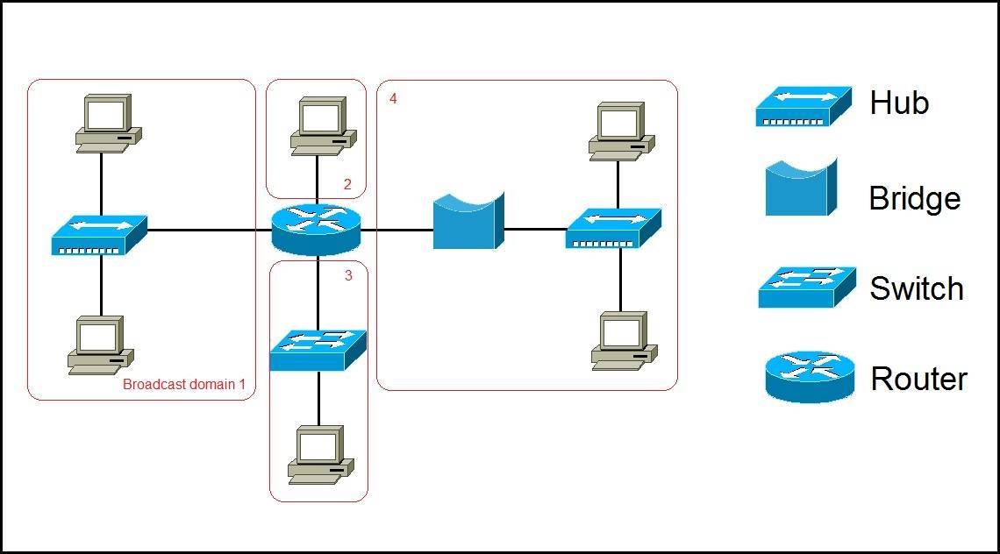
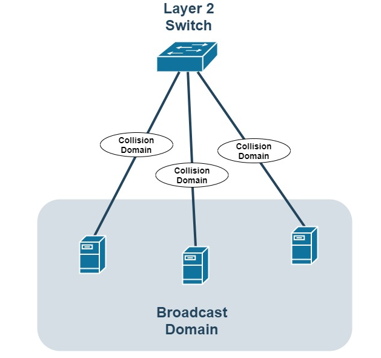
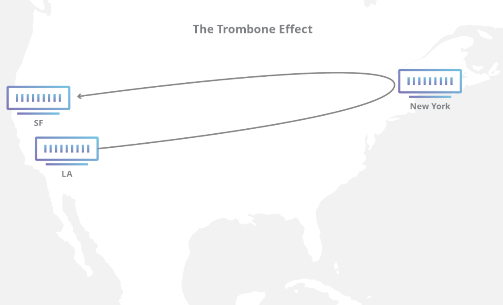

# data link layer
[toc]

### 概述

#### 1.有两种类型信道

##### （1）点对点信道（PPP协议）
使用一对一的点对点通信方式

##### （2）广播信道（以太网，CSMA/CD协议）
使用一对多的广播通信方式
即发送的数据，连接在线路上的机器都会收到，但只有特定的机器会接受，其他的都会丢弃

#### 2.基本概念

##### （1）link（链路）
一条点到点的物理线路

##### （2）data link（数据链路）
除了物理线路外，还需要通信协议才能进行数据传输
把实现通信协议的硬件和软件加到链路上，就构成了数据链路（常用的方法是网卡）

#### 4.广播/多播 域
广播域 是 计算机网络的逻辑划分，在广播域内的所有节点，都能够在数据链路层收到其他节点的广播
* 路由器 利用 端口 划分广播域，一个端口 就是 一个广播域
* 交换机 利用 vlan 划分广播域，一个vlan就是一个广播域，不同交换机的同一个vlan是同一个广播域

* 每一个红圈是一个广播域

#### 5.冲突域和广播域
* 冲突域 是物理连接上的，在物理层
* 广播域 是逻辑上的，在数据链路层

#### 6.BUM frame
* broadcast
* unkown-unicast
  当目的地址不在fdb中时，会将该包广播出去（这种方式现在已经不用，因为会先用arp获取地址）
* multicast

#### 7.IXP(internet exchange points)
不同网络供应商，在某一个物理位置将他们的网络连接在一起（即连接到同一个交换机上），从而使得他们之间的流量互通

* 为什么需要IXP
如果没有IXP，流量就需要通过中介网络才能到达对方，这样效率和性能都比较低，如下所示

[查看世界上的所有IXPs](https://www.internetexchangemap.com/)
