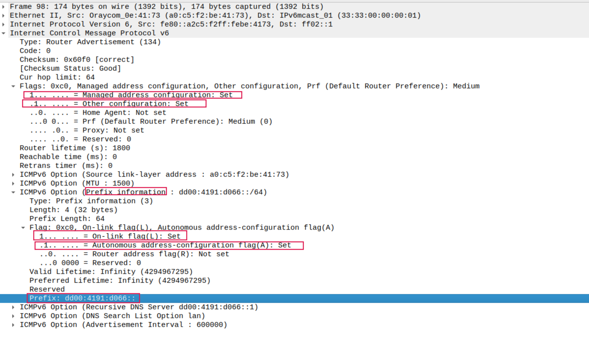

# ip（internet protocol）

<!-- @import "[TOC]" {cmd="toc" depthFrom=1 depthTo=6 orderedList=false} -->
<!-- code_chunk_output -->

- [ip（internet protocol）](#ipinternet-protocol)
    - [概述](#概述)
      - [1.ip报头](#1ip报头)
        - [（1）TTL（time to live）](#1ttltime-to-live)
        - [（2）protocol](#2protocol)
      - [2.reachalibity scopes (可达域)](#2reachalibity-scopes-可达域)
        - [(1) node-local](#1-node-local)
        - [(2) link-local](#2-link-local)
        - [(3) global](#3-global)
    - [ipv6](#ipv6)
      - [1.定义](#1定义)
        - [(1) 表示](#1-表示)
        - [(2) prefix](#2-prefix)
        - [(3) scope id](#3-scope-id)
      - [2.ipv6网关地址是link-local address](#2ipv6网关地址是link-local-address)
      - [3.NDP (Neighbor Discovery Protocol) (等价于ipv4的ARP)](#3ndp-neighbor-discovery-protocol-等价于ipv4的arp)
      - [4.三类Autoconiguration](#4三类autoconiguration)
        - [(1) SLAAC (Stateless Auto Address Configuration)](#1-slaac-stateless-auto-address-configuration)
        - [(2) stateless DHCPv6](#2-stateless-dhcpv6)
        - [(3) stateful DHCPv6](#3-stateful-dhcpv6)
      - [5.Autoconiguration解析 (使用ICMPv6协议)](#5autoconiguration解析-使用icmpv6协议)
        - [(1) Router Solicitation](#1-router-solicitation)
        - [(2) Router Advertisement](#2-router-advertisement)
      - [6.PD (Prefix Delegation)](#6pd-prefix-delegation)
    - [ipv4保留地址](#ipv4保留地址)
    - [ipv6保留地址](#ipv6保留地址)
    - [ipv6 troubleshooting](#ipv6-troubleshooting)
      - [1.dadfailed (duplicate address detection failed)](#1dadfailed-duplicate-address-detection-failed)

<!-- /code_chunk_output -->

### 概述

#### 1.ip报头

##### （1）TTL（time to live）
每个ip都有一个TTL，每经过一个路由，TTL-1，当TTL=0时，ip包就会被丢弃（防止ip包被无限传播）
可以`ping <IP> -t <TTL>`，用设置的TTL减去返回的TTL，就能知道经过了多少路由

##### （2）protocol
协议号，用于标识封装的是什么协议
比如：
  * 4 IP-in-IP协议
  * 6 TCP协议
  * 17 UDP协议

#### 2.reachalibity scopes (可达域)

##### (1) node-local
* 本地
  * 即数据包不会发往link和router
  * 比如: `127.0.0.1/8`、`::1/128`等

##### (2) link-local

* 为同一链路上的机器分配网络地址
  * 即数据包不会发往router
  * 比如:
    * ipv4: 未指定ip，会用`169.254.0.0/16`这个地址段进行链路上的通信
    * ipv6: 以`fe80`开头的地址

##### (3) global

* 全局

***

### ipv6

#### 1.定义

##### (1) 表示

* 一共128 bit，每16 bit为一组 (8组)，每组用4个16进制数表示
  * 形如: `21DA:00D3:0000:2F3B:02AA:00FF:FE28:9C5A`

* 当多个连续的组都是0时，可以进行**压缩**（压缩成`::`），只能压缩**一次**
  * 比如: `FF02:0:0:0:0:0:0:2`压缩成`FF02::2`

##### (2) prefix
* 跟ipv4的prefix一样，用于标识网段
* ipv6没有subnet mask

##### (3) scope id

* `<ipv6>%<scope_id>`
* 在**link-local**域时，需要指定，用于标识该ipv6地址属于哪个网卡的link-local
  * 如果不指定，当有多个网卡时，每个网卡都有自己的link-local address，会产生歧义，不知道使用哪个网卡发送该数据包
* `<scope_id>`一般为网卡名

#### 2.ipv6网关地址是link-local address
* 对于ipv6来说，每个网卡必须有一个link-local address (`fe80::/10`)，用于链路通信
  * link-local地址通过mac地址计算而来（EUI-64方案） 

* why
  * 效率更高，NDP使用的也是link-local address，如果使用global address，可能导致条目数会非常大
  * 方便设置，比如所有网段的网关都可以设置成: `fe80::1`

#### 3.NDP (Neighbor Discovery Protocol) (等价于ipv4的ARP)
* 用于ipv6 link-local地址 和 链路层地址（mac地址）进行映射
  * 查看映射表: `ip -6 neigh show`

#### 4.三类Autoconiguration

* client根据Router Advertisement中的FLAG选择某一种
* 当FLAG M和A都为1
  * 主要看客户端怎么去获取
    * 可能会设两个ipv6地址
    * 可能有些client不支持dhcpv6，则只会使用SLAAC

##### (1) SLAAC (Stateless Auto Address Configuration)
* 通过Router Advertisement获取该链路上的prefix info、DNS等信息
* 然后prefix info和自身的mac地址，生成一个ipv6地址

##### (2) stateless DHCPv6
* 通过Router Advertisement获取该链路上的prefix info信息
* 然后prefix info和自身的mac地址，生成一个ipv6地址
* 其他的信息（比如DNS等）通过DHCPv6获得

##### (3) stateful DHCPv6
* 发送DHCPv6请求到服务端（获取ipv6、DNS等信息）
* 服务端负责分配地址等

#### 5.Autoconiguration解析 (使用ICMPv6协议)

##### (1) Router Solicitation
client端（网卡）用于请求路由等信息

##### (2) Router Advertisement
server端回复给客户端的数据，以下信息比较重要

* FLAG

|flag|设为1的意义|
|-|-|
|M (Managed address configuration)|表示支持stateful dhcpv6|
|O (Other configutaion)|表示支持stateless dhcpv6|
|在prefix info中: L (On-Link)|表示这个prefix的地址在同一链路上|
|在prefix info中: A (Address Configuration)|表示支持SLLAC|

#### 6.PD (Prefix Delegation)

***

### ipv4保留地址

|地址块|地址范围|用于范围|用途|
|-|-|-|-|
|127.0.0.0/8|全范围|Host|环路地址|
|224.0.0.0/4|全范围|Internet|组播地址|
|10.0.0.0/8|全范围|Private Network|私有网络内通信|
|172.16.0.0/12|全范围（172.16.0.0–172.31.255.255）|Private Network|私有网络内通信|
|192.168.0.0/24|全范围|Private Network|私有网络内通信|
|169.254.0.0/16|全范围|Subnet|链路地址（用于没有ip时，同一链路上的主机能够设置链路地址，进行通信）|

[更多参考](https://en.wikipedia.org/wiki/Reserved_IP_addresses)

***

### ipv6保留地址

* 一般以**f 开头**的都是保留地址

|地址块|地址范围|用于范围|用途|
|-|-|-|-|
|fe80::/10|全范围|Subnet|链路地址|
|fd00::/8|全范围|Private Network|私有网络内通信|
|ff00::/8|全范围|Internet|组播地址|

***

### ipv6 troubleshooting

#### 1.dadfailed (duplicate address detection failed)

* 当一个LAN中，存在两个或两个以上的ipv6 dhcp，会造成这个问题