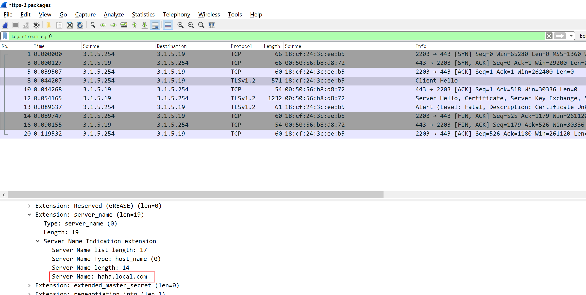

# TLS (SSL)


<!-- @import "[TOC]" {cmd="toc" depthFrom=1 depthTo=6 orderedList=false} -->

<!-- code_chunk_output -->

- [TLS (SSL)](#tls-ssl)
    - [概述](#概述)
      - [1.TLS (SSL): transport layer security](#1tls-ssl-transport-layer-security)
      - [2.有两个阶段](#2有两个阶段)
        - [(1) 握手 (handshake)](#1-握手-handshake)
        - [(2) 加密传输应用层数据 (Application Data)](#2-加密传输应用层数据-application-data)
      - [3.frame格式](#3frame格式)
        - [(1) Content type](#1-content-type)
      - [3.TLS extensions](#3tls-extensions)
        - [(1) SNI (sever name indication)](#1-sni-sever-name-indication)
        - [(2) ALPN (Application-Layer Protocol Negotiation)](#2-alpn-application-layer-protocol-negotiation)
    - [使用](#使用)
      - [1.解析TLS流量](#1解析tls流量)
        - [（1）利用ssl-key-log解析](#1利用ssl-key-log解析)
        - [（2）利用private key（不通用）](#2利用private-key不通用)

<!-- /code_chunk_output -->


### 概述

[参考](https://peelingrage.netlify.app/demystifying-tls/)


#### 1.TLS (SSL): transport layer security

* TLS: tansport layer security
* SSL: secure socket layer
* TLS是SSL的继承者（增强版），SSL已经淘汰

#### 2.有两个阶段


##### (1) 握手 (handshake)
* Hello
    * 交换必要的信息 并 协商
        * 交换随机数
        * client声明自己支持的cipher suits（加密套件）
            * server会选择其中一种cipher suit（用于后续的加密，即change cipher spec后使用该方式加密）
        * 等等
    * server将 公钥 发给 client
* client key exchange
    * 将client key（client key的类型根据cipher suit类型确定），通过公钥加密发给server
        * 用于生成session key
* change cipher spec
    * 更换加密方式（在Hello阶段协商出的cipher suit）
        * 默认的cipher suit:
            * session key（即密钥）通过server random，client random和client key临时生成的，所以不需要传递给对方
            * 由于使用使用了随即数，所以session key不固定
            * 这种方式在sever端无法进行抓包解密，因为session key是不固定
        * RSA cipher suit:
            * session key用的是client key和servce的公钥，是固定的，不是临时生成的
            * 这种方式在sever端能够进行抓包，然后用私钥解密


##### (2) 加密传输应用层数据 (Application Data)

#### 3.frame格式


##### (1) Content type
常见的Context type:

|Context type|description|
|-|-|
|Handshake|用于协商|
|ChangeCipherSpec|用于切换加密方式|
|Application Data|加密传输应用层数据|

#### 3.TLS extensions

用于在握手阶段，添加相应的功能，常用的extensions

##### (1) SNI (sever name indication)
* 用于标识访问的主机名
  * 服务端会根据这个主机名，选择相应的virtual server，从而可以使用不同的配置（比如不同的证书）
  * SNI要和证书里的CN符合（即访问的主机名在证书的CN列表中），不然客户端会认为不安全



##### (2) ALPN (Application-Layer Protocol Negotiation)
* 用于协商应用层的协议
    * 当应用层协议为http2时，会在TLS中使用该extension

***

### 使用

#### 1.解析TLS流量

##### （1）利用ssl-key-log解析
只能解析客户端的TLS（即在抓取客户端的包，利用客户端的ssl-key log）
```shell
ssldump -i eth0 -dnq -l /tmp/ssl-key.log port 443
```
结果如下
```
...
1 11   0.1172   (0.0001)    C>S    application_data
      ---------------------------------------------------------------
      GET / HTTP/1.1
      User-Agent: curl/7.29.0
      Host: 10.172.1.207
      Accept: */*

      ---------------------------------------------------------------
1 12   0.1174   (0.0001)    S>C    application_data
      ---------------------------------------------------------------
      HTTP/1.1 200 OK
      Server: nginx/1.20.1
      Date: Fri, 13 May 2022 08:53:00 GMT
      Content-Type: text/html
      Content-Length: 4
      Last-Modified: Fri, 13 May 2022 08:02:13 GMT
      Connection: keep-alive
      ETag: "627e1085-4"
      Accept-Ranges: bytes

      aaa
      ---------------------------------------------------------------
...
```
* 发起https请求
```shell
SSLKEYLOGFILE="/tmp/ssl-key.log" curl --insecure https://10.172.1.207:443
```

##### （2）利用private key（不通用）
We can only decrypt TLS/SSL packet data if RSA keys are used to encrypt the data.因为很多并没有用RSA进行加密，而是利用RSA进密钥传递，然后用该密钥加密数据，所以导致无法用private key解密数据。

根据serverhello中的Cipher Suite类型，当使用的是DHE或者RSA ephemeral cipher suite等，就不能用私钥进行https解密

* 建议使用wireshark解析，使用ssldump解析可能会有问题
```shell
ssldump -i eth0 -dnq -k <server.key> port 443
```
