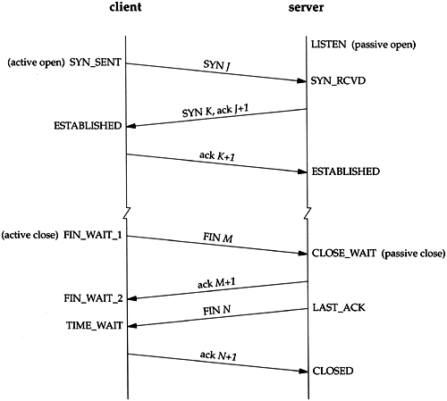

[toc]
# tcp
### 基础
#### 1.tcp中用序列号标识数据段
* 所以序列号是**递增**的，当恢复ACK=n时，表示序列号**小于等于n的数据段**都收到了
* 当**数据段长度为0**时，即只有头部，没有数据时，回复的ACK序列号就**不用增加**
* 在**建立连接**和**断开连接**阶段，为什么**ACK序列号都加1**，这是协议中定义的规定

#### 2.TCP11中状态

#### 3.tcp receive window（影响网络传输性能）
* tcp接收缓冲区，用于缓冲还没有被应用处理的数据
* tcp hearder中会包含window size字段，告诉对方，自己还能接收多少字节的数据
  * 即对方就知道发送多少数据合适了，当发送数据后
  * 本地接收到数据，会返回一个acknowledgment报文，header中同样包含window size字段
