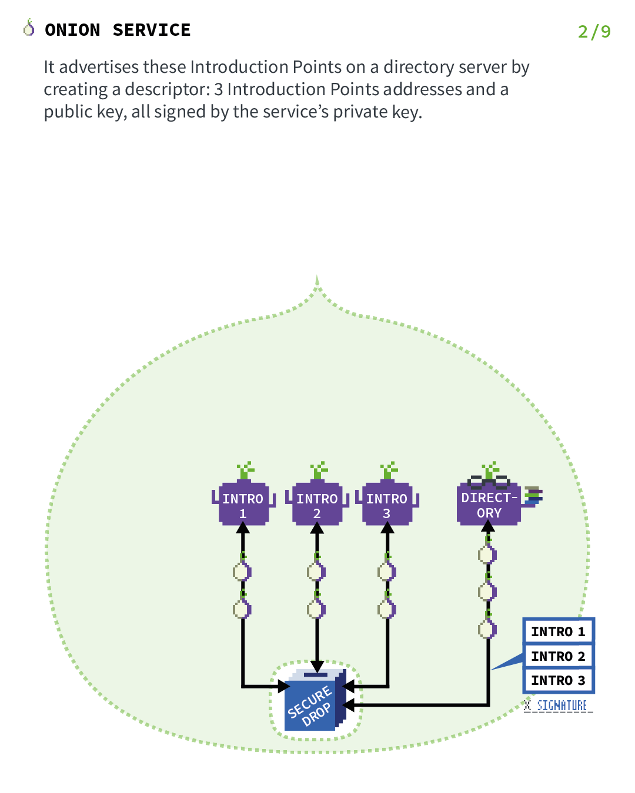
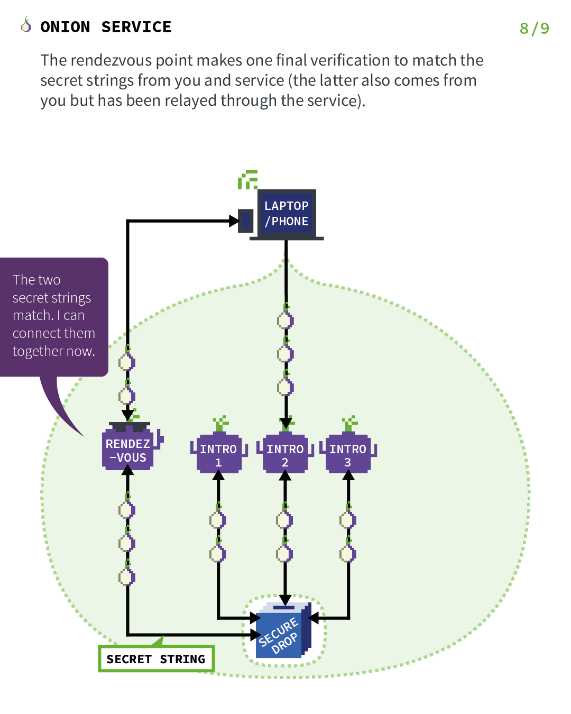
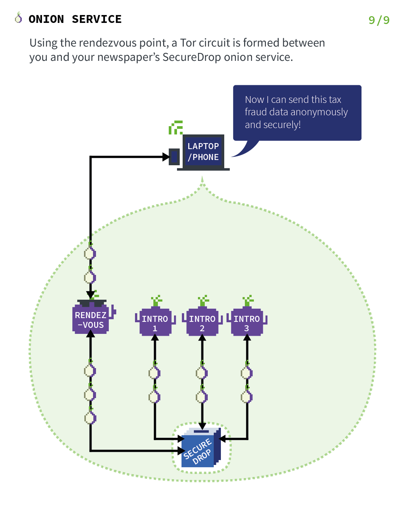
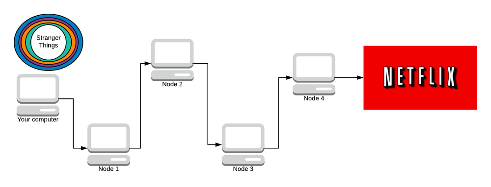
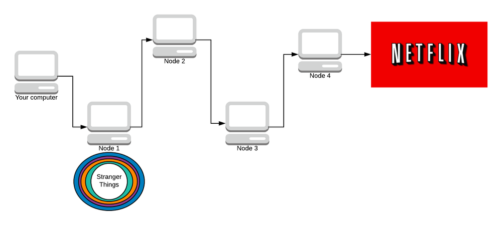

# onion routing

<!-- @import "[TOC]" {cmd="toc" depthFrom=1 depthTo=6 orderedList=false} -->

<!-- code_chunk_output -->

- [onion routing](#onion-routing)
    - [概述](#概述)
      - [1.relay (node)的类型](#1relay-node的类型)
        - [(1) entry (guard) relay](#1-entry-guard-relay)
        - [(2) middle relay](#2-middle-relay)
        - [(3) exit relay](#3-exit-relay)
        - [(4) bridge](#4-bridge)
        - [(5) directory relay](#5-directory-relay)
        - [(6) HSDir (hidden service directory) relay](#6-hsdir-hidden-service-directory-relay)
      - [2.发布hidden service](#2发布hidden-service)
        - [(1) 设置introduction points](#1-设置introduction-points)
      - [(2) 发布descriptor](#2-发布descriptor)
      - [3.访问hidden service](#3访问hidden-service)
        - [(1) 获取onion address](#1-获取onion-address)
        - [(2) 获取descriptor](#2-获取descriptor)
        - [(3) 选择rendezvous point](#3-选择rendezvous-point)
        - [(4) 通过rendezvous point进行连接](#4-通过rendezvous-point进行连接)
      - [4.原理概述](#4原理概述)
      - [5.缺陷](#5缺陷)
        - [(1) 速度慢](#1-速度慢)
        - [(2) 不是绝对的隐秘](#2-不是绝对的隐秘)

<!-- /code_chunk_output -->

### 概述

[参考](https://skerritt.blog/how-does-tor-really-work/#%F0%9F%A4%BA-attacks-on-tor)

#### 1.relay (node)的类型

##### (1) entry (guard) relay
* client连接的第一个节点
* 该节点知道的信息
    * 发起请求的源地址
    * 下一个节点的地址
* 不知道的信息
    * 最终的目标地址
    * 数据内容

##### (2) middle relay
* 负责转发节点的请求（是TOR circuit上的非entry和exit relay），用于隐匿数据的来源和去向
* 该节点知道的信息
    * 上一个节点的地址
    * 下一个节点的地址
* 不知道的信息
    * 发起请求的源地址
    * 最终的目标地址
    * 数据内容

##### (3) exit relay
* 数据包离开tor network，访问最终的目标地址
* 该节点知道的信息
    * 上一个节点的地址
    * 最终的目标地址
    * 数据内容
* 不知道的信息
    * 发起请求的源地址

##### (4) bridge
* 没有在direcotory relay中列出的节点（防止被政府机构获知，从而被禁止）
* 用户可以连接到bridge上，从而连接到tor network，这样政府机构就不知道用户连接到了tor network中

##### (5) directory relay
* 提供directory service
    * 负责维护正在运行的节点的列表
* flag: Authority

##### (6) HSDir (hidden service directory) relay
* 提供hidden service directory service
    * 负责维护DHT（分布式哈希表）
        * key: `<public_key_encode>.onion`
            * key就是hidden service的onion address，比如: `vww6ybal4bd7szmgncyruucpgfkqahzddi37ktceo3ah7ngmcopnpyyd.onion`
        * value: service desciptor
* flag: HSDir

#### 2.发布hidden service

当需要提供一个hidden service，需要进行以下步骤，[参考](https://community.torproject.org/onion-services/overview/)

##### (1) 设置introduction points
* 与一批relays通信，需要其中三个作为introdution points
* introduction points到hidden service需要经过两个relay
    * 所以introduction points不知道hidden service具体的位置

#### (2) 发布descriptor
* 包含的内容:
    * introduction points信息
    * authentication keys
* 用私钥对这些内容进行加密
* 将descriptor发布到DHT（即directory节点维护的）
    * key: 公钥 encode
    * value: descriptor

#### 3.访问hidden service

[参考](https://community.torproject.org/onion-services/overview/)

##### (1) 获取onion address
* client需要获取hidden service的相应的onion address
    * 比如: `vww6ybal4bd7szmgncyruucpgfkqahzddi37ktceo3ah7ngmcopnpyyd.onion`

##### (2) 获取descriptor
* client根据onion address，去directory节点中获取相应的descriptor
* 用公钥验证descriptor
    * 公钥通过onion address进行decode获得
* 获取descriptor中的信息
    * introduction points信息

##### (3) 选择rendezvous point
* 选择一个relay作为rendezvous point
    * 发送"one-time secret"给他
* 连接一个introduction point
    * 发送 rendezvous point信息 和 "one-time secret" 给他
    * introduction point把rendezvous point信息 和 "one-time secret" 发送给 hidden service
    * hidden service会判断你是否可信

##### (4) 通过rendezvous point进行连接
* hiddent service用"one-time secret"连接到rendezvous point，从而建立和client之间的连接

#### 4.原理概述
* client从directory node获取节点信息，然后规划路由路径
* 发送请求之前，经过多少节点，就会加密多少层，每一个节点解密一层，直到exit node

#### 5.缺陷

##### (1) 速度慢
* 由于进行多层加密和转发，导致速度会很慢

##### (2) 不是绝对的隐秘 
* 当控制了entry node和exit node
    * 就能够进行追踪，从而无法隐藏踪迹