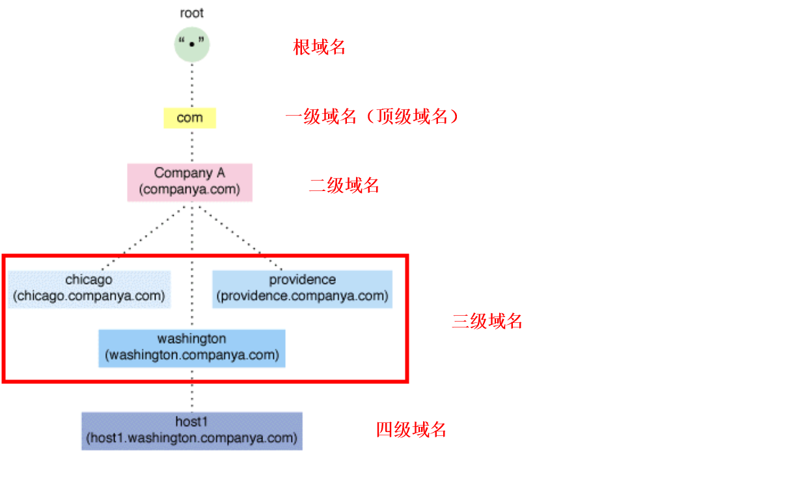
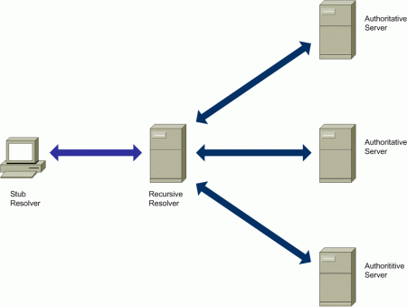

# DNS

<!-- @import "[TOC]" {cmd="toc" depthFrom=1 depthTo=6 orderedList=false} -->
<!-- code_chunk_output -->

- [DNS](#dns)
    - [概述](#概述)
      - [1.域名结构](#1域名结构)
      - [2.基础概念](#2基础概念)
        - [（1）stub resolver（存根解析器）](#1stub-resolver存根解析器)
        - [（2）recursive DNS server（cacheing DNS server，递归DNS）](#2recursive-dns-servercacheing-dns-server递归dns)
        - [（3）authoritative DNS server（权威DNS）](#3authoritative-dns-server权威dns)
        - [（4）forwarding DNS server（转发DNS）](#4forwarding-dns-server转发dns)
      - [3.域名解析时的各项解析记录](#3域名解析时的各项解析记录)
      - [4.DNS的search选项](#4dns的search选项)
      - [5.`/etc/resolv.conf`最多只有3个nameserver生效](#5etcresolvconf最多只有3个nameserver生效)
    - [使用](#使用)
      - [1.`dig`](#1dig)

<!-- /code_chunk_output -->

### 概述

#### 1.域名结构


#### 2.基础概念


##### （1）stub resolver（存根解析器）
是DNS客户端库，用于查询DNS服务器进行解析工作

##### （2）recursive DNS server（cacheing DNS server，递归DNS）
* 递归查询
即本机无法查询到结果，会继续去其他DNS server查询
</br>
* 缓存查询结果

##### （3）authoritative DNS server（权威DNS）
权威DNS服务器，负责维护 指定域 中的域名信息

##### （4）forwarding DNS server（转发DNS）
查询请求转发给另外一台DNS服务器，由另外一台DNS服务器来完成查询请求
* 客户端会自己去 转发到的DNS服务器 查询结果
* 递归服务器会帮忙查询到结果并返回

#### 3.域名解析时的各项解析记录

* A记录
  将域名指向一个IPv4地址
</br>
* AAA记录
  将域名指向一个IPv6地址
</br>
* CNAME记录
  该域名的别名
</br>
* MX记录
指向邮件服务器地址
</br>
* NS记录
域名解析服务器记录
</br>
* TXT记录
  可任意填写，可为空
</br>
* SRV记录
  服务记录(记录了哪台计算机提供了哪个服务)
</br>
* SOA记录
  SOA叫做起始授权机构记录，NS用于标识多台域名解析服务器，SOA记录用于在众多NS记录中那一台是主服务器
</br>
* PTR记录
  PTR记录是A记录的逆向记录，又称做IP反查记录或指针记录，负责将IP反向解析为域名

#### 4.DNS的search选项
```shell
#vim /etc/resolv.conf
nameserver <DNS_SERVER>
search <DOMAIN1> <DOMAIN@>
```
```shell
ping <HOST>
```
* 首先会在本地解析`<HOST>`
* 当本地无法解析时，会去DNS服务器解析`<HOST>`
* 当DNS服务器无法解析`<HOST>`时，会加上search中设置的域，即会尝试去DNS服务器解析`<HOST>.<DOMAIN1>`，`<HOST>.<DOMAIN2>`

#### 5.`/etc/resolv.conf`最多只有3个nameserver生效

***

### 使用

#### 1.`dig`
```shell
dig <SERVER>
    +search         #利用/etc/resolv.conf中的search参数，默认不使用
    -t <TYPE>       #查询指定记录
```
