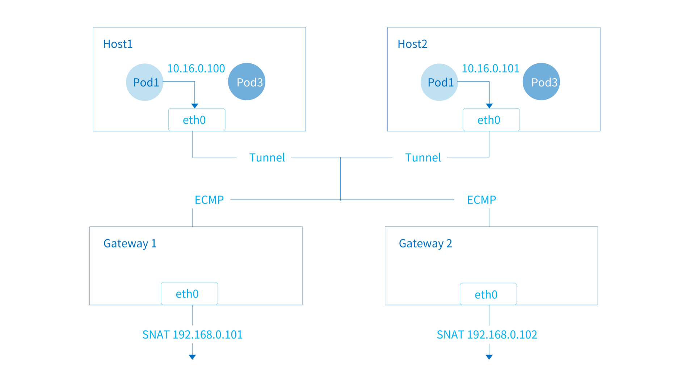

# useage


<!-- @import "[TOC]" {cmd="toc" depthFrom=1 depthTo=6 orderedList=false} -->

<!-- code_chunk_output -->

- [useage](#useage)
    - [客户端命令](#客户端命令)
    - [subnet (OVN中的switch)](#subnet-ovn中的switch)
      - [1.内置subnet](#1内置subnet)
        - [(1) default subnet (安装就存在)](#1-default-subnet-安装就存在)
        - [(2) join subnet](#2-join-subnet)
      - [2.自定义subnet](#2自定义subnet)
      - [3.subnet ACL](#3subnet-acl)
    - [VPC (OVN中的router)](#vpc-ovn中的router)
      - [1.VPC (virtual private cloud)](#1vpc-virtual-private-cloud)
      - [2.创建vpc和subnet](#2创建vpc和subnet)
      - [3.使VPC能够连接外网](#3使vpc能够连接外网)
        - [(1) 安装multus](#1-安装multus)
        - [(2) 创建VPC gateway (即provider网络)](#2-创建vpc-gateway-即provider网络)
        - [(3) 设置路由和SNAT](#3-设置路由和snat)
        - [(4) 设置路由](#4-设置路由)
        - [(5) 验证](#5-验证)
    - [与openstack集成网络](#与openstack集成网络)
      - [1.方法一: 流量都从opentack出](#1方法一-流量都从opentack出)
      - [2.方法二: 流量都从k8s出](#2方法二-流量都从k8s出)

<!-- /code_chunk_output -->

### 客户端命令
[参考](https://kubeovn.github.io/docs/v1.11.x/en/ops/kubectl-ko/)

```shell
kubectl ko --help
#具体命令参考OVN
```

***

### subnet (OVN中的switch)

#### 1.内置subnet

##### (1) default subnet (安装就存在)

* 如果一个namesapce不指定subnet
    * 则默认使用default subnet，即使用default subnet给pod分配地址
    * 比如: pod-cidr为`10.244.0.0/16`，则default subnet就为`10.244.0.0/16`
```shell
 kubectl get subnet ovn-default -o yaml
```

##### (2) join subnet
* 在node上创建一个虚拟网卡`ovn0`，使得node能够与pod通信
    * 类似于vxlan的隧道

```shell
$ kubectl get subnet join -o yaml

#比如pod-cidr(default subnet): 10.244.0.0/16
#join subnet: 100.64.0.0/16
$ ip r

10.244.0.0/16 via 100.64.0.1 dev ovn0 
100.64.0.0/16 dev ovn0 proto kernel scope link src 100.64.0.3
```

#### 2.自定义subnet

* 同一个VPC下的subnet不能有重叠

```yaml
kind: Subnet
apiVersion: kubeovn.io/v1
metadata:
  name: subnet1
spec:
  vpc: ovn-cluster 
  namespaces:
  - test
  cidrBlock: 10.66.0.0/16
  gateway: 10.66.0.1
  #支持的模式: distributed和centralized
  gatewayType: distributed
  #是否做SNAT，能够隐藏原始ip
  natOutgoing: false

  #excludeIps:
  #- 10.172.1.1..10.172.1.51
  #- 10.172.1.58..10.172.1.254
```

* 查看subnet是否创建成功
  * 如果配置正确但未成功，重启 ovn-controller
```shell
kubectl get subnet
#看V4AVAILABLE是否有可用地址，如果没有证明创建的有问题
```

* distributed gateway
  * 每个节点都是一个gateway
  
* centralized gateway
  * 加上natOutgoing 就能固定外出的ip
  
  ```yaml
  gatewayType: centralized
  gatewayNode: "node1,node2"
  #gatewayNode: "kube-ovn-worker:172.18.0.2, kube-ovn-control-plane:172.18.0.3"
  ```

#### 3.subnet ACL

* [match规则](https://man7.org/linux/man-pages/man5/ovn-sb.5.html#Logical_Flow_TABLE)

```yaml
#允许10.10.0.2访问所有地址，不能其他地址访问10.10.0.2
apiVersion: kubeovn.io/v1
kind: Subnet
metadata:
  name: acl
spec:
  acls:
    - action: drop
      direction: to-lport
      match: ip4.dst == 10.10.0.2 && ip
      priority: 1002
    - action: allow-related
      direction: from-lport
      match: ip4.src == 10.10.0.2 && ip
      priority: 1002
  cidrBlock: 10.10.0.0/24
```

***

### VPC (OVN中的router)

#### 1.VPC (virtual private cloud)
* VPC之间网络隔离
  * Subnet
  * routing policies
  * security policies
  * outbound gateways
  * EIP
  * 等等

#### 2.创建vpc和subnet

* VPC
```yaml
kind: Vpc
apiVersion: kubeovn.io/v1
metadata:
  name: vpc-test
spec:
  namespaces:
    - net1
```

* subnet
```yaml
kind: Subnet
apiVersion: kubeovn.io/v1
metadata:
  name: net1
spec:
  vpc: vpc-test
  namespaces:
    - net1
  cidrBlock: 10.68.0.0/24
```

* 查看subnet是否创建成功
  * 如果配置正确但未成功，重启 ovn-controller
```shell
kubectl get subnet
#看V4AVAILABLE是否有可用地址，如果没有证明创建的有问题
```

#### 3.使VPC能够连接外网

##### (1) 安装multus
[参考](https://github.com/k8snetworkplumbingwg/multus-cni/blob/master/docs/how-to-use.md)

##### (2) 创建VPC gateway (即provider网络)

* 创建subnet
  * 该subnet是物理网络，用于给VPC gateway设置网络
    * 所以已经被使用的地址，要在这里排除掉，防止出现冲突 
```yaml
apiVersion: kubeovn.io/v1
kind: Subnet
metadata:
  name: ovn-vpc-external-network
spec:
  protocol: IPv4
  provider: ovn-vpc-external-network.kube-system
  cidrBlock: 10.172.1.0/24
  gateway: 10.172.1.254  # IP address of the physical gateway
  excludeIps:
  - 10.172.1.1..10.172.1.51
  - 10.172.1.58..10.172.1.254
```

* 往pod中添加一个macvlan类型的网卡
  * 指定使用上面创建的subnet
  * 指定物理网卡（比如: `eth0`）
    * 虚拟网卡（子网卡）不能访问母网卡的地址
    * 如果有两张物理网卡且在同一网段内，用第二张网卡进行macvlan不生效（猜测是这个原因，待验证）
    * 物理网卡的要求
      * 对于openstack VM，则需要disable port security
      * 对于VMware，则MAC Address Changes, Forged Transmits and Promiscuous Mode Operation should be set to allow
      * [更多](https://kubeovn.github.io/docs/v1.11.x/en/guide/vpc/#configuring-the-external-network)

```yaml
apiVersion: "k8s.cni.cncf.io/v1"
kind: NetworkAttachmentDefinition
metadata:
  name: ovn-vpc-external-network
  namespace: kube-system
spec:
  config: '{
      "cniVersion": "0.3.0",
      "type": "macvlan",
      "master": "eth0",
      "mode": "bridge",
      "ipam": {
        "type": "kube-ovn",
        "server_socket": "/run/openvswitch/kube-ovn-daemon.sock",
        "provider": "ovn-vpc-external-network.kube-system"
      }
    }'
```

* enable VPC gateway
```yaml
kind: ConfigMap
apiVersion: v1
metadata:
  name: ovn-vpc-nat-gw-config
  namespace: kube-system
data:
  image: 'docker.io/kubeovn/vpc-nat-gateway:v1.11.11' 
  enable-vpc-nat-gw: 'true'
```

* 部署vpc nat gateway
  * 可以绑定到具体的节点上
  * 如果不生效重启一下
```yaml
kind: VpcNatGateway
apiVersion: kubeovn.io/v1
metadata:
  name: gw-test
spec:
  vpc: vpc-test   #指定VPC
  subnet: net1    #指定subnet
  lanIp: 10.68.0.254  #未被使用的地址
  selector:
    - "kubernetes.io/os: linux"
    - "kubernetes.io/hostname: master-1"
```

* 验证

```shell
$ kubectl exec -n kube-system -it vpc-nat-gw-gw-test-0 -- /bin/bash

#存在一个bug, net1 arp可能没有开启，需要enable一下
# ip a查看net1是否存在NOARP标志
$ ip link set net1 arp on

#查看地址
$ ip a

#多出一张net1网卡，配置了物理网络地址
1: lo: <LOOPBACK,UP,LOWER_UP> mtu 65536 qdisc noqueue state UNKNOWN group default qlen 1000
    link/loopback 00:00:00:00:00:00 brd 00:00:00:00:00:00
    inet 127.0.0.1/8 scope host lo
       valid_lft forever preferred_lft forever
    inet6 ::1/128 scope host 
       valid_lft forever preferred_lft forever
2: net1@if2: <BROADCAST,MULTICAST,UP,LOWER_UP> mtu 1450 qdisc noqueue state UNKNOWN group default 
    link/ether f2:7f:64:5c:b2:8e brd ff:ff:ff:ff:ff:ff link-netnsid 0
    inet 10.172.1.53/24 brd 10.172.1.255 scope global net1
       valid_lft forever preferred_lft forever
    inet6 dd00:4191:d066:1:f07f:64ff:fe5c:b28e/64 scope global dynamic mngtmpaddr 
       valid_lft 86362sec preferred_lft 14362sec
    inet6 fe80::f07f:64ff:fe5c:b28e/64 scope link 
       valid_lft forever preferred_lft forever
14: eth0@if15: <BROADCAST,MULTICAST,UP,LOWER_UP> mtu 1350 qdisc noqueue state UP group default 
    link/ether 00:00:00:cd:90:6d brd ff:ff:ff:ff:ff:ff link-netnsid 0
    inet 10.68.0.254/24 brd 10.68.0.255 scope global eth0
       valid_lft forever preferred_lft forever
    inet6 fe80::200:ff:fecd:906d/64 scope link 
       valid_lft forever preferred_lft forever

#测试网络连通

#ping 物理网关
$ ping 10.172.1.254

#ping 外网
$ ping 8.8.8.8
```

##### (3) 设置路由和SNAT

* 设置EIP
```yaml
kind: IptablesEIP
apiVersion: kubeovn.io/v1
metadata:
  name: eips01
spec:
  natGwDp: gw-test  #网关名
```

* 设置SNAT

```yaml
kind: IptablesSnatRule
apiVersion: kubeovn.io/v1
metadata:
  name: snat01
spec:
  eip: eips01
  internalCIDR: 10.68.0.0/24
```

* 查看
```shell
$ kubectl get iptables-eips

$ kubectl exec -n kube-system -it vpc-nat-gw-gw-test-0 -- /bin/bash

$ ip a
#能够看到分配

$ iptables -t nat -nL
#能够看到设置的snat
```

##### (4) 设置路由
* 设置路由
```yaml
kind: Vpc
apiVersion: kubeovn.io/v1
metadata:
  name: vpc-test
spec:
  namespaces:
    - net1
  staticRoutes:
  - cidr: 0.0.0.0/0
    nextHopIP: 10.68.0.254  #NAT gateway的地址
    policy: policyDst
```

##### (5) 验证
```yaml
apiVersion: v1
kind: Pod
metadata:
  name: ubuntu
  namespace: net1
spec:
  containers:
    - image: docker.io/kubeovn/kube-ovn:v1.8.0
      command:
        - "sleep"
        - "604800"
      imagePullPolicy: IfNotPresent
      name: ubuntu
  restartPolicy: Always
```

```shell
#查看路由
#此时默认路由并不是指定10.68.0.254，这没问题
$ ip r
$ ping 8.8.8.8
```

***

### 与openstack集成网络

#### 1.方法一: 流量都从opentack出

* 设置snat
```shell
kubectl-ko nbctl lr-nat-list <router>
kubectl-ko nbctl lr-nat-add <router> snat <EXTERNAL_IP> <LOGICAL_IP>
```

* EIP通过nat实现
```shell
$ kubectl-ko nbctl lr-nat-list <router>

TYPE             EXTERNAL_IP        EXTERNAL_PORT    LOGICAL_IP            EXTERNAL_MAC         LOGICAL_PORT
dnat_and_snat    10.172.1.51                         3.1.5.116

$ kubectl-ko nbctl lr-nat-add <router> dnat_and_snat <EXTERNAL_IP> <LOGICAL_IP>
```

#### 2.方法二: 流量都从k8s出

参考 使VPC能够连接外网，额外的配置

* 在路由器上添加路由
```shell
kubectl-ko nbctl lr-route-add 100c2ac6-382b-4708-a8f6-4e97bed4e11c 0.0.0.0/0 10.67.0.254 
```

* 在NAT gateway中设置openstack网段的SNAT
```yaml
kind: IptablesSnatRule
apiVersion: kubeovn.io/v1
metadata:
  name: snat02-1
spec:
  eip: eips02
  internalCIDR: 3.1.5.0/24
```

* 在NAT gateway中设置openstack网段的路由
```shell
ip r add 3.1.5.0/24 via 10.67.0.1 dev eth0
```