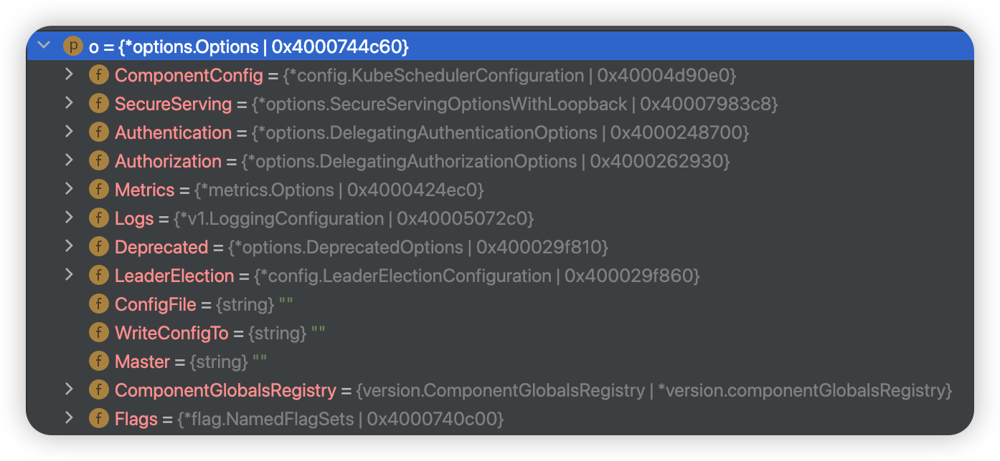

# kube-scheduler


<!-- @import "[TOC]" {cmd="toc" depthFrom=1 depthTo=6 orderedList=false} -->

<!-- code_chunk_output -->

- [kube-scheduler](#kube-scheduler)
    - [setup a scheduler](#setup-a-scheduler)
      - [1.new scheduler](#1new-scheduler)
        - [(1) config](#1-config)
    - [run scheduler](#run-scheduler)
      - [1.run basic services](#1run-basic-services)

<!-- /code_chunk_output -->


### setup a scheduler

* Setup creates a completed config and a scheduler based on the command args and options

```go
cc, sched, err := Setup(ctx, opts, registryOptions...)
```

```go
// set defaults using scheme defaultFunc
cfg, err := latest.Default()

// componentConfig is the config of the current component(e.g. kubeScheduler) 
opts.ComponentConfig = cfg

// set command config, including
//   common config: client, EventBroadcaster, InformerFactory, DynInformerFactory
//   ComponentConfig
c, err := opts.Config(ctx)

// make the config completed
//   grant apiserver authrization to it
cc := c.Complete()

/*
set up the scheduler and complement some configs, such as 
    * add informers to informer factory
    * add eventhandlers
*/
sched, err := scheduler.New(ctx,
        cc.Client,
        cc.InformerFactory,
        cc.DynInformerFactory,
        recorderFactory,
        scheduler.WithComponentConfigVersion(cc.ComponentConfig.TypeMeta.APIVersion),
        scheduler.WithKubeConfig(cc.KubeConfig),
        scheduler.WithProfiles(cc.ComponentConfig.Profiles...),
        scheduler.WithPercentageOfNodesToScore(cc.ComponentConfig.PercentageOfNodesToScore),
        scheduler.WithFrameworkOutOfTreeRegistry(outOfTreeRegistry),
        scheduler.WithPodMaxBackoffSeconds(cc.ComponentConfig.PodMaxBackoffSeconds),
        scheduler.WithPodInitialBackoffSeconds(cc.ComponentConfig.PodInitialBackoffSeconds),
        scheduler.WithPodMaxInUnschedulablePodsDuration(cc.PodMaxInUnschedulablePodsDuration),
        scheduler.WithExtenders(cc.ComponentConfig.Extenders...),
        scheduler.WithParallelism(cc.ComponentConfig.Parallelism),
        scheduler.WithBuildFrameworkCapturer(func(profile kubeschedulerconfig.KubeSchedulerProfile) {
            // Profiles are processed during Framework instantiation to set default plugins and configurations. Capturing them for logging
            completedProfiles = append(completedProfiles, profile)
        }),
    )
```

#### 1.new scheduler

##### (1) config

* Options
    * General command-line arguments or configuration settings passed to the Kubernetes scheduler
    * Options has **all** the params needed to run a Scheduler
    
* schedulerOptions
    * global configuration options for schedulers
        * kube-scheduler may have multiple shedulers and the default is default-scheduler
* KubeSchedulerProfile
    * a specific configuration option for a specific sheduler
    * SchedulerName is the name of the scheduler associated to this profile.
	* If SchedulerName matches with the pod's "spec.schedulerName", then the pod is scheduled with this profile.


```go
func New(ctx context.Context,
    client clientset.Interface,
    informerFactory informers.SharedInformerFactory,
    dynInformerFactory dynamicinformer.DynamicSharedInformerFactory,
    recorderFactory profile.RecorderFactory,
    opts ...Option) (*Scheduler, error) {
    

    // set default options
    options := defaultSchedulerOptions

    // set custom options
    for _, opt := range opts {
        opt(&options)
    }
}
```

***

### run scheduler

#### 1.run basic services

```go
// Start events processing pipeline.
cc.EventBroadcaster.StartRecordingToSink(ctx.Done())
defer cc.EventBroadcaster.Shutdown()

// Start up the healthz server.
// ...

// start informerss
startInformersAndWaitForSync := func(ctx context.Context) {
    // Start all informers.
    cc.InformerFactory.Start(ctx.Done())
    // DynInformerFactory can be nil in tests.
    if cc.DynInformerFactory != nil {
        cc.DynInformerFactory.Start(ctx.Done())
    }

    // WaitForCacheSync blocks until all started informers' caches were synced
    cc.InformerFactory.WaitForCacheSync(ctx.Done())
    // DynInformerFactory can be nil in tests.
    if cc.DynInformerFactory != nil {
        cc.DynInformerFactory.WaitForCacheSync(ctx.Done())
    }

    // Wait for all handlers to sync (all items in the initial list delivered) before scheduling.
    if err := sched.WaitForHandlersSync(ctx); err != nil {
        logger.Error(err, "waiting for handlers to sync")
    }

    close(handlerSyncReadyCh)
    logger.V(3).Info("Handlers synced")
}
if !cc.ComponentConfig.DelayCacheUntilActive || cc.LeaderElection == nil {
    startInformersAndWaitForSync(ctx)
}

// start scheduler
sched.Run(ctx)
```