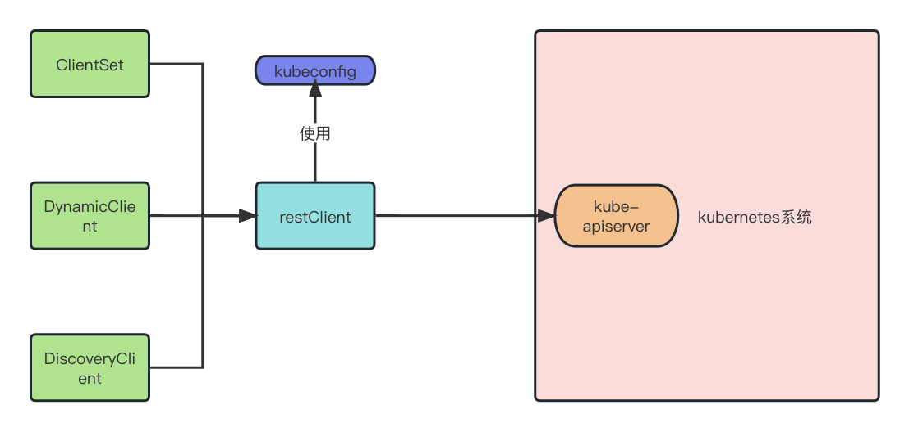

# client


<!-- @import "[TOC]" {cmd="toc" depthFrom=1 depthTo=6 orderedList=false} -->

<!-- code_chunk_output -->

- [client](#client)
    - [Overview](#overview)
      - [1.what](#1what)
        - [(1) restclient (foundamental client)](#1-restclient-foundamental-client)
        - [(2) Clientset (including DiscoveryClient)](#2-clientset-including-discoveryclient)
        - [(3) dynamic client](#3-dynamic-client)
      - [2.create a clientset](#2create-a-clientset)
        - [(4) difference between clientset vs dynamic client](#4-difference-between-clientset-vs-dynamic-client)

<!-- /code_chunk_output -->


### Overview



#### 1.what

##### (1) restclient (foundamental client)
* `staging/src/k8s.io/client-go/rest/client.go`
```go
type Interface interface {
    GetRateLimiter() flowcontrol.RateLimiter
    Verb(verb string) *Request
    Post() *Request
    Put() *Request
    Patch(pt types.PatchType) *Request
    Get() *Request
    Delete() *Request
    APIVersion() schema.GroupVersion
}
```

##### (2) Clientset (including DiscoveryClient)
* DiscoveryClient
```go
type DiscoveryClient struct {
    restClient restclient.Interface

    LegacyPrefix string
    // Forces the client to request only "unaggregated" (legacy) discovery.
    UseLegacyDiscovery bool
}
```
* Clientset

```go
// Clientset contains the clients for groups.
type Clientset struct {
    *discovery.DiscoveryClient
    admissionregistrationV1       *admissionregistrationv1.AdmissionregistrationV1Client
    admissionregistrationV1alpha1 *admissionregistrationv1alpha1.AdmissionregistrationV1alpha1Client
    admissionregistrationV1beta1  *admissionregistrationv1beta1.AdmissionregistrationV1beta1Client
    internalV1alpha1              *internalv1alpha1.InternalV1alpha1Client
    appsV1                        *appsv1.AppsV1Client
    appsV1beta1                   *appsv1beta1.AppsV1beta1Client
    appsV1beta2                   *appsv1beta2.AppsV1beta2Client
    authenticationV1              *authenticationv1.AuthenticationV1Client
    authenticationV1alpha1        *authenticationv1alpha1.AuthenticationV1alpha1Client
    authenticationV1beta1         *authenticationv1beta1.AuthenticationV1beta1Client
    authorizationV1               *authorizationv1.AuthorizationV1Client
    authorizationV1beta1          *authorizationv1beta1.AuthorizationV1beta1Client
    autoscalingV1                 *autoscalingv1.AutoscalingV1Client
    autoscalingV2                 *autoscalingv2.AutoscalingV2Client
    autoscalingV2beta1            *autoscalingv2beta1.AutoscalingV2beta1Client
    autoscalingV2beta2            *autoscalingv2beta2.AutoscalingV2beta2Client
    batchV1                       *batchv1.BatchV1Client
    batchV1beta1                  *batchv1beta1.BatchV1beta1Client
    certificatesV1                *certificatesv1.CertificatesV1Client
    certificatesV1beta1           *certificatesv1beta1.CertificatesV1beta1Client
    certificatesV1alpha1          *certificatesv1alpha1.CertificatesV1alpha1Client
    coordinationV1alpha1          *coordinationv1alpha1.CoordinationV1alpha1Client
    coordinationV1beta1           *coordinationv1beta1.CoordinationV1beta1Client
    coordinationV1                *coordinationv1.CoordinationV1Client
    coreV1                        *corev1.CoreV1Client
    discoveryV1                   *discoveryv1.DiscoveryV1Client
    discoveryV1beta1              *discoveryv1beta1.DiscoveryV1beta1Client
    eventsV1                      *eventsv1.EventsV1Client
    eventsV1beta1                 *eventsv1beta1.EventsV1beta1Client
    extensionsV1beta1             *extensionsv1beta1.ExtensionsV1beta1Client
    flowcontrolV1                 *flowcontrolv1.FlowcontrolV1Client
    flowcontrolV1beta1            *flowcontrolv1beta1.FlowcontrolV1beta1Client
    flowcontrolV1beta2            *flowcontrolv1beta2.FlowcontrolV1beta2Client
    flowcontrolV1beta3            *flowcontrolv1beta3.FlowcontrolV1beta3Client
    networkingV1                  *networkingv1.NetworkingV1Client
    networkingV1alpha1            *networkingv1alpha1.NetworkingV1alpha1Client
    networkingV1beta1             *networkingv1beta1.NetworkingV1beta1Client
    nodeV1                        *nodev1.NodeV1Client
    nodeV1alpha1                  *nodev1alpha1.NodeV1alpha1Client
    nodeV1beta1                   *nodev1beta1.NodeV1beta1Client
    policyV1                      *policyv1.PolicyV1Client
    policyV1beta1                 *policyv1beta1.PolicyV1beta1Client
    rbacV1                        *rbacv1.RbacV1Client
    rbacV1beta1                   *rbacv1beta1.RbacV1beta1Client
    rbacV1alpha1                  *rbacv1alpha1.RbacV1alpha1Client
    resourceV1alpha3              *resourcev1alpha3.ResourceV1alpha3Client
    schedulingV1alpha1            *schedulingv1alpha1.SchedulingV1alpha1Client
    schedulingV1beta1             *schedulingv1beta1.SchedulingV1beta1Client
    schedulingV1                  *schedulingv1.SchedulingV1Client
    storageV1beta1                *storagev1beta1.StorageV1beta1Client
    storageV1                     *storagev1.StorageV1Client
    storageV1alpha1               *storagev1alpha1.StorageV1alpha1Client
    storagemigrationV1alpha1      *storagemigrationv1alpha1.StoragemigrationV1alpha1Client
}
```

##### (3) dynamic client

You specify resources by their GroupVersionResource (GVR) instead of using typed interfaces

* `staging/src/k8s.io/client-go/dynamic/interface.go`
```go
type Interface interface {
    Resource(resource schema.GroupVersionResource) NamespaceableResourceInterface
}

type ResourceInterface interface {
    Create(ctx context.Context, obj *unstructured.Unstructured, options metav1.CreateOptions, subresources ...string) (*unstructured.Unstructured, error)
    Update(ctx context.Context, obj *unstructured.Unstructured, options metav1.UpdateOptions, subresources ...string) (*unstructured.Unstructured, error)
    UpdateStatus(ctx context.Context, obj *unstructured.Unstructured, options metav1.UpdateOptions) (*unstructured.Unstructured, error)
    Delete(ctx context.Context, name string, options metav1.DeleteOptions, subresources ...string) error
    DeleteCollection(ctx context.Context, options metav1.DeleteOptions, listOptions metav1.ListOptions) error
    Get(ctx context.Context, name string, options metav1.GetOptions, subresources ...string) (*unstructured.Unstructured, error)
    List(ctx context.Context, opts metav1.ListOptions) (*unstructured.UnstructuredList, error)
    Watch(ctx context.Context, opts metav1.ListOptions) (watch.Interface, error)
    Patch(ctx context.Context, name string, pt types.PatchType, data []byte, options metav1.PatchOptions, subresources ...string) (*unstructured.Unstructured, error)
    Apply(ctx context.Context, name string, obj *unstructured.Unstructured, options metav1.ApplyOptions, subresources ...string) (*unstructured.Unstructured, error)
    ApplyStatus(ctx context.Context, name string, obj *unstructured.Unstructured, options metav1.ApplyOptions) (*unstructured.Unstructured, error)
}

type NamespaceableResourceInterface interface {
    Namespace(string) ResourceInterface
    ResourceInterface
}
```

#### 2.create a clientset
```go
import (
    clientset "k8s.io/client-go/kubernetes"
)

// createClients creates a kube client and an event client from the given kubeConfig
func createClients(kubeConfig *restclient.Config) (clientset.Interface, clientset.Interface, error) {
    client, err := clientset.NewForConfig(restclient.AddUserAgent(kubeConfig, "xx"))
    if err != nil {
        return nil, nil, err
    }

    eventClient, err := clientset.NewForConfig(kubeConfig)
    if err != nil {
        return nil, nil, err
    }

    return client, eventClient, nil
}
```

```go
func NewForConfig(c *rest.Config) (*Clientset, error) {
    configShallowCopy := *c

    if configShallowCopy.UserAgent == "" {
        configShallowCopy.UserAgent = rest.DefaultKubernetesUserAgent()
    }

    // share the transport between all clients
    httpClient, err := rest.HTTPClientFor(&configShallowCopy)
    if err != nil {
        return nil, err
    }

    return NewForConfigAndClient(&configShallowCopy, httpClient)
}
```

##### (4) difference between clientset vs dynamic client
* Clientsets provide a strongly-typed way to interact with **standard** Kubernetes resources, which **can't discover CRD**
```go
import (
    corev1 "k8s.io/api/core/v1"
)

pod := &corev1.Pod{
    ObjectMeta: metav1.ObjectMeta{
        Name: "my-pod",
    },
    Spec: corev1.PodSpec{
        Containers: []corev1.Container{
            {
                Name:  "my-container",
                Image: "nginx:latest",
            },
        },
    },
}

createdPod, err := clientset.CoreV1().Pods("default").Create(context.Background(), pod, metav1.CreateOptions{})
```
* dynamic client provides flexibility to work with arbitrary or unknown resources
```go
gvr := schema.GroupVersionResource{Group: "", Version: "v1", Resource: "pods"}
// List all Pods in the "default" namespace:
podList, err := dynamicClient.Resource(gvr).Namespace("default").List(context.Background(), v1.ListOptions{})
```