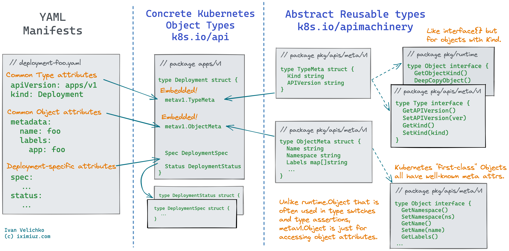
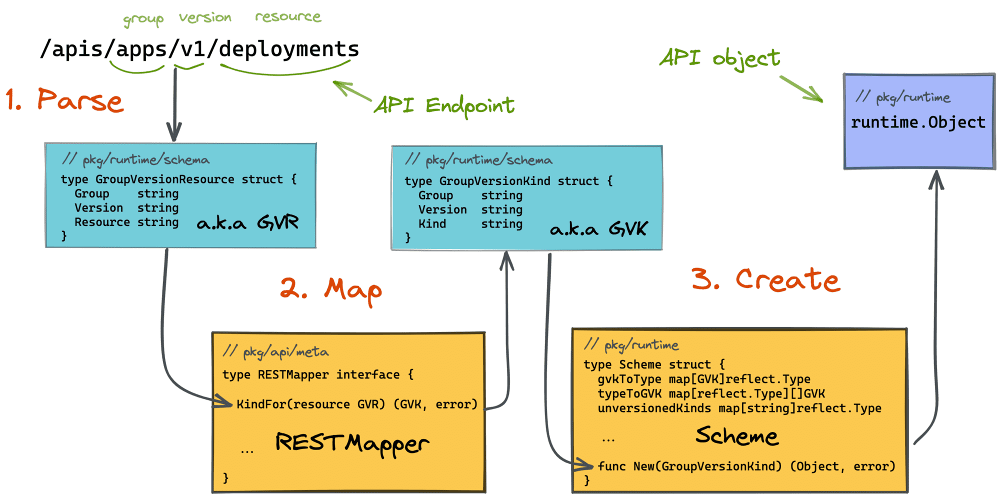

# overview


<!-- @import "[TOC]" {cmd="toc" depthFrom=1 depthTo=6 orderedList=false} -->

<!-- code_chunk_output -->

- [overview](#overview)
    - [overview](#overview-1)
      - [1.basic](#1basic)
        - [(1) Resources and Verbs](#1-resources-and-verbs)
        - [(2) Kind (aka. Object Schemas)](#2-kind-aka-object-schemas)
      - [2.library](#2library)
      - [2.apimachinery pkgs](#2apimachinery-pkgs)
        - [(1) Useful Structs and Interfaces](#1-useful-structs-and-interfaces)
        - [(2) Object Serialization to JSON, YAML, or Protobuf](#2-object-serialization-to-json-yaml-or-protobuf)
        - [(3) Scheme and RESTMapper](#3-scheme-and-restmapper)
        - [(4) Field and Label Selectors](#4-field-and-label-selectors)
        - [(5) API Error Handling](#5-api-error-handling)
        - [(6) Miscellaneous Utils](#6-miscellaneous-utils)

<!-- /code_chunk_output -->


### overview

https://iximiuz.com/en/series/working-with-kubernetes-api/

#### 1.basic

##### (1) Resources and Verbs
* resources
    * a particular instance of some resource kind (loosely, objects of a certain structure)
    * **resource type** 
* verbs
    * actions on these resources

##### (2) Kind (aka. Object Schemas)
In other words, a kind refers to a particular data structure

* Kubernetes data structures that are not resources can have kinds
```yaml
apiVersion: audit.k8s.io/v1
kind: Policy
rules:
- level: Metadata
```
* resources that aren't Kubernetes Objects (i.e., persistent entities) also have kinds
```shell
$ kubectl get --raw /api | python -m json.tool
{
    "kind": "APIVersions",    
    "versions": [
        "v1"
    ],
    ...
}
```

#### 2.library

* `k8s.io/apimachinery`
    * brings lower-level building blocks and common API functionality like serialization, type conversion, or error handling
        *  lower-level data structures: apiVersion, kind, name, uid, ownerReferences, creationTimestamp    

* `k8s.io/api`
    * defines Go structs for the Kubernetes Objects
        * higher-level types like Deployments, Secrets, or Pods
    * summatization:
        * Huge - 1000+ structs describing Kubernetes API objects.
        * Simple - almost no algorithms, only "dumb" data structures.
        * Useful - its data types are used by clients, servers, controllers, etc.

* `client-go`
    * dependencies:
        * `k8s.io/api`
        * `k8s.io/apimachinery`

#### 2.apimachinery pkgs

##### (1) Useful Structs and Interfaces
* `TypeMeta`, `ObjectMeta`
    * pkg: `k8s.io/apimachinery/pkg/apis/meta`
    * the TypeMeta and ObjectMeta structs implement `meta.Type` and `meta.Object` interfaces that can be used to point to any compatible object in a generic way



* `runtime.Object` interface
    * A runtime.Object instance can be pointing to any object with the kind attribute 

* more useful types
    * `PartialObjectMetadata` struct - combination of meta.TypeMeta and meta.ObjectMeta as a generic way to represent any object with metadata.
    * `APIVersions`, `APIGroupList`, `APIGroup` structs - remember the API exploration exercise with kubectl get --raw /apis? These and similar structs are used for types that are Kubernetes API resources, but not Kubernetes Objects (i.e., they have kind and apiVersion attributes but no true Object metadata).
    * `GetOptions`, `ListOptions`, `UpdateOptions`, etc. - these structs represent arguments for the corresponding client action on resources.
    * `GroupKind`, `GroupVersionKind`, `GroupResource`, `GroupVersionResource`, etc. - simple data transfer objects - tuples containing group, version, kind, or resource strings.

##### (2) Object Serialization to JSON, YAML, or Protobuf

```go
// pkg/runtime

// Encoder writes objects to a serialized form
type Encoder interface {
  Encode(obj Object, w io.Writer) error
  Identifier() Identifier
}

// Decoder attempts to load an object from data.
type Decoder interface {
  Decode(
    data []byte,
    defaults *schema.GroupVersionKind,
    into Object
  ) (Object, *schema.GroupVersionKind, error)
}

type Serializer interface {
  Encoder
  Decoder
}
```

##### (3) Scheme and RESTMapper 

* `runtime.Scheme`: Kinds <--> go types
* `RESTMapper`: Kinds <--> resources



##### (4) Field and Label Selectors
* pkg: `k8s.io/apimachinery/pkg/labels`

##### (5) API Error Handling
* pkg: `k8s.io/apimachinery/pkg/api/errors`
* example
```go
_, err = client.
  CoreV1().
  ConfigMaps("default").
  Get(
    context.Background(),
    "this_name_definitely_does_not_exist",
    metav1.GetOptions{},
  )
if !errors.IsNotFound(err) {
  panic(err.Error())
}
```

##### (6) Miscellaneous Utils
* pkg: `apimachinery/pkg/util`
    * `util/wait`: eases the task of waiting for resources to appear or to be gone, with retries and proper backoff/jitter implementation
    * `util/yaml`: unmarshal YAML or convert it into JSON
