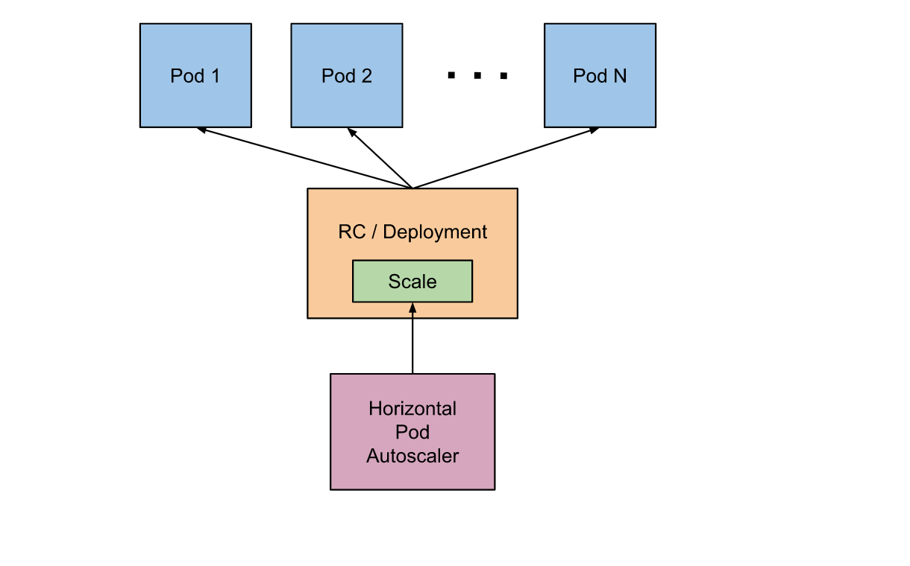

# horizontal pod autoscaler

<!-- @import "[TOC]" {cmd="toc" depthFrom=1 depthTo=6 orderedList=false} -->
<!-- code_chunk_output -->

- [horizontal pod autoscaler](#horizontal-pod-autoscaler)
    - [概述](#概述)
      - [1.HPA可以应用于以下资源](#1hpa可以应用于以下资源)
      - [2.指标的来源](#2指标的来源)
      - [3.算法](#3算法)
        - [（1）contrller manager中关于HPA的配置](#1contrller-manager中关于hpa的配置)
      - [2.服务的要求](#2服务的要求)
    - [使用](#使用)
      - [1.清单文件格式](#1清单文件格式)
        - [（1）有三种metrics来源](#1有三种metrics来源)
      - [2.demo](#2demo)

<!-- /code_chunk_output -->

### 概述


#### 1.HPA可以应用于以下资源
* ReplicaSet
* ReplicationController
* Deployment
* StatefulSet

#### 2.指标的来源
* `metrics.k8s.io`（metrics-server）
* `custom.metrics.k8s.io`
* `external.metrics.k8s.io`

#### 3.算法
```shell
扩缩比 = 当前指标 / 期望指标

#ceil表示进一取整
期望副本数 = ceil[当前副本数 * (当前指标 / 期望指标)]
```

* 忽略的pods：
  * 被删了时间戳的（即正在被删除的）
  * 失败的pods
* 被搁置的pods：
  * 缺失指标的
  * 没有ready的
* 如果有多个指标时，会根据计算出最大的副本数进行扩容，最小的副本数进行缩容
* 当存在被搁置的pods，扩缩比的计算
  * 先把搁置的pods忽略，计算一次扩缩比，这时就会得到扩缩的方向（要么扩大，要么缩小）
  * 再把搁置的pods考虑进去
    * 没有ready的pods认为消耗期望目标的0%
    * 对于扩大，缺失指标的pods认为消耗期望目标的0%
    * 对于缩小，缺失指标的pods认为消耗期望目标的100%
  * 重新计算一次扩缩比，如果扩缩方向与第一次扩缩方向不同，则不做操作，如果扩缩方向相同，则采用新的扩缩比
* 通过`kubectl get hpa`查看到的指标值，没有考虑 被忽略的pods 和 被搁置的pods

##### （1）contrller manager中关于HPA的配置
|配置项|默认值|说明|
|-|-|-|
|`--horizontal-pod-autoscaler-sync-period duration`|15s|HPA多久计算一次决定是否需要扩缩|
|`--horizontal-pod-autoscaler-tolerance`|0.1|扩缩比与1.0的差值，大于这里的值时，才会考虑扩缩容|
|`--horizontal-pod-autoscaler-initial-readiness-delay`|30s|由于技术上无法获取哪些pod已经ready，所以设置一个时间，认为这个时间过后，才认为pod处于ready状态|
|`--horizontal-pod-autoscaler-cpu-initialization-period`|5m0s|当根据CPU进行扩缩容时，经过这个时间后，才认为pod处于ready状态|
|`--horizontal-pod-autoscaler-downscale-stabilization`（缩容相关）|5m0s|当需要缩容时，会看过去指定时间的情况，选择最大的副本数进行缩容，这样能够实现平滑缩容|

#### 2.服务的要求

***

### 使用

#### 1.清单文件格式

```yaml
apiVersion: autoscaling/v2beta2
kind: HorizontalPodAutoscaler
metadata:
  name: <hpa-name>
spec:
  scaleTargetRef:         #指定需要扩缩的资源
    apiVersion: <apiversion>  #比如deployment就是apps/v1
    kind: <Kind>
    name: <resource_name>
  minReplicas: <int>
  maxReplicas: <int>
  metrics: []              #指定根据哪些指标进行扩缩
```

##### （1）有三种metrics来源

* `Resource`类型
```yaml
- type: Resource
  resource:
    name: <metric_name>   #现在只有两种：cpu 或者 memory
    target:                 #定义目标值（即期望值）
      type: <metric_type>      #指定用哪种类型的值去比较，有三种：
                               #Utilization，平均百分比类型（averageUtilization）
                               #AverageValue，平均值类型（averageValue）
                               #注意：pod相关的指标不能使用Value类型，必须使用平均类型
                               #Value，总值类型（value）
      #下面三选一（需要根据上面设置的类型）
      averageUtilization: <desired_value>   #即 所有pods的当前值/所有pods的requests 和 <desired_value> 比较
      averageValue: <desired_value>         #需要单位，即 所有pods的当前值/pods的数量 和 <desired_value> 比较
                                            #需要单位，比如：cpu的单位就是m
      value: <desired_value>                #即 所有pods的当前值 和 <desired_value>比较
```

* `Pods`类型
依赖自定指标，而且要是pods的指标
```yaml
- type: Pods
  pods:
    metric:
      name: <metric_name>       #packets-per-second
    target:
      type: AverageValue                #只支持是AverageValue类型
      averageValue: <desired_value>    #需要单位，即 所有pods的当前值/pods的数量 和 <desired_value> 比较
```

* `Object`类型
依赖自定义指标，自定义指标不仅有pods的指标，还有ingress、service等等，所以下面要指定object的类型
```yaml
- type: Object
  object:
    metric:
      name: <metric_name>
    describedObject:
      apiVersion: <object_apiversion>
      kind: <object_kind>
      name: <object_name>
    target:
      type: metric_type   #只支持：Value 和 AverageValue

      #下面二选一
      value: <desired_value>        #用 指标的值 和 <desired_value>比较
      averageValue: <desired_value> #用 指标的值/pods数量 和 <desired_value>比较
```

#### 2.demo

* 创建demo镜像
```dockerfile
FROM php:5-apache
COPY index.php /var/www/html/index.php
RUN chmod a+rx index.php
```

* `index.php`
```shell
<?php
  $x = 0.0001;
  for ($i = 0; $i <= 1000000; $i++) {
    $x += sqrt($x);
  }
  echo "OK!";
?>
```

* deployment
```yaml
apiVersion: apps/v1
kind: Deployment
metadata:
  name: php-apache
spec:
  selector:
    matchLabels:
      run: php-apache
  replicas: 1
  template:
    metadata:
      labels:
        run: php-apache
    spec:
      containers:
      - name: php-apache
        image: k8s.gcr.io/hpa-example
        ports:
        - containerPort: 80
        resources:
          limits:
            cpu: 500m
          requests:
            cpu: 200m
---
apiVersion: v1
kind: Service
metadata:
  name: php-apache
  labels:
    run: php-apache
spec:
  ports:
  - port: 80
  selector:
    run: php-apache
```

* 创建hpa
```yaml
apiVersion: autoscaling/v2beta2
kind: HorizontalPodAutoscaler
metadata:
  name: php-apache
spec:
  scaleTargetRef:
    apiVersion: apps/v1
    kind: Deployment
    name: php-apache
  minReplicas: 1
  maxReplicas: 10
  metrics:
  - type: Resource
    resource:
      name: cpu
      target:
        type: Utilization
        averageUtilization: 50
```

* 提高负载
```shell
kubectl run -i --tty load-generator --rm --image=busybox --restart=Never -- /bin/sh -c "while sleep 0.01; do wget -q -O- http://php-apache; done"
```
