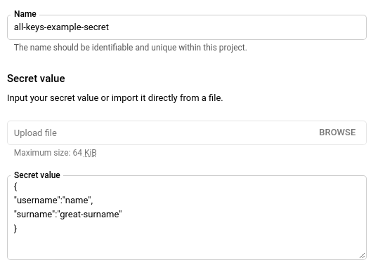

# Secrets


<!-- @import "[TOC]" {cmd="toc" depthFrom=1 depthTo=6 orderedList=false} -->

<!-- code_chunk_output -->

- [Secrets](#secrets)
    - [Secrets](#secrets-1)
      - [1. Secret Kind](#1-secret-kind)
      - [6.Secret Usage](#6secret-usage)
        - [（1）Create Secret](#1create-secret)
        - [（2）get the value of a secret](#2get-the-value-of-a-secret)
    - [External Secrets](#external-secrets)
      - [1.Quick Start](#1quick-start)
        - [(1) Install External Secrets Operator](#1-install-external-secrets-operator)
        - [(2) Create SecretStore (i.e. provider)](#2-create-secretstore-ie-provider)
        - [(3) get the secret](#3-get-the-secret)

<!-- /code_chunk_output -->


### Secrets

#### 1. Secret Kind

* `generic` (Opaque)
* `kubernetes.io/service-account-token`
* `kubernetes.io/dockerconfigjson`
* `kubernetes.io/tls`
* [more](https://kubernetes.io/docs/concepts/configuration/secret/#secret-types)

#### 6.Secret Usage
##### （1）Create Secret
```shell
kubectl create secret <type> <name>
          --from-file=<path>           # file name is key, file content is value
          --from-file=<key>=<path>     # <ket> is key, file content is value
          --from-literal=<key1>=<value1>
```
##### （2）get the value of a secret 
* get data
```shell
kubectl get secret xx -o yaml
```
* decode data
```shell
echo <data> | base64 --decode
```

***

### External Secrets

use external secrets, such as get db passwords from aws secret manager

#### 1.Quick Start

##### (1) Install External Secrets Operator

[ref](https://external-secrets.io/latest/introduction/getting-started/)

##### (2) Create SecretStore (i.e. provider)

* also can create a cluster-wide secret store: `kind: ClusterSecretStore`

```yaml
apiVersion: external-secrets.io/v1beta1
kind: SecretStore
metadata:
  name: secretstore-sample
spec:
  provider:
    aws:
      service: SecretsManager
      region: us-east-1
      auth:
        secretRef:
          accessKeyIDSecretRef:
            name: awssm-secret
            key: access-key
          secretAccessKeySecretRef:
            name: awssm-secret
            key: secret-access-key
```

##### (3) get the secret

```yaml
apiVersion: external-secrets.io/v1beta1
kind: ExternalSecret
metadata:
  name: example
spec:

  # rate SecretManager pulls the secret
  refreshInterval: 1h

  # name of the SecretStore
  secretStoreRef:
    name: secretstore-sample
    kind: SecretStore
  
  # name of the k8s Secret to be created
  target:
    name: secret-to-be-created
    creationPolicy: Owner

  # secret content

  # type 1: map remote key to secret key
  data: []

  # type 2: extract structed value
  dataFrom: []
```

* example
  * secret manger
  

  * type 1
    ```yaml
    - remoteRef:
        key: all-keys-example-secret
      # the key name in the k8s secret
      secretKey: key1
    ```
    * content of `secret-to-be-created` k8s secret
      ```yaml
      key1: | 
        {
        "username":"name",
        "surname":"great-surname"
        }
      ```

  * type 2
    ```yaml
    dataFrom:
    - extract:
        key: all-keys-example-secret  
    ```
    * content of `secret-to-be-created` secret
      ```yaml
      username: "name"
      surname: "great-surname"
      ```