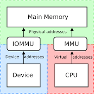

# gpu


<!-- @import "[TOC]" {cmd="toc" depthFrom=1 depthTo=6 orderedList=false} -->

<!-- code_chunk_output -->

- [gpu](#gpu)
    - [gpu passthrough](#gpu-passthrough)
      - [1.开启 VT-D](#1开启-vt-d)
        - [(1) bios开启vt-d](#1-bios开启vt-d)
        - [(2) enbale IOMMU](#2-enbale-iommu)
        - [(3) 检查](#3-检查)
      - [2.禁止加载nvidia driver（跳过）](#2禁止加载nvidia-driver跳过)
      - [3.配置VFIO能够绑定gpu](#3配置vfio能够绑定gpu)
      - [5.修改nova的配置](#5修改nova的配置)
        - [(1) 使用kolla-ansible](#1-使用kolla-ansible)
      - [6.创建flavor](#6创建flavor)
      - [7.创建虚拟机测试 (at least two gpus)](#7创建虚拟机测试-at-least-two-gpus)
        - [(1) 镜像配置（很重要）](#1-镜像配置很重要)
        - [(2) 用该镜像和flavor创建虚拟机](#2-用该镜像和flavor创建虚拟机)

<!-- /code_chunk_output -->


### gpu passthrough

#### 1.开启 VT-D

##### (1) bios开启vt-d
* 在bios中开启 VT-D (virtualization for technology direct I/O access)
    * chipset -> IOO configuration -> vt-d

##### (2) enbale IOMMU
* IOMMU: input–output memory management unit


```shell
#对于intel
GRUB_CMDLINE_LINUX_DEFAULT="intel_iommu=on"

#对于AMD
GRUB_CMDLINE_LINUX_DEFAULT="iommu=pt iommu=1"

$ update-grub
```

##### (3) 检查
```shell
$ dmesg | grep -e "Directed I/O"

[    3.502438] DMAR: Intel(R) Virtualization Technology for Directed I/O
```

#### 2.禁止加载nvidia driver（跳过）
* 不需要禁止，只需要在`/etc/modprobe.d/gpu-vfio.conf`中，指定哪些gpu使用vfio driver
```shell
$ vim /etc/modprobe.d/blacklist-nvidia.conf

#如果有其他driver需要在这里加上
blacklist nouveau
blacklist nvidia
```

#### 3.配置VFIO能够绑定gpu
* VFIO: Virtual Function I/O, VFIO is a device driver that is used to assign devices to virtual machines

* 加载vfio-pci module
    * 新版本的kernel，这个module是built-in的，不需要加载（通过`modinfo vifo-pci`查看）
```shell
$ vim /etc/modules-load.d/modules.conf
...
vfio-pci
```

* 查找显卡的Product ID 以及 Vendor ID
```shell
$ lspci -nn | grep NVIDIA
02:00.0 VGA compatible controller [0300]: NVIDIA Corporation GK107 [GeForce GTX 650] [10de:0fc6] (rev a1)
02:00.1 Audio device [0403]: NVIDIA Corporation GK107 HDMI Audio Controller [10de:0e1b] (rev a1)
```

* 绑定gpu（绑定的gpu就不能用于图形化了）
```shell
$ vim /etc/modprobe.d/gpu-vfio.conf
options vfio-pci ids=10de:0fc6,10de:0e1b
```

* 重启之后验证
```shell
$ lshw -C display

# 查看gpu的driver
```

#### 5.修改nova的配置
```shell
$ vim /etc/kolla/nova-compute/nova.conf

[pci]
passthrough_whitelist: { "vendor_id": "10de", "product_id": "0fc6" }

$ docker restart nova-compute
```
```shell
$ vim /etc/kolla/nova-api/nova.conf

[pci]
alias: { "vendor_id":"10de", "product_id":"0fc6", "device_type":"type-PCI", "name":"geforce-gtx" }
[filter_scheduler]
enabled_filters = PciPassthroughFilter
available_filters = nova.scheduler.filters.all_filters

$ docker restart nova-api
```

```shell
$ vim /etc/kolla/nova-scheduler/nova.conf

[filter_scheduler]
enabled_filters = PciPassthroughFilter
available_filters = nova.scheduler.filters.all_filters

$ docker restart nova-scheduler
```

##### (1) 使用kolla-ansible
```shell
$ vim /etc/kolla/config/nova.conf

[pci]
passthrough_whitelist: { "vendor_id": "10de", "product_id": "0fc6" }
alias: { "vendor_id":"10de", "product_id":"0fc6", "device_type":"type-PCI", "name":"geforce-gtx" }

[filter_scheduler]
enabled_filters = PciPassthroughFilter
available_filters = nova.scheduler.filters.all_filters
```

#### 6.创建flavor
```shell
openstack flavor create \
...
--property "pci_passthrough:alias"="geforce-gtx:1" \
test
# 1表示分配一个gpu
```
* demo
```shell
openstack flavor create --vcpus 8 --ram 16384 --disk 50 gpu/8c/16g --property "pci_passthrough:alias"="geforce-gtx:1"
```

#### 7.创建虚拟机测试 (at least two gpus)

if you have only single gpu and make it passthrough, which will lead to shutdown

##### (1) 镜像配置（很重要）
* 需要设置如下属性，因为NVIDIA drivers do not work in instances with KVM hypervisor signatures
```shell
--property img_hide_hypervisor_id=true
```

##### (2) 用该镜像和flavor创建虚拟机

* 查看hypervisor signatures
```shell
$ apt install cpuid

$ cpuid | grep hypervisor_id

   hypervisor_id = "@  @      "
   hypervisor_id = "@  @      "
   hypervisor_id = "@  @      "
   hypervisor_id = "@  @      "
   hypervisor_id = "@  @      "
   hypervisor_id = "@  @      "
   hypervisor_id = "@  @      "
   hypervisor_id = "@  @      "
```

* 查看gpu
```shell
lshw -C display
```

* 安装driver
```shell
apt install ubuntu-drivers-common
ubuntu-drivers devices
# 安装推荐的驱动
apt install nvidia-driver-470
```

* 重启
```shell
nvidia-smi
```

* 关闭图形化界面
```shell
systemctl set-default multi-user.target
```