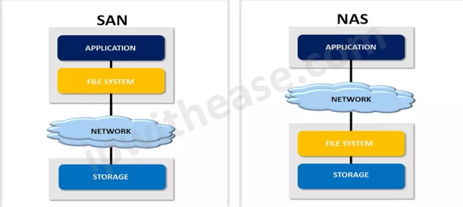

# overview

<!-- @import "[TOC]" {cmd="toc" depthFrom=1 depthTo=6 orderedList=false} -->

<!-- code_chunk_output -->

- [overview](#overview)
    - [概述](#概述)
      - [1.存储虚拟化三类接口](#1存储虚拟化三类接口)
        - [(1) 块接口 (block-level)](#1-块接口-block-level)
        - [(2) 文件接口 (file-level)](#2-文件接口-file-level)
        - [(3) 对象存储接口 (object-level)](#3-对象存储接口-object-level)
      - [2.分布式存储的实现](#2分布式存储的实现)
        - [(1) SAN (storage area network)](#1-san-storage-area-network)
        - [(2) NAS (network attached storage)](#2-nas-network-attached-storage)
        - [(3) 其他实现](#3-其他实现)
        - [(4) SAN和NAS区别](#4-san和nas区别)
      - [3.storage virtualization](#3storage-virtualization)
        - [(1) 说明](#1-说明)

<!-- /code_chunk_output -->

### 概述

#### 1.存储虚拟化三类接口

##### (1) 块接口 (block-level)
* 本地块存储
    * SATA,SAS
    * 本地磁盘阵列(RAID)
* 远程块存储接口
    * 光纤通道
    * iSCSI

##### (2) 文件接口 (file-level)
* 文件系统
* 网络文件系统 (NFS, CIFS, HDFS)
* VFS

##### (3) 对象存储接口 (object-level)
* S3
* openstack swift

#### 2.分布式存储的实现

##### (1) SAN (storage area network)
* 存储服务器通过**专用存储网络**连接，例如光纤通道(FC)或以太网
* 支持的协议:
    * FCP: a mapping of SCSI over Fibre Channel
    * iSCSI: mapping of SCSI over TCP/IP
    * FCoE: Fibre Channel over Ethernet
    * 等等
* 提供 **block-level** 存储

##### (2) NAS (network attached storage)
* 存储服务器通过**通用的网络**来访问，例如以太网
* 支持的协议: 
    * Network File System (NFS)
    * File Transfer Protocol (FTP)
    * Hypertext Transfer Protocol (HTTP)
    * 等等
* 提供 **file-level** 存储

##### (3) 其他实现
比如：ceph

##### (4) SAN和NAS区别

#### 3.storage virtualization

##### (1) 说明
* 以RAID为例子
