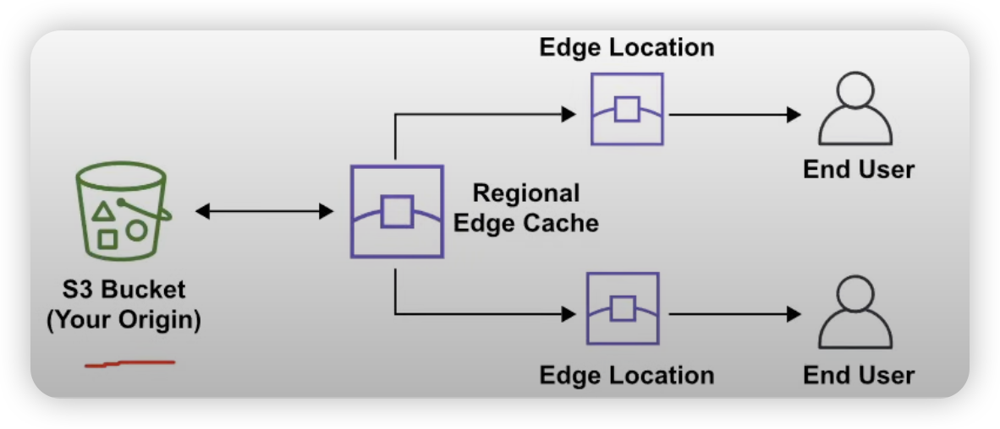

# AWS

<!-- @import "[TOC]" {cmd="toc" depthFrom=1 depthTo=6 orderedList=false} -->

<!-- code_chunk_output -->

- [AWS](#aws)
    - [AWS Architecture](#aws-architecture)
      - [1.Region and AZ](#1region-and-az)
        - [(1) Region Selection](#1-region-selection)
        - [(2) AZ](#2-az)
      - [2.point of presence (PoP)](#2point-of-presence-pop)
        - [(1) Edge location](#1-edge-location)
    - [Basic](#basic)
      - [1.Concepts](#1concepts)
        - [(1) Amazon Resource Names (ARNs)](#1-amazon-resource-names-arns)
        - [(2) CDK vs SDK](#2-cdk-vs-sdk)

<!-- /code_chunk_output -->

### AWS Architecture

#### 1.Region and AZ

##### (1) Region Selection

-   four factors needed to consider
-   regulatory compliance
-   the cost of AWS services in this region
-   What AWS services are available in this region
-   the distance and latency to my end-users

##### (2) AZ

-   A subnet is associated with an AZ

    -   so choose a subnet to choose an AZ

-   other zones
    -   local zone
        -   have shorter distance and low latency
    -   wavelength zone
        -   allow for edge-computing on 5G network (ultra-low latency)

#### 2.point of presence (PoP)

an intermediate location (datacenter or collection of hardware) between an AWS region and the end user

-   edge location
    -   are datacenters that hold cached(or cpoy) on the most popular files
-   regional edge locations
    -   are datacenters that hold much larger cache of less-popular files

##### (1) Edge location

-   Edge location can acts as on and off ramps
    -   on-ramp:
        -   quickly reach AWS resources in other regions by reaching the cloest AWS network node first and then transmitting data in AWS network
    -   off-ramp:
        -   CDN

---

### Basic

#### 1.Concepts

##### (1) Amazon Resource Names (ARNs)

-   format: `arn:<partition>:<service>:<region>:<account-id>:<resource-id>`
    -   partition: aws/aws-cn/aws-us-gov
    -   service: ec2/s3/iam/...
    -   resouce-id: a number name or path or wildcard

##### (2) CDK vs SDK

-   CDK: cloud development kit, ensures idempotent of your infrastructure
    -   CDK has the same aim with terraform
    -   use couldformation underneath
