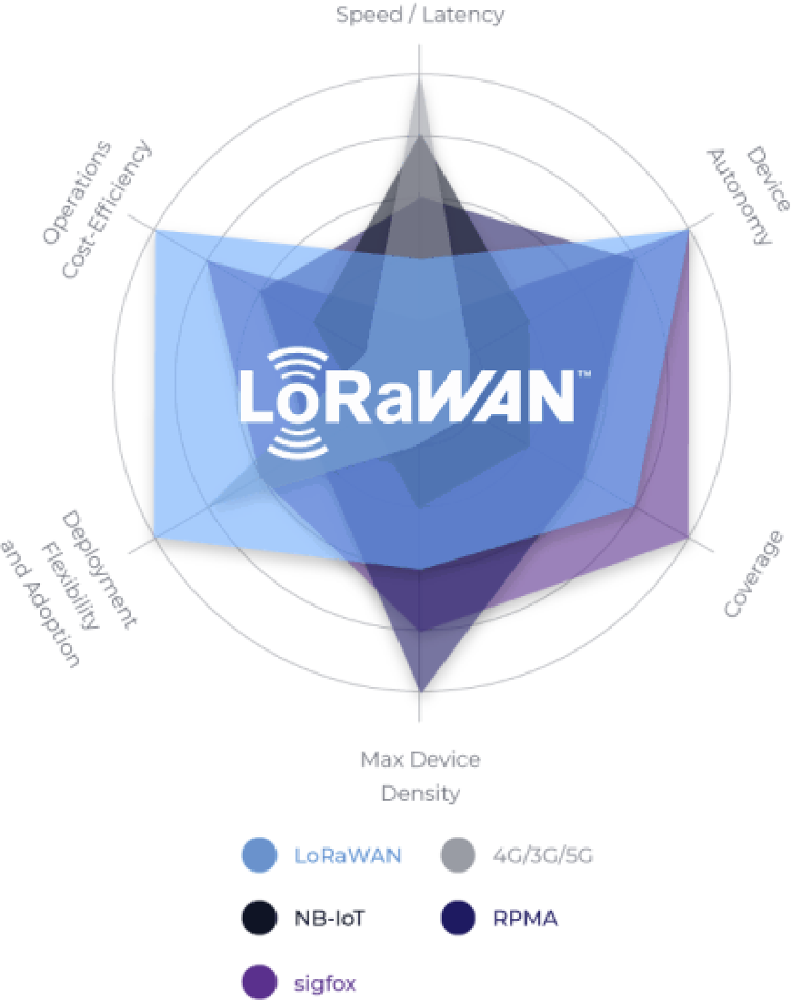
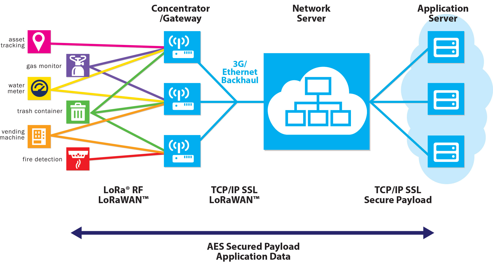

# LoRa

[toc]

### Introduction

#### 1.Terms

|term|description|
|-|-|
|LoRa(long range)|a wireless modulation technique|
|LoRaWAN|a MAC layer protocol for wide area networks|
|EUI|Extended Unique Identifier|

#### 2.LoRaWAN
* It is designed to allow low-powered devices to communicate with Internet-connected applications over long range **wireless connections**
* LoRaWAN can be mapped to the **second and third layer** of the OSI model
* LoRaWAN is suitable for transmitting small size payloads (like sensor data) over long distances

##### (1) why LoRaWAM

* low power
* long range
* high capacity - a LoRaWAN network server can handle millions of messages from thousands of gateways
* security and robustness
* low cost

##### (2) LoRa frame format

#### 3.LoRa network architecture

* end devices send LoRa frame to LoRa gateway through a specific radio frequency
* LoRa gateways send LoRa frame to LoRa network server through tcp/ip network
* LoRa network servers send LoRa Application layer to application server through tcp/ip network  

##### (1) end devices
* A LoRaWAN end device can be a sensor, an actuator, or both
* They are often battery operated
* These end devices are wirelessly connected to the LoRaWAN network through gateways using LoRa RF modulation

##### (2) gateways

* types of gateways

|type|description|application|
|-|-|-|
|indoor gateways|provide coverage in difficult-to-reach indoor locations|deployment places like homes, businesses and buildings|
|outdoor gateways|suitable for providing coverage in rural, urban, and dense urban areas|deployment places like cellular towers, the rooftops of very tall buildings, metal pipes (masts) etc|

##### (3) network server
manage the entire LoRaWAN network, main functions:
* activate end devices
* message routing
  * forward uplink data(application payloads) to application servers
  * forward downlink data to end devices
