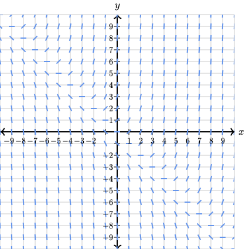

# differential equations

<!-- @import "[TOC]" {cmd="toc" depthFrom=1 depthTo=6 orderedList=false} -->

<!-- code_chunk_output -->

- [differential equations](#differential-equations)
    - [概述](#概述)
      - [1.differential equations](#1differential-equations)
      - [2.slope fields](#2slope-fields)
      - [3.approximate function curve: Euler's method](#3approximate-function-curve-eulers-method)
      - [4.separable differential equation](#4separable-differential-equation)
        - [(1) 求解](#1-求解)
      - [5.exponential models](#5exponential-models)
      - [6.logstic models](#6logstic-models)
        - [(1) logistic function](#1-logistic-function)
      - [7.exact differential equation](#7exact-differential-equation)
        - [(1) exact differential equation](#1-exact-differential-equation)
        - [(2) 求解](#2-求解)

<!-- /code_chunk_output -->

### 概述

#### 1.differential equations
* 描述 一个函数 和 其导数 的关系
  * 求出的解是一个函数
  * 比如: $y'=2x+3y-1$

#### 2.slope fields
* 根据函数在各个点的slope，approximate function curve

  * 起点决定了 function curve

#### 3.approximate function curve: Euler's method

* 假设起点为$(x_0,y_0)$
  * 提高近似的精确度：减小$\Delta x$

|x|y|y'|
|-|-|-|
|$x_0$|$y_0$|$f'(x_0)$|
|$x_1=x_0+\Delta x$|$y_1=y_0+\Delta x\cdot f'(x_0)$|$f'(x_1)$|
|$x_2=x_1+\Delta x$|$y_2=y_1+\Delta x\cdot f'(x_1)$|$f'(x_2)$
|...|

#### 4.separable differential equation
* $y'=f(x)g(y)$

##### (1) 求解
* 比如: $y'=\frac{-x}{ye^{x^2}}$，即 $\frac{dy}{dx}=\frac{-x}{ye^{x^2}}$
  * $\therefore \frac{dy}{dx}=\frac{-x}{e^{x^2}}\cdot \frac{1}{y}$
  * $\therefore ydy=\frac{-x}{e^{x^2}}dx$
  * $\therefore \int ydy=\int \frac{-x}{e^{x^2}}d$
  * $\therefore \frac{y^2}{2}+C_1=\frac{1}{2}e^{-x^2}+C_2$

#### 5.exponential models

* 人口增长速度 与 当前的人口数（N） 成一定的比列
  * $\frac{dN}{dt}=rN$
    * $N(t)=N_0e^{rt}$

#### 6.logstic models
* 人口增长速度 与 当前的人口数（N） 成一定的比列
  * 但是增长一定量（K）就不再增长
  * 当N=0时，增长率也为0
  * 所以模型为：
    * $\frac{dN}{dt}=rN(1-\frac{N}{K})$

##### (1) logistic function
* $\frac{dN}{dt}=rN(1-\frac{N}{K})$
  * $\therefore (\frac{1}{N}+\frac{\frac{1}{K}}{1-\frac{N}{K}})dN=rdt$
  * $\therefore \ln{|N|}-\ln{|1-\frac{N}{K}|}=rt+C$
  * $\therefore \ln{|\frac{N}{1-\frac{N}{K}}|}=rt+C$
  * $\therefore |\frac{N}{1-\frac{N}{K}}|=C_2e^{rt}$
  * $\therefore N(t)=\frac{1}{C_3e^{-rt}+\frac{1}{K}}$
  * $N(0)=N_0$, $\therefore N(t)=\frac{N_0K}{(K-N_0)e^{-rt}+N_0}$

#### 7.exact differential equation

##### (1) exact differential equation
* $\psi=f_1(x)g_1(y)+...+f_n(x)g_n(y)$

* $$\begin{align}\frac{d\psi}{dx}&=f_1'(x)g_1(y)+f_1(x)g_1'(y)\frac{dy}{dx}+...+f_n'(x)g_n(y)+f_n(x)g_n'(y)\frac{dy}{dx}
\\&=(f_1'(x)g_1(y)+...+f_n'(x)g_n(y))+(f_1(x)g_1'(y)+f_n(x)g_n'(y))\frac{dy}{dx}
\\&=\frac{\partial \psi}{\partial x}+\frac{\partial \psi}{\partial y}\frac{dy}{dx}
\end{align}$$

* exact differential equation性质
  * $\frac{\partial}{\partial y}(\frac{\partial}{\partial x}\psi)=\frac{\partial^2\psi}{\partial y\partial x}=\psi_{xy}$
  * $\frac{\partial}{\partial x}(\frac{\partial}{\partial y}\psi)=\frac{\partial^2\psi}{\partial x\partial y}=\psi_{yx}$
  * 当$\psi,\frac{\partial \psi}{\partial x}, \frac{\partial \psi}{\partial y}$是连续函数的
    * 则$\psi_{xy}=\psi_{yx}$

##### (2) 求解
* $M(x,y)+N(x,y)\frac{dy}{dx}=0$
  * 当$\frac{\partial M}{\partial y}=\frac{\partial N}{\partial x}$（也可写成$M_y=N_x$），则是exact differential equation
* 利用以下性质求解:
  * $\psi_x=M$
  * $\psi_y=N$
  * $\frac{d\psi}{dx}=0$ 

* 举例: $(y\cos x+2xe^y)+(\sin x+x^2e^y-1)y'=0$
  * $M_y=N_x$，所以这就是一个exact differential equation
  * $\psi_x=M=y\cos x+2xe^y$
    * $\therefore \psi=\int \psi_xdx=y\sin x+x^2e^y+f(y)$
  * $\psi_y=N=\sin x+x^2e^y-1$
    * $\therefore \frac{\partial\psi}{y}=\sin x+x^2e^y+f'(y)=\sin x+x^2e^y-1$
    * $\therefore f'(y)=-1$
    * $\therefore f(y)=-y+C_1$
  * $(y\cos x+2xe^y)+(\sin x+x^2e^y-1)y'=0$
    * $\therefore \frac{d\psi}{dx}=0$
    * $\therefore \psi=C_2$
    * $\therefore y\sin x+x^2e^y-y=C$