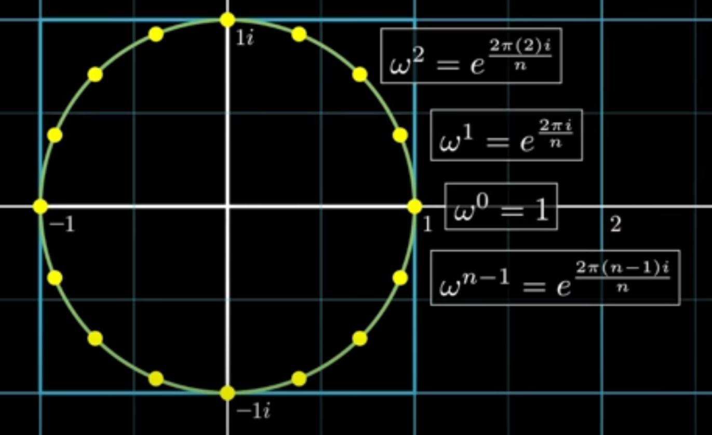
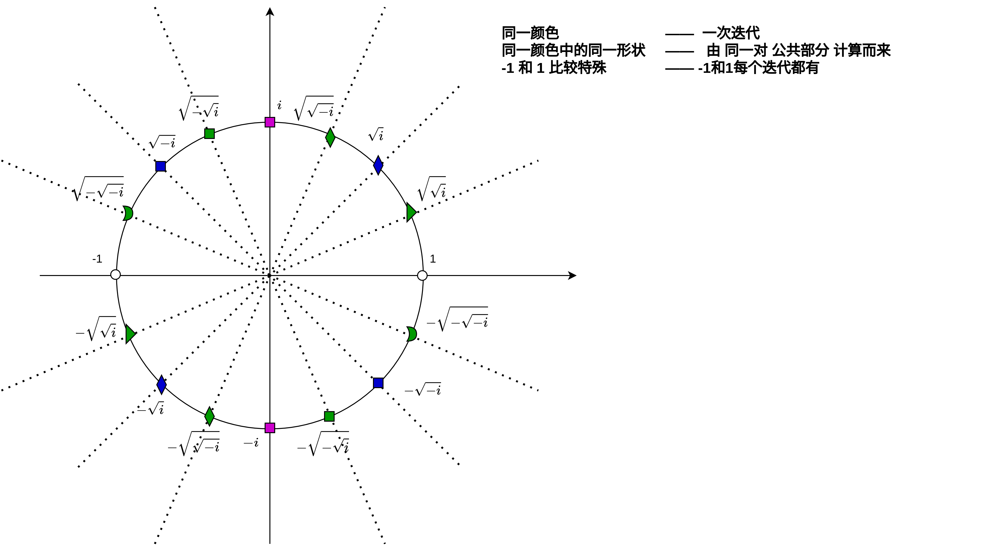
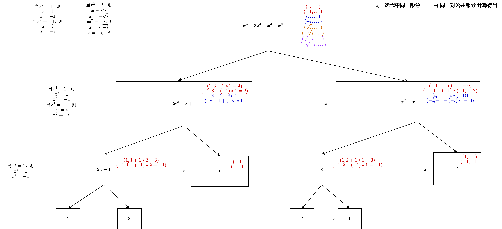

# fourier transform

<!-- @import "[TOC]" {cmd="toc" depthFrom=1 depthTo=6 orderedList=false} -->

<!-- code_chunk_output -->

- [fourier transform](#fourier-transform)
    - [概述](#概述)
      - [1.Euler's number e](#1eulers-number-e)
        - [(1) 定义](#1-定义)
        - [(2) 特性](#2-特性)
        - [(3) complex plane的理解](#3-complex-plane的理解)
        - [(4) Euler's formula](#4-eulers-formula)
        - [(5) $f(x)\cdot e^{ix}$的理解](#5-fxcdot-eix的理解)
      - [2.sin函数](#2sin函数)
        - [(1) 基础](#1-基础)
        - [(2) 常用公式](#2-常用公式)
      - [3.以频率的形式表示sin函数](#3以频率的形式表示sin函数)
      - [4.fourier基础](#4fourier基础)
        - [(1) 波的叠加 (fourier series)](#1-波的叠加-fourier-series)
        - [(2) 求解系数](#2-求解系数)
      - [5.fourier transformation](#5fourier-transformation)
        - [(1) 基于函数的理解](#1-基于函数的理解)
        - [(2) 基于复平面的理解](#2-基于复平面的理解)
        - [(3) 变换公式](#3-变换公式)
      - [6.discrete fourier transformation (DFT)](#6discrete-fourier-transformation-dft)
      - [7.fast fourier transformation (FFT)](#7fast-fourier-transformation-fft)
        - [(1) 基于多项式的理解](#1-基于多项式的理解)
        - [(2) 利用FFT计算DFT](#2-利用fft计算dft)

<!-- /code_chunk_output -->

### 概述

#### 1.Euler's number e

##### (1) 定义
$\lim_{n \to \infty} (1 + \frac{1}{n})^n = 2.718...$

##### (2) 特性

* 导数是其本身
    * $\frac{d}{dx}e^x = e^x$

##### (3) complex plane的理解
* **二维**的数字，正常理解数字是一维的（即所有的数字都可以在一条负无穷到正无穷的直线上找到）
    * 横坐标为实数轴（Re），纵坐标为虚数轴（Im）
* **乘法**可以理解为 先**旋转**一定度数，然后进行**scale**
    * $z_1 * z_2$ 表示将$z_2$旋转 一定度数（$z_1$和横坐标形成的度数），然后进行scale
    * $(\frac{\sqrt 2}{2} + i\frac{\sqrt 2}{2})^2 = i$
        * 理解为1旋转45度，再旋转45度
    * 乘以$i$ 表示旋转90度（所以$i^2=-1$）
    * $x^3=1$，在complex plane中表示，1旋转3次相同的角度，还得到1，所以x有多种解（比如: $x=-\frac{1}{2} + i\frac{\sqrt 3}{2}$）

##### (4) Euler's formula

* **用$e^{ix}$表示复数$\cos x + i\sin x$**

* $e^{ix}$的理解
  * 在**complex plane**上，以原点为与圆心的**圆周运动** (x可以理解成时间)
      * amplitude: 1（当$ne^{ix}$就是n）
      * period: $2\pi$ (时间单位)
      * frequency: $\frac{1}{period} = \frac{1}{2\pi}$

* 为什么$e^{ix}$是圆周运动
  * $\frac{d}{dx}e^{ix} = ie^{ix}$，即导数在任何位置都呈90度（因为i理解为旋转90度）
  * $e^0=1$
  * 所以只有 **单位圆** 满足要求
  * 所以 $e^{ix} = \cos x + i\sin x$
      * $e^{i\pi} = -1$

##### (5) $f(x)\cdot e^{ix}$的理解
* **$f(x)$基于$e^{ix}$参照系的运动（即将$f(x)$变换到频域）**
  * 将$e^{ix}$作为参照系，而不是通常使用的实数坐标系
  * 所以从实数坐标系角度看就是，$e^{ix}$和$f(x)$的**叠加**运动
    * 因为$e^{ix}$是单位圆周运动，只有方向在变，所以乘以f(x)可以看作一个叠加运动
    * 改变$e^{ix}$的频率，能够求出f(x)各个频率的分量

* 当$f(x)$也是**周期**函数，就会出现如下效果
  * 当$f(x)$频率 > $e^{ix}$的频率
    * 
    * 所以 $\int_0^{2\pi} f(x)e^{ix} = 0$
  * 当$f(x)$频率 = $e^{ix}$的频率
    * 
    * 所以 $\int_0^{2\pi} f(x)e^{ix} > 0 $

#### 2.sin函数

理解为在单位圆上的圆周运动

##### (1) 基础
$y=sin(kx+\varphi)$

* frequence: $\frac{k}{2\pi}$
  * 1秒转动的圈数，另x=1，$kx$就是1秒经过的弧长（在单位圆上），用 弧长/2$\pi$，就是每秒经过的圈数
* period: $\frac{2\pi}{k}$
* phase $\varphi$: 偏移（即**起始位置**）

##### (2) 常用公式

* $sin(x+y) = sinx\cdot cosy + siny\cdot cosx$
* sin(-x)=-sinx
* cos(-x)=cosx

#### 3.以频率的形式表示sin函数

$f(t) = sin(2\pi kt)$
* frequence: k clycle/s
* period: 1 (对于所有正整数k而言)
    * $\frac{2\pi}{2\pi k} = \frac{1}{k}$
    * 因为对于1/2（频率为2）是一个周期的sin函数，1肯定也是他的周期
    * 因为对于1/3（频率为3）是一个周期的sin函数，1肯定也是他的周期

#### 4.fourier基础

##### (1) 波的叠加 (fourier series)

* $f(t) = \sum_{k=1}^{N}A_k\sin(2\pi kt + \varphi_k) = \sum_{k=1}^{N}(a_k\sin(2\pi kt) + b_k\cos(2\pi kt))$

* 欧拉公式和sin、cos的关系
  * 因为$e^{ix} = \cos x + i\sin x$
  * 所以
    * $\cos x = \frac{e^{ix}+e^{-ix}}{2}$
    * $\sin x=\frac{e^{ix}-e^{-ix}}{2i}$
  * 所以
    * $a_n\sin nx + b_n\cos nx = a_n\frac{e^{inx}+e^{-inx}}{2} + b_n\frac{e^{inx}-e^{-inx}}{2i} = \frac{a_n-ib_n}{2}e^{inx} + \frac{a_n+ib_n}{2}e^{-inx}$

* 根据上述推导，使用欧拉公式表示（即傅里叶级数）
    * $f(t) = \sum_{k=-n}^{n}C_ke^{2\pi i kt}$
        * $C_0$是实数
        * $C_k$是复数，且$C_k$和$C_{-k}$是**共轭**的（根据上述推导）
            * 比如$(a+ib)(\cos x+i\sin x) + (a-ib)(\cos x-i\sin x)=2a\cos x-2b\sin x$
        * 系数（复数） 包含了 **振幅** 和 **相位** 的信息

##### (2) 求解系数

* $C_m = f(t)e^{-2\pi imt} - \sum_{k\ne m}C_ke^{2\pi i (k-m)t} $
* 两边求微积分: $\int_0^1C_mdt = \int_0^1f(t)e^{-2\pi imt}dt + \int_0^1\sum_{k\ne m}C_ke^{2\pi i (k-m)t}dt$
  * $\int_0^1\sum_{k\ne m}C_ke^{2\pi i (k-m)t}dt = \frac{1}{2\pi i (k-m)} \sum_{k\ne m}C_ke^{2\pi i (k-m)t}dt$ 在t=1和t=0时的差值,即0
    * 因为$e^{2\pi i (k-m)t} = 1$
* 所以$C_m = \int_0^1f(t)e^{-2\pi imt}dt$

#### 5.fourier transformation

##### (1) 基于函数的理解
* 比如信号是一个sin函数
  * 乘以一个不同频率的sin函数
  
  * 乘以一个相同频率的sin函数
  

* 如果信号是一个cos函数，此时乘以一个相同频率的sin函数，值还是会相互抵消，所以需要乘以一个带相位的sin函数: $\sin(x+\varphi)=\cos \varphi \sin x+\sin \varphi \cos x$

##### (2) 基于复平面的理解
* 参考: (5) $f(x)\cdot e^{ix}$的理解

##### (3) 变换公式

将时域函数，转换成频率函数，即求fourier series的系数
* $F(w) = \int_{-\infty}^{\infty}f(t)\cdot e^{-iwt} dt$
  * $\int_0^1f(x)d(x) = C_0$
  * $\int_0^1f(x)e^{-2\cdot 2\pi ix}d(x) = C_2$
  * 依次类推: $C_n = \int_0^1f(x)e^{n\cdot 2\pi ix}d(x)$

#### 6.discrete fourier transformation (DFT)
* 对采样点进行傅里叶变换
* $X_k=\sum\limits_{n=0}^{N-1}x_n\cdot e^{-i2\pi \frac{k}{N}n}$

* 求序列$x_n$在各个频率分量的值，用矩阵表示
  * $\begin{bmatrix}X(\omega^0)\\X(\omega^1)\\X(\omega^2)\\\vdots\\X(\omega^{n-1})\end{bmatrix} = \begin{bmatrix}1&1&1&\dots&1\\1&\omega&\omega^2&\dots&\omega^{n-1}\\1&\omega^2&\omega^4&\dots&\omega^{2(n-1)}\\\vdots&\vdots&\vdots&\ddots&\vdots\\1&\omega^{n-1}&\omega^{2(n-1)}&\dots&\omega^{(n-1)(n-1)}\end{bmatrix}\begin{bmatrix}x_0\\x_1\\x_2\\\vdots\\x_{n-1}\end{bmatrix}$

#### 7.fast fourier transformation (FFT)

##### (1) 基于多项式的理解
* 对于n次的多项式，只要确定**n+1个点**，就能确定该多项式
  * 直接选取n个点进行计算，需要的复杂度是$O(n^2)$，因为每一个需要进行n次乘法运算，一共有n+1个点

* 多与任何多项式而言，要求出n个点，只需要计算$log n$个点
* 对于任何多项式，都可以分解成（偶数部分和奇数部分）
  * $P(x) = P_e(x^2) + xP_o(x^2)$
    * **一对公共部分**（$P_e$ 和 $P_o$），就能求出**两个点的值**（$P(x)$ 和 $P(-x)$）

* FFT原理
  * 对多项式拆分，直至不可拆分为止
    * 对$P(x)$进行分解，此次迭代会进行$2^0$次分解
    * 对$P(x^2)$进行分解，此次迭代会进行$2^1$次分解
    * 对$P(x^4)$，此次迭代会进行$2^2$次分解
    * ...
    * 对$P(x^{n/2})$，此次迭代会进行$n/2$次分解

  * 每迭代一次（一次迭代有多次分解），能求出的点数就会乘以2
  
  * 所以要求出n各点，需要经过$\log n$次迭代，每次迭代需要进行n次乘法，所以一共需要$n\log n$次乘法

* 举例: $P(x) = x^5 + 2x^4 - x^3 +x^2+1$

##### (2) 利用FFT计算DFT
* 将$x_n$看成多项式的系数，$(w^0,w^1,...,w^{(n-1)})$为需要找出的点
* 利用上述算法能够快速求得相应的频率分量