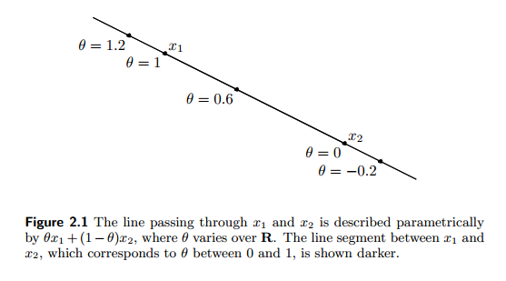
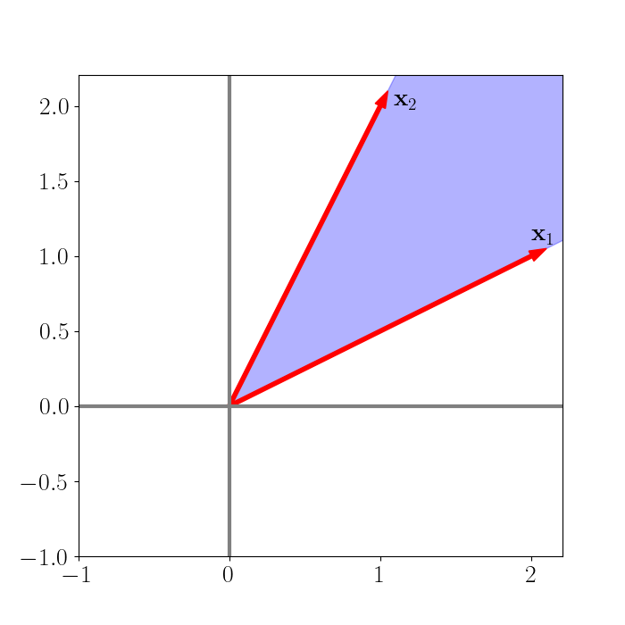
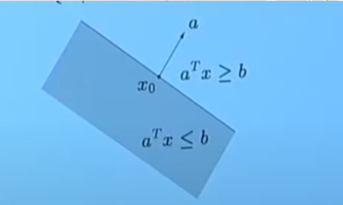
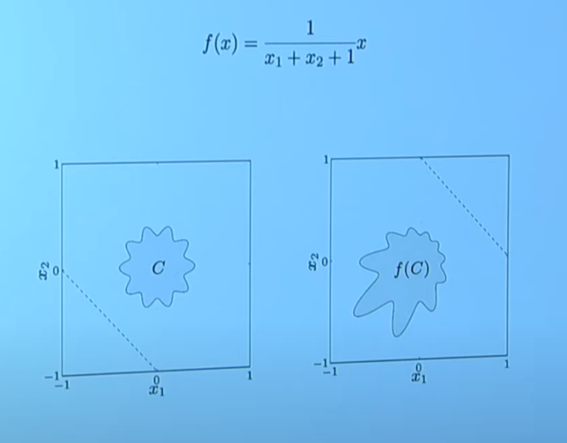

# convex_optimization

<!-- @import "[TOC]" {cmd="toc" depthFrom=1 depthTo=6 orderedList=false} -->

<!-- code_chunk_output -->

- [convex_optimization](#convex_optimization)
    - [overview](#overview)
      - [1.基础概念](#1基础概念)
        - [(1) affine set (直线)](#1-affine-set-直线)
        - [(2) convex set (线段)](#2-convex-set-线段)
        - [(3) convex hull](#3-convex-hull)
        - [(4) convex cone (射线)](#4-convex-cone-射线)
        - [(5) affine set, convex set, convex cone](#5-affine-set-convex-set-convex-cone)
        - [(6) hyperplane and halfspace (convex)](#6-hyperplane-and-halfspace-convex)
        - [(7) other convex sets](#7-other-convex-sets)
      - [2.operation that perserves convexity](#2operation-that-perserves-convexity)
      - [3.generalized inequality (广义不等式)](#3generalized-inequality-广义不等式)

<!-- /code_chunk_output -->

### overview

#### 1.基础概念

**x is a point in vector space**

##### (1) affine set (直线)

* affine combination
    * 经过$x_1,x_2$的直线:
        * $x=\theta x_1+(1-\theta) x_2 \qquad \theta \in R$
            * 为什么系数加起来为1
                * 为了保证所有的点在一条直线上（$x_1,x_2$是常量，$\theta$是变量，不同的$\theta$值，产生不同的点）
                * $x=x_2+\theta(x_1-x_2)$

    
* affine set:
    * 集合中 任意两点 的 affine combination 还在集合中（所以affine set就是一条直线）

##### (2) convex set (线段)

* convex combination
    * $x_1,x_2$的线段:
        * $x=\theta x_1+(1-\theta) x_2 \qquad 0\le\theta\le1$

* convex set:
    * 集合中 任意两点 的 convex combination 还在集合中
    

##### (3) convex hull 
* convex combination
    * $x=\theta_1x_1+\theta_2x_2+...+\theta_kx_k$
        * $\theta_1+\theta_2+...+\theta_3=1$
        * $\theta_i\ge0$

* convex hull
    * a set of all convex combinations of all points
    

##### (4) convex cone (射线)
* convex cone
    * for a set C, if for every $x\in C$ and $\theta\ge 0$ we have $\theta x\in C$，
    * then C is a cone 
    * 一定经过**原点**
* conic combination:
    * $x=\theta_1x_1+\theta_2x_2+...+\theta_kx_k$
        * $\theta_1\ge0,\theta_2\ge0,...,\theta_k\ge 0$

    

* conical hull
    * a set of all conic combinations of all points

##### (5) affine set, convex set, convex cone
* affine set一定是convex set
* convex cone一定是convex set

##### (6) hyperplane and halfspace (convex)

* hyperplane
    * $\{x|a^Tx=b\}, (a\ne 0)$
        * a is normal vector
* halfspace
    * $\{x|a^Tx\le b\}, (a\ne 0)$
    

##### (7) other convex sets
在向量空间中的表示
* ball
    * $B(x_c,r)=\{x|\ ||x-x_c||_2\le r\}$
* ellipsoids
    * $\{x|(x-x_c)^TP^{-1}(x-x_c)\le 1\}$
        * 其中 $P\in S^n_{++}$

#### 2.operation that perserves convexity

* apply convex combination
    * $x=\theta x_1+(1-\theta) x_2 \qquad 0\le\theta\le1$
* operations of convex sets 
    * intersection
        * 多个convex sets的交集还是convex set
    * affine functions
        * $f(x)=Ax+b$ 
            * $A\in R^{m\times n}, x\in R^n,b\in R^m$
        * the image of convex
            * $S\subseteq R^n \text { convex} \implies f(S)=\{f(x)|x\in S\}$ is convex
        * the inverse image of a convex set under f is convex
            * $C\subseteq R^m \text { convex} \implies f^{-1}=\{x\in R^n|f(x)\in C\}$ is convex
    * perspective function P: $R^{n+1} \to R^n$
        * $P(x,t)=x/t$, dom $P=\{(x,t)|t>0\}$
            * 实际就是将所有分量除以最后一个分量，然后在去除最后一个分量，以达到降维的目的
    * linear-fractional function f: $R^n\to R^m$
        * $f(x)=\frac{Ax+b}{C^Tx+d}$, dom $f=\{x|C^Tx+d>0\}$
            * 可以理解先affine，
                * $g(x)=\begin{bmatrix}A\\ C^T\end{bmatrix}x+\begin{bmatrix}b\\ d\end{bmatrix}$
            * 再perspective
        * example
            * 
            * 图一虚线以上: $x_1+x_2+1>0$
            * 越靠近图一的虚线，$x_1+x_2+1$越小，则f(x)越大，反之则越小

#### 3.generalized inequality (广义不等式)