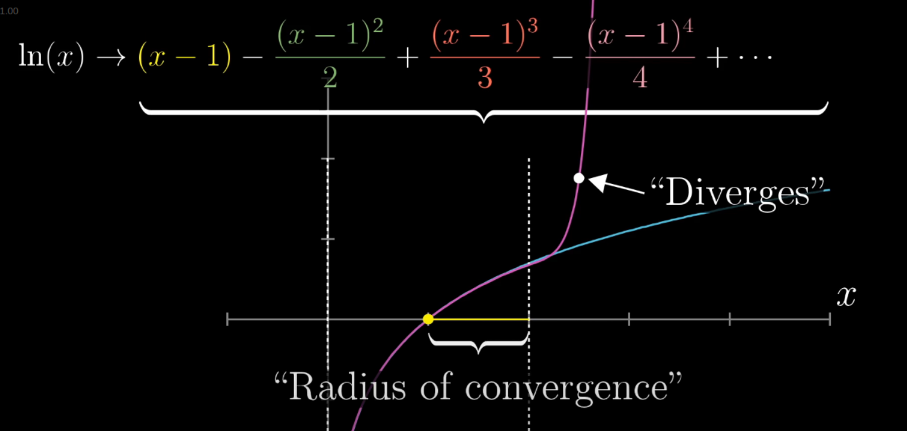

# overview

<!-- @import "[TOC]" {cmd="toc" depthFrom=1 depthTo=6 orderedList=false} -->

<!-- code_chunk_output -->

- [overview](#overview)
    - [概述](#概述)
      - [1.calculus](#1calculus)
      - [2.derivative](#2derivative)
        - [(1) 概念](#1-概念)
        - [(2) sum rule](#2-sum-rule)
        - [(3) product rule](#3-product-rule)
        - [(4) chain rule](#4-chain-rule)
        - [(5) 指数](#5-指数)
        - [(6) implicit function](#6-implicit-function)
        - [(7) l'hopital's rule (罗必达法则) (利用导数求极限值)](#7-lhopitals-rule-罗必达法则-利用导数求极限值)
      - [3.Euler's number e](#3eulers-number-e)
        - [(1) 定义](#1-定义)
        - [(2) 特性](#2-特性)
        - [(3) Euler's formula](#3-eulers-formula)
      - [4.integration](#4integration)
        - [(1) 概念](#1-概念-1)
        - [(2) average of a continuous value](#2-average-of-a-continuous-value)
      - [5.high-order derivatives](#5high-order-derivatives)
      - [6.Tylor series](#6tylor-series)
        - [(1) 定义](#1-定义-1)

<!-- /code_chunk_output -->

### 概述

#### 1.calculus

* differentiation (微分)
    * 划分成很小的份
    * 表示: $dx$、$dy$等
* integration (积分)
    * 将很多个很小的份合为一个整体
    * 表示: $\int_{1}^{3}$

#### 2.derivative

##### (1) 概念

* instantaneous rate of change
    * 顺时变化率，这个概念本身是矛盾的（顺时和变化是矛盾的），可以理解为 变化率的最佳常数近似

* 定义
    * 存在f(x)，则$\frac{d}{dx}f(x) = \lim_{\Delta x \to 0}\frac{f(x + \Delta x) - f(x)}{\Delta x}$

##### (2) sum rule
$\frac{d}{dx}(g(x) + h(x)) = \frac{dg}{dx} + \frac{dh}{dx}$
* visualization: 在xy轴上，画出相应的函数，然后合并

##### (3) product rule

$\frac{d}{dx}(g(x)h(x)) = g(x)\frac{dh}{dx} + h(x)\frac{dg}{dx}$
* 简单记忆：left d(right) + right d(left)
* visulization: 长为g(x)，宽为h(x)的长方形面积

##### (4) chain rule

$\frac{d}{dx}(g(h(x))) = \frac{dg}{dh}(h(x)) \frac{dh}{dx}(x)$

##### (5) 指数
$\frac{d}{dx}e^x = e^x$
* $\frac{d}{dx}e^{cx} = \frac{d}{dt}e^t \frac{dt}{dx} = ce^{cx}$, 其中$t=cx$，c是常数，利用chain rule进行计算
* $\frac{d}{dx}2^x = \frac{d}{dx}e^{xln(2)} = ln(2)e^{xln(2)} = ln(2)e^x$

##### (6) implicit function
以下面的implicit function为例：
* $x^2 + y^2 = S(x,y)$
    * 两边**求微分**（注意不是求导）：
        * $dS = 2xdx + 2ydy$
    * 对于$x^2 + y^2 = 25$这个隐函数，如果需要x,y点落在曲线上，需要dS = 0，则
        * $2xdx + 2ydy = 0$
    * 所以导数：
        * $\frac{dy}{dx} = -\frac{x}{y}$

* $sin(x)y^2 = x$
    * 两边**求微分**（注意不是求导）：
        * $sin(x)(2ydy) + y^2(cos(x)dx) = dx$
    * 所以导数:
        * $\frac{dy}{dx} = ...$
* $y = ln(x)$
    * 先进行转换:
        * $e^y = x$
    * 两边**求微分**（注意不是求导）：
        * $e^ydy = dx$
    * 所以导数：
        * $\frac{dy}{dx} = \frac{1}{e^y} = \frac{1}{x}$

##### (7) l'hopital's rule (罗必达法则) (利用导数求极限值)

* 可以利用导数求 分母趋近于0的函数的 极限值
    * 比如，当x=0时，函数f(x)、g(x)都等于0
    * $\lim_{x \to a}\frac{f(x)}{g(x)} = \frac{\frac{df}{dx}(a)dx}{\frac{dg}{dx}(a)dx}$

#### 3.Euler's number e

##### (1) 定义
$\lim_{n \to \infty} (1 + \frac{1}{n})^n = 2.718...$

##### (2) 特性

* 导数是其本身
    * $\frac{d}{dx}e^x = e^x$

##### (3) Euler's formula
* complex plane的理解
    * 横坐标为实数轴（Re），纵坐标为虚数轴（Im）
    * $i$ 可以理解成旋转90%
        * 比如$1$旋转90度就是$i$，再旋转90度就是$i^2=-1$

* $e^{ix}$的理解
    * x表示的**角度**（对于单位圆也是对应的弧长）
    * $e^{ix}$
        * 在complex plane中，是圆周运动
        * 本质就是**余弦运动**，随着时间t的推移，沿着实数轴的变换
            * **实数轴表示运动幅度，虚数轴表示相**
    * $\frac{d}{dx}e^{ix} = ie^{ix}$，即导数在任何位置都呈90度（因为i理解为旋转90度）
    * $e^0=1$
    * 所以只有 **单位圆** 满足要求
    * 所以 $e^{ix} = \cos x + i\sin x$
        * $e^{i\pi} = -1$

#### 4.integration

##### (1) 概念

* $\int_a^bf(x)dx = F(b) - F(a)$
    * $\frac{d}{dx}(F(x)) = f(x)$
    * 对$f(x)$反求导，会有无限个可能，比如$x^2$，反求导的结果的就是$\frac{1}{3}x^3 + c$，但是F(b) - F(a)时，会将c抵消掉

* 几何意思：
    * $f(x)dx$ 是 f(x)和dx形成的小矩形的面积
    * $\int_a^bf(x)dx$ 表示x轴从a到b的那段区域
    * 所以，一个 函数的导数 与 x轴形成的 有符号区域面积，就是函数 在上下界 值 的差值

##### (2) average of a continuous value

* 需要求$f(x)$在a到b范围内的平均值：
    * 假设将a到b划分成若干份，每份的距离为$dx$，则分为$\frac{b-a}{dx}$份
    * 求平均值：$\frac{\int_a^bf(x)}{\frac{b-a}{dx}}$
* $\frac{\int_a^bf(x)dx = F(b) - F(a)}{b-a} = \frac{F(b) - F(a)}{b-a}$

#### 5.high-order derivatives
* 二阶的表示: $\frac{d^2f}{dx^2} = \frac{d(\frac{df}{dx})}{dx}$
    * 意义：变化的变化

#### 6.Tylor series

用于求 一个函数（比如$cosin(x)$等）在 **某个点** **附近** 的 **近似值**，用**多项式**表示，因为多项式更易处理
* series: ifinite sum

* 附近：存在一个radius convergence（收敛半径），在这个范围内，当泰特多项式越来越多，P(x)就越接近f(x)

##### (1) 定义

存在函数f(x)，求该函数在a点的泰勒展示式
* $P(x) = f(a) + \frac{df}{dx}(a)\frac{(x-a)^1}{1!} + \frac{d^2f}{dx^2}(a)\frac{(x-a)^2}{2!} + \frac{d^3f}{dx^3}(a)\frac{(x-a)^3}{3!}+...$
    * $P(a) = f(a)$
    * $\frac{dP}{dx}(a) = \frac{df}{dx}(a)$
    * $\frac{d^2P}{dx^2}(a) = \frac{d^2f}{dx^2}(a)$
    * ...
    * 所以在a点附近，P(a)是近似于f(a)的，因为 **$P(a)=f(a)$，且后续的高阶导数也相等（即变化相等）**
        * 当泰勒多项式越多，在 **radius convergence（收敛半径）** 范围内的，P(x)就越无限接近f(x)

* 以$ln(x)$，在x=1 的泰勒展开式为例子：

