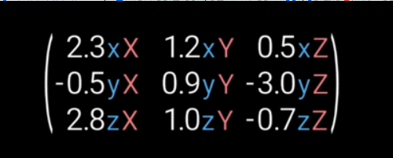
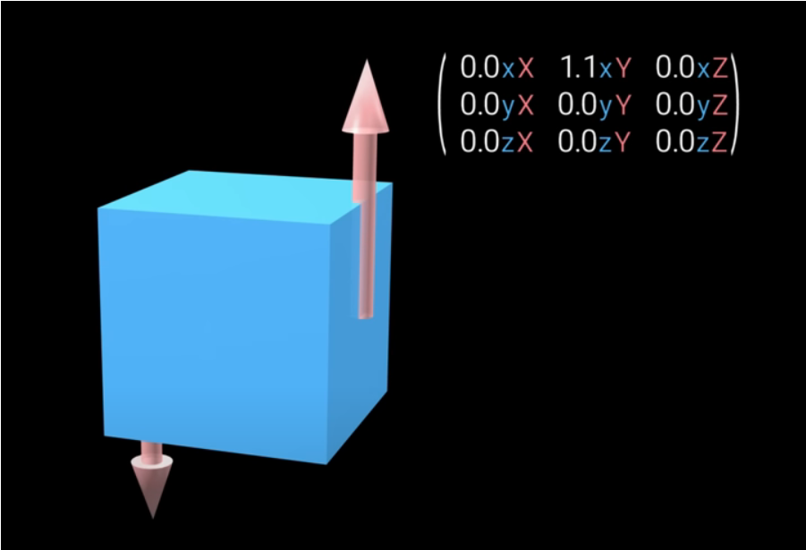

# overview

<!-- @import "[TOC]" {cmd="toc" depthFrom=1 depthTo=6 orderedList=false} -->

<!-- code_chunk_output -->

- [overview](#overview)
    - [概述](#概述)
      - [1.vector](#1vector)
        - [(1) 线性组合](#1-线性组合)
        - [(2) span](#2-span)
        - [(3) linear dependent](#3-linear-dependent)
        - [(4) basis vector（基向量）](#4-basis-vector基向量)
      - [2.subspace](#2subspace)
        - [(1) subspace of $R^n$](#1-subspace-of-rn)
        - [(2) basis of subspace](#2-basis-of-subspace)
      - [3.矩阵](#3矩阵)
        - [(1) column space](#1-column-space)
        - [(2) null space (kernel)](#2-null-space-kernel)
        - [(3) column space 和  null space的关系](#3-column-space-和--null-space的关系)
        - [(4) 寻找null space](#4-寻找null-space)
      - [4.特殊矩阵](#4特殊矩阵)
        - [(1) orthonormal matrix: Q](#1-orthonormal-matrix-q)
        - [(2) symmetric matrix: S](#2-symmetric-matrix-s)
      - [5.线性变换](#5线性变换)
        - [(1) 定义](#1-定义)
        - [(2) 以二维空间为例](#2-以二维空间为例)
        - [(3) 线性变换组合](#3-线性变换组合)
        - [(4) determinant (行列式)](#4-determinant-行列式)
        - [(5) inverse matrices (只有方正矩阵可逆)](#5-inverse-matrices-只有方正矩阵可逆)
        - [(6) rank (矩阵的秩)](#6-rank-矩阵的秩)
        - [(7) 非方阵](#7-非方阵)
      - [6.tensor](#6tensor)
        - [(1) 1-d tensor (vector)](#1-1-d-tensor-vector)
        - [(2) 2-d tensor (matrix)](#2-2-d-tensor-matrix)
        - [(3) 3-d tensor](#3-3-d-tensor)

<!-- /code_chunk_output -->

### 概述

线性代数的目标：解决线性方程$Ax=0$问题（A是矩阵，x是向量）

#### 1.vector

*  一个向量就是一段运行轨迹

##### (1) 线性组合
* $\vec v_1 + \vec v_2$
    * 先进行第一段运行轨迹，再进行第二段运行轨迹
* $\vec v_1 * n$
    * 就是对运动轨迹进行scale（即拉伸或缩短）

##### (2) span

向量所有可能的**线性组合** 的 **集合**

##### (3) linear dependent
在一组向量中，其中一个向量，能由这组向量中的**其他向量** 通过 **线性组合** **相互转换**

##### (4) basis vector（基向量）
* 基向量一组**非线性相关**的向量，能够span到**整个空间**

* 对于二维空间来说，下面两个**非线性相关**的向量可以作为该空间的基向量
    * $\vec i$ = (1,0)
    * $\vec j$ = (0,1)
    * 所有向量都能由这两个向量进行scale得到

* 对于三维空间
    * $\vec i$ = (1,0,0)
    * $\vec j$ = (0,1,0)
    * $\vec k$ = (0,0,1)

#### 2.subspace

##### (1) subspace of $R^n$
* if V is subspace of $R^n$，则V is subset of $R^n$，且需要满足下述条件:  
    * $\vec 0$ in V
    * closed under addition
        * if $\vec x$ in v, then $c\vec x$ in V
    * closed under multiplication
        * if $\vec a, \vec b$ in V, then $\vec a+\vec b$ in V

* 举例:
    * $V=\{\begin{bmatrix} 0\\0\\0\end{bmatrix}\}$
        * V is subspace of $R^3$
    * $S=\{\begin{bmatrix} x_1\\x_2\end{bmatrix}\in R^2 | x_1\ge0\}$
        * S is not subspace of $R^2$
    * $V=\text {span}(\vec v_1,\vec v_2,...)$
        * 任意向量的span都是subspace

##### (2) basis of subspace
basis is minimum set of vectors than spans the subspace
* $V=\text {span}(\vec v_1,\vec v_2,..., \vec v_n)$
    * if $\{\vec v_1,\vec v_2,..., \vec v_n\}$ is linearly independent
    * then $S=\{\vec v_1,\vec v_2,..., \vec v_n\}$, S is a basis for V

#### 3.矩阵
A是一个$m\times n$的矩阵，由vector组成
* **一列**就是一个**vector**
* **一行**就是一个**维度**

##### (1) column space
* column space： $C(A)$
    * $C(A)=\text {span}(\vec v1,\vec v2,...,\vec v_n)$
        * column vectors（一个column就是一个vector）的所有线性组成 构成的span
    * 另一种表述: $C(A)={A\vec x|\vec x\in R^n}$
* row space: $C(A^T)$
    * row vectors（一个row就是一个vector）的所有线性组合 构成的span
* $C(A^T) = C(A)$

##### (2) null space (kernel)
null space of A: $N(A)=\{\vec x\in R^n|A\vec x=\vec 0\}$
* null space中的向量经过线性变化后为0
* $A\vec x=x_1\vec v_1+x_2\vec v_2+...+x_n\vec v_n=0$
    * 即**A的null space 和 row space正交**: $N(A) \bot C(A^T)$
    * 当$\vec v_1,\vec v_2,...,\vec v_n$ 是linearly independent，则N(A)只有$\vec 0$这一个

##### (3) column space 和  null space的关系
* 当$\vec v_1,\vec v_2,...,\vec v_n$ 是linearly independent时，
    * N(A)只有一个，即$\vec 0$
    * 所以可以通过求A的null space，判断其column vector是否linearly independent

* 假设A是一个m*n矩阵，rank=r，N(A).dim表示需要多少basis vector才能构成该null space
    * $N(A).dim = n-r$
    * $N(A^T).dim = m -r$

##### (4) 寻找null space

求解$A\vec x=\vec 0$
* $N(A)=N(rref(A))$
    * rref: reduced row echelon form，利用消元（elimination）简化计算

#### 4.特殊矩阵

##### (1) orthonormal matrix: Q

* Q是**方正** 且 每一列都是**orthonormal vectors (标准正交向量)**
    * 每一列的向量 都和 其他列向量 正交 且 与自身的点积为1
    * $Q^TQ = I$
        * 因为是方正，所以$QQ^T=I$
        * 因为等于$I$，所以 $Q^T=Q^{-1}$
    * 本质就是**旋转（可能还有翻转）**，所以对任何向量进行该线型变换，都不会改变该向量的长度

##### (2) symmetric matrix: S

* $S = S^T$
* S的**特征向量是正交的**
* $A^TA$ 结果是 symmetric positive definite 矩阵

* $X^TSX$（X是一个向量，比如: X=[x y]）能表示所有的二次方程，而在机器学习中，代价函数几乎都是二次方程
    * 满足以下任一个条件就是symmetric positive definite
        * 所有特征值 > 0
        * $X^TSX$ > 0 (X不等于0)
        * $S=A^TA$ (A的每一列都线性无关)
        * 所有的leading determinants > 0
            * leading determinants表示 取矩阵的 1x1矩阵，2x2矩阵，3x3矩阵，依次类推
        * 所有的pivots in elimination > 0
            * 消元后的每行的第一个非0的值 > 0

    * 当$f(x) = X^TSX$ 时，表示f(x)函数的形状像碗一样

#### 5.线性变换

##### (1) 定义

* $L(\vec v + \vec w) = L(\vec v) + L(\vec w)$
* $L(c\vec v) = cL(\vec v)$

* 所以**所有向量**可以使用**基向量**进行表示，然后对**基向量**进行**线性变换**，从而求得对**该向量**的**线性变换**

##### (2) 以二维空间为例
* 默认前提:
    * 基向量：
        * $\vec i$ = (1,0)
        * $\vec j$ = (0,1)
    * 基向量用矩阵表示为
        * $\begin{bmatrix} 1 & 0 \\ 0 & 1 \end{bmatrix}$

* 存在一个向量$\vec v= \begin{bmatrix} x \\y \end{bmatrix} = x\vec i + y\vec j$

* 对基向量进行线性变量，则向量v的位置就能够确定
    * 比如旋转90度
    * 基向量就变为
        * $\begin{bmatrix} 0 & -1 \\ 1 & 0 \end{bmatrix}$
    * 则向量v的位置就是
        * $\begin{bmatrix} 0 & -1 \\ 1 & 0 \end{bmatrix}\begin{bmatrix} x \\y \end{bmatrix} = x\vec i + y\vec j =x\begin{bmatrix} 0 \\1 \end{bmatrix} + y\begin{bmatrix} -1 \\0 \end{bmatrix} = \begin{bmatrix} -y \\ x \end{bmatrix}$
    * 所以新的基向量就是**变换矩阵**

##### (3) 线性变换组合
即多次进行线性变换
* 第一次变换:
    * $\vec M_1 = \begin{bmatrix} a & b \\ c & d \end{bmatrix}$
* 第二次变换
    * $\vec M_2 = \begin{bmatrix} e & f \\ g & h \end{bmatrix}$
* 对向量v进行变换：
    * 对向量v先做$\vec M_1$变换再做$\vec M_2$变换
        * $\begin{bmatrix} e & f \\ g & h \end{bmatrix}\begin{bmatrix} a & b \\ c & d \end{bmatrix}\begin{bmatrix} x \\y \end{bmatrix} = \begin{bmatrix} e & f \\ g & h \end{bmatrix}(x\begin{bmatrix} a \\c \end{bmatrix} + y\begin{bmatrix} b \\d \end{bmatrix})$
     
    * 先对基向量进行$\vec M_1$和$\vec M_2$变换，再对向量v变换
        * $\begin{bmatrix} e & f \\ g & h \end{bmatrix}\begin{bmatrix} a \\ c \end{bmatrix} = \begin{bmatrix} ae+cf \\ ag+ch \end{bmatrix}$
         
        * $\begin{bmatrix} e & f \\ g & h \end{bmatrix}\begin{bmatrix} b \\ d \end{bmatrix} = \begin{bmatrix} be+df \\ bg+dh \end{bmatrix}$
         
        * $\begin{bmatrix} ae+cf & be+df \\ ag+ch & gb+dh \end{bmatrix}\begin{bmatrix} x \\ y \end{bmatrix}$

##### (4) determinant (行列式)
决定方正矩阵**是否可逆**，表示为 $\text {det(A)}=|A|$
* 用于描述**基向量**经过**线性变换**后的**空间变化程度**
    * 默认基向量空间1为，如果变换后的基向量空间为2,则称该变换的行列式为2
    * 当行列式为负数时，表示发生了翻转

* 若A是一个$n\times n$的矩阵，$A_{ij}$是A的$(n-1)\times (n-1)$子矩阵（去除第i行和第j列）
    * $$\begin{align}det(A)=&a_{11}det(A_{11})-a_{12}det(A_{12})\\ 
    & +a_{13}det(A_{13})-a_{14}det(A_{14})\\ 
    & ... + (-1)^{1+n}a_{1n}det(A_{1n})\end{align}$$
        * $det(\begin{bmatrix} a & b \\c & d \end{bmatrix}) = ad - bc$
            * 
        * $det(\begin{bmatrix} a & b & c\\d & e & f\\g & h & i \end{bmatrix}) = a*det(\begin{bmatrix} e & f \\h & i \end{bmatrix}) - b*det(\begin{bmatrix} d & f \\g & i \end{bmatrix}) + c*det(\begin{bmatrix} d & e \\g & h \end{bmatrix})$

##### (5) inverse matrices (只有方正矩阵可逆)

* 矩阵就是对向量的变换，逆矩阵就是逆变换
    * 所以$A^{-1}A=I$

* **当det(A)=0时，A不存在逆矩阵**
    * 比如二维，当det(A)=0时，代表变换后span为一条直线，这样就不存在逆变换还原向量
    * 比如三维，当det(A)=0时，代表变换后span为一个平面或一条直线，同样无法还原向量

##### (6) rank (矩阵的秩)

* **rank = row rank = column rank = #independent columns** 
    * column rank: 线性无关的列的数量，即**column space**的**维度**

    * $\begin{bmatrix} 2 & -2 \\1 & -1 \end{bmatrix}$
        * 这个线性变换后，span为一条直线，即一维，则这个矩阵的秩为1

* 满秩
    * 行满秩: 行数 = rank
    * 列满秩: 列数 = rank
    * 如果将列看成一个向量时，当列满秩时，行列式才不为0，此时
        * 才能求出**逆矩阵**，也就是**方程式有解**
        * 如果不满秩，行列式为0，方程式可以有无限的解 或者 无解

##### (7) 非方阵

* 比如:
    * $\begin{bmatrix} 2 & 0 \\-1 & 1 \\ -2 & 1 \end{bmatrix}$
        * 将二维向量变换为三维向量
        * 但是**变换还是在二维空间进行**的
            * 所以column space的维度为2，所以为满秩
    * $\begin{bmatrix} 2 & 0 & 1\\-1 & 1 & 2 \end{bmatrix}$
        * 将三维向量变换为二维向量
        * 比如:
            * 存在$\vec v=\begin{bmatrix} 4 \\ 3\end{bmatrix}$
            * 线性变换: $\begin{bmatrix} 1 & -2 \end{bmatrix}$
            * 变换后的 $\vec v' = 4\vec i + 3\vec j = 4\begin{bmatrix} 1 \end{bmatrix} + 3\begin{bmatrix} -2 \end{bmatrix} = [-2]$

#### 6.tensor

以**三维空间**为例

##### (1) 1-d tensor (vector)
* 三维空间中的vector，有3个基向量（即基分量）
    * $\begin{bmatrix}x\\y\\z\end{bmatrix}$

##### (2) 2-d tensor (matrix)
* 因为是三维空间，所有有三个元素，且每个元素也是一个三维空间，所以一共有$3*3=9$个基向量（即基分量）
    * 
    * 

* 可以理解成 平面受力问题，比如：
    * 
    * 上面只有 xY分量上有值，表示x平面收到y方向的力

##### (3) 3-d tensor
* 因为是三维空间，所以一共 $3*3*3=27$个基向量（即基分量）

