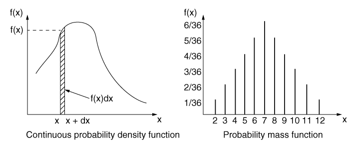

# probability theory

<!-- @import "[TOC]" {cmd="toc" depthFrom=1 depthTo=6 orderedList=false} -->

<!-- code_chunk_output -->

- [probability theory](#probability-theory)
    - [overview](#overview)
      - [1.coditional probability](#1coditional-probability)
        - [(1) 求A概率](#1-求a概率)
        - [(2) bayes formula](#2-bayes-formula)
      - [2.probability using combinations](#2probability-using-combinations)
        - [(1) permutation and combination](#1-permutation-and-combination)
        - [(2) fair probability](#2-fair-probability)
        - [(3) unfair probability](#3-unfair-probability)
      - [3.random variables](#3random-variables)
      - [4.probability distribution](#4probability-distribution)
        - [(1) probability mass function vs probability density](#1-probability-mass-function-vs-probability-density)
        - [(2) uniform distribution](#2-uniform-distribution)

<!-- /code_chunk_output -->

### overview

#### 1.coditional probability

* $P(A \cap B)=P(B) \cdot P(A|B) = P(A) \cdot P(B|A)$
    * 如果A和B是independent的，则
        * $P(A \cap B) = P(A)\cdot P(B)$

##### (1) 求A概率
* $P(A) = P(A \cap B) + P(A \cap \neg B)=P(B) \cdot P(A|B) + P(\neg B) \cdot P(A|\neg B)$

##### (2) bayes formula
* $P(B) \cdot P(A|B) = P(A) \cdot P(B|A)$

#### 2.probability using combinations

##### (1) permutation and combination

* permutation有P(n,k)中情况：$P(n,k)=\frac{n!}{(n-k)!}$ 
    * 在意顺序
    * 比如：5个人坐3张椅子，ABC和BAC是不一样的
* combination有C(n,k)中情况：$C(n,k)=\frac{P(n,k)}{k!}=\frac{n!}{(n-k)! \times k!}$ 
    * 不在意顺序
    * 比如：5个人坐3张椅子，ABC和BAC是一样的

##### (2) fair probability

* P(k heads in n throws of coins) = $\frac{C(n,k)}{2^n} = \frac{n!}{(n-k)! \times k! \times 2^n}$

##### (3) unfair probability

* 比如: heads朝上的概率为80%
* P(k heads in n throws of coins) = $C(n,k)\times 0.8^k\times 0.2^{(n-k)} = \frac{n!}{(n-k)! \times k!}\times 0.8^k\times 0.2^{(n-k)}$

#### 3.random variables

* 即用变量（比如：X）表示各个事件，方便后续的probability distribution等研究
    * 比如: 
        * 抛硬币，用X表示事件：当为head，X=1，当为tail，X=0
        * 扔骰子，用X表示事件：当为1点时，X=1，当为2点时，X=2，依次类推
* 变量分为discrete和continuous
    * 对于连续的比如：用X表示明天降雨量

#### 4.probability distribution

##### (1) probability mass function vs probability density
* discrete: probability mass function
* continuous: probability density
    * **面积**是事件发生的概率

##### (2) uniform distribution