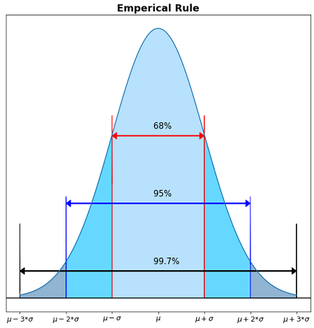
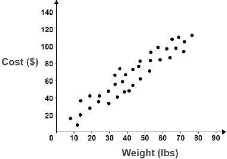
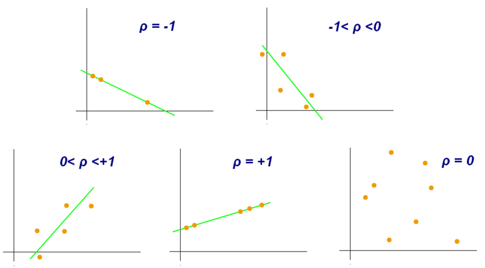

# statistics

<!-- @import "[TOC]" {cmd="toc" depthFrom=1 depthTo=6 orderedList=false} -->

<!-- code_chunk_output -->

- [statistics](#statistics)
    - [overview](#overview)
      - [1.基础概念](#1基础概念)
        - [(1) population and sample](#1-population-and-sample)
        - [(2) frequency 和 relative frequency](#2-frequency-和-relative-frequency)
        - [(3) percentile](#3-percentile)
      - [2.mearures of central tendency](#2mearures-of-central-tendency)
        - [(1) median](#1-median)
        - [(2) mode](#2-mode)
        - [(3) expectation (mean): $\mu$](#3-expectation-mean-mu)
      - [3.measures of spread](#3measures-of-spread)
        - [(1) range](#1-range)
        - [(2) min-range](#2-min-range)
        - [(3) interquartile range (IQR)](#3-interquartile-range-iqr)
        - [(4) mean absolute deviation (MAD)](#4-mean-absolute-deviation-mad)
        - [(5) variance (squared deviation): $\sigma^2$](#5-variance-squared-deviation-sigma2)
        - [(6) standard deviation: $\sigma$](#6-standard-deviation-sigma)
      - [4.sample的基本统计](#4sample的基本统计)
        - [(1) measures](#1-measures)
        - [(2) 为什么除以n-1](#2-为什么除以n-1)
      - [5.线性变化对指标的影响](#5线性变化对指标的影响)
      - [6.Z-score](#6z-score)
        - [(1) 定义](#1-定义)
        - [(2) normal distribution Z-table](#2-normal-distribution-z-table)
      - [7.data disribution](#7data-disribution)
        - [(1) density curves](#1-density-curves)
        - [(2) normal distribution (Gaussian distribution)](#2-normal-distribution-gaussian-distribution)
        - [(3) standard normal  distribution](#3-standard-normal--distribution)
      - [8.correlation](#8correlation)
        - [(1) description of correlation](#1-description-of-correlation)
        - [(2) scatterplots](#2-scatterplots)
        - [(3) covariance](#3-covariance)
        - [(4) correlation coefficent (相关系数): r](#4-correlation-coefficent-相关系数-r)
      - [8.normalization in statistic (统计学中的归一化)](#8normalization-in-statistic-统计学中的归一化)
        - [(1) Z-score normalization](#1-z-score-normalization)

<!-- /code_chunk_output -->

### overview

#### 1.基础概念

##### (1) population and sample

当无法对整体进行统计时（由于数量大、数据无法获得等），可以进行采样统计，从而反映整体的统计信息

##### (2) frequency 和 relative frequency
* the number of times the observation has occurred/recorded **in an experiment or study**

* relative frequency = frequency / total numbers of all observations

##### (3) percentile
* percentile: the percentage of the data that is at or below the amount in question 

#### 2.mearures of central tendency

##### (1) median
中位数

##### (2) mode
众数

##### (3) expectation (mean): $\mu$
* $E[X] = \sum_{i=1}^n x_ip_i = \frac{sum(X)}{num(X)}$

#### 3.measures of spread

##### (1) range
* $\max - \min$

##### (2) min-range
* $\frac{\max - \min}{2} + \min = \frac{\max + \min}{2}$

##### (3) interquartile range (IQR)

* IQR = quartile 3 - quartile 1 = 75th percentile - 25th percentile

##### (4) mean absolute deviation (MAD)
* MAD $= \frac{1}{n}\sum_{i=1}^n|x_i-\mu|$

##### (5) variance (squared deviation): $\sigma^2$

* $Var(X) = E[(X-\mu)^2] = \frac{1}{n}\sum_{i=1}^n(x_i-\mu)^2$

##### (6) standard deviation: $\sigma$

* $\sigma = \sqrt {Var(X)}$

#### 4.sample的基本统计

##### (1) measures
* mean: $\overline {x}$
* variance:
  * biased variance: $S^2_n=\frac{1}{n}\sum_{i=1}^n(x_i-\mu)^2$
  * unbiased variance: $S^2_{n-1}=\frac{1}{n-1}\sum_{i=1}^n(x_i-\mu)^2$
* standard deviation
  * biased standard deviation: $S_n$
  * unbiased standard deviation: $S_{n-1}$

##### (2) 为什么除以n-1
* 没有明确的证明，sample时，除以n-1，方差更准确
  * 当sample数量越多时
    * 数据越接近population
    * n-1影响就会越小

#### 5.线性变化对指标的影响

||median, mean|standard deviation|
|-|-|-|
|加减n|加减n|无影响|
|乘除n|乘除n|乘除n|

#### 6.Z-score

##### (1) 定义
how many $\sigma$ away from the $\mu$

* $Z = \frac{x - \mu}{\sigma}$

##### (2) normal distribution Z-table
* 查找normal distribution的[Z-table](https://www.dummies.com/article/academics-the-arts/math/statistics/how-to-use-the-z-table-147241/)，能够得到低于该Z-score区域的面积

#### 7.data disribution

##### (1) density curves
* 理解density curve
  * x轴: 数据的范围
  * y轴: density (value per unit)
  * 面积: relative frequency
    * 即 某个范围的数据 占 总数据的 百分比
    * 所以整个面积是100%（或1）
* median
  * 在x轴上标出median，左右两边的面积相等
* mean
  * sum(relative frequence * 对应的x值) / total number
  * symmetric distribution: mean = median
  * left skewd distribution: mean < median

##### (2) normal distribution (Gaussian distribution)
* $f(x) = \frac{1}{\sigma \sqrt{2\pi}}e^{-\frac{1}{2}(\frac{x-\mu}{\sigma})^2}$
* 特征
  * symmetric bell shape
  * mean = median

* empirical rule
  * 
  * Z-score $(\mu+\sigma)$ = 1
  * Z-score $(\mu-\sigma)$ = -1
  * Z-score $(\mu+2\sigma)$ = 2

##### (3) standard normal  distribution
* $\mu = 0$
* $\sigma = 1$

#### 8.correlation

##### (1) description of correlation
用于描述**两个变量**之间的关联
* Form: 
  * Is the association linear or nonlinear?
* Direction:
  * Is the association positive or negative?
* Strength:
  * Does the association appear to be strong, moderately strong, or weak?
    * 比如两个变量满足 positive linear model，所有的点都离这条线很近，则说明该关联很strong
* Outliers:
  * Do there appear to be any data points that are unusually far away from the general pattern?

##### (2) scatterplots
* 便于观察两个变量的关联

##### (3) covariance
* $Cov(X,Y) = E[(X-E[X])(Y-E[Y])] = \frac{1}{n}\sum_{i=1}^n(x_i-\mu_x)(y_i-\mu_y)$
  * 对于sample，除以n-1
  * 能够反映 X和Y变化的趋势**direction**（但不能反映趋势strength）：
    * 为正数时：x值越大（小），y值往往也越大（小）
    * 为负数时：x值越大，y值往往越小
    * 等于0时：y往往不随x变化

* $Cov(X,Y) = E[(X-E[X])(Y-E[Y])] = E(XY)-E(X)E(Y)$

##### (4) correlation coefficent (相关系数): r

how well a **linear** model can describe the relationship between two variables

* $Corr(X,Y) = \frac{Cov(X,Y)}{\sqrt {Var(X)} \sqrt {Var(Y)}} = \frac{1}{n}\sum_{i=1}^n(\frac{x_i-\mu_x}{\sigma_x})(\frac{y_i-\mu_y}{\sigma_y})$
  * 对于sample，除以n-1
  * x dataset的Z-score和y dataset的Z-score相乘
  * 范围: **-1 ~ 1**
  * 能够反映 X和Y变化的趋势**direction**和**strength**：
    * 当Corr的绝对值越接近于1，X和Y的关联度越高
      * 注意：这只是观察现象，并不是本质原因，可能还有更多变量，这里只关注X和Y的关系

  

* matrix correlation
  * 就是该元素的所在行和所在列的correlation

#### 8.normalization in statistic (统计学中的归一化)

使得数据分布符合一定要求

##### (1) Z-score normalization