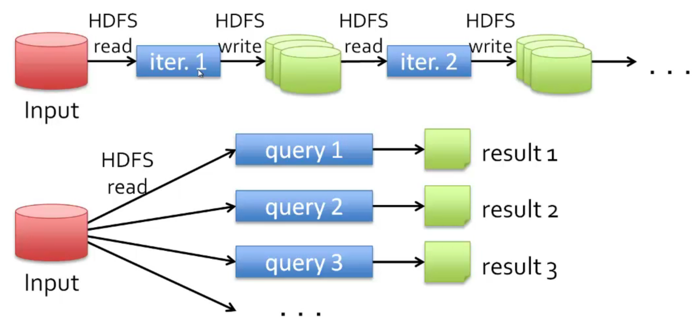

# overview

<!-- @import "[TOC]" {cmd="toc" depthFrom=1 depthTo=6 orderedList=false} -->

<!-- code_chunk_output -->

- [overview](#overview)
    - [概述](#概述)
      - [1.in-memory computing](#1in-memory-computing)
        - [(1) 使用磁盘 vs 使用内存](#1-使用磁盘-vs-使用内存)
        - [(2) 抽象多台机器的内存](#2-抽象多台机器的内存)

<!-- /code_chunk_output -->

### 概述

#### 1.in-memory computing

##### (1) 使用磁盘 vs 使用内存
* 使用磁盘

* 使用内存

##### (2) 抽象多台机器的内存

* 分布式共享内存（DSM）
    * 统一地址空间
    * 很难容错

* 分布式键-值存储
    * 允许细粒度访问
    * 可以修改数据（mutable）
    * 容错开销大

* RDD (resilient distributed datasets)
    * spark使用的此方法