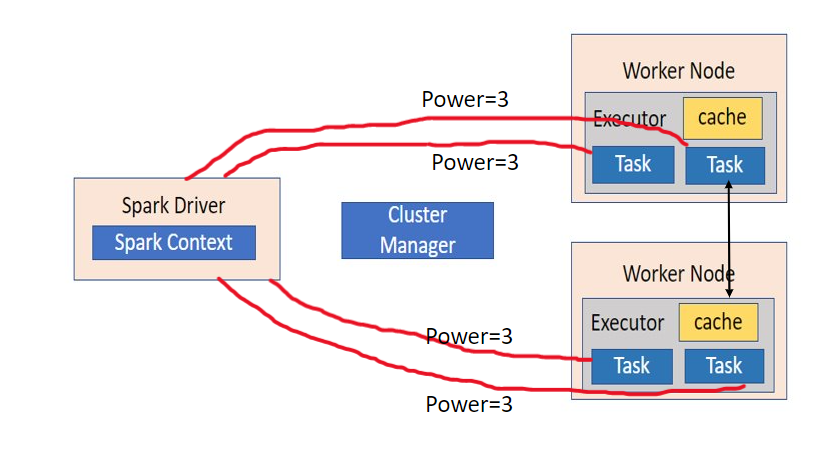
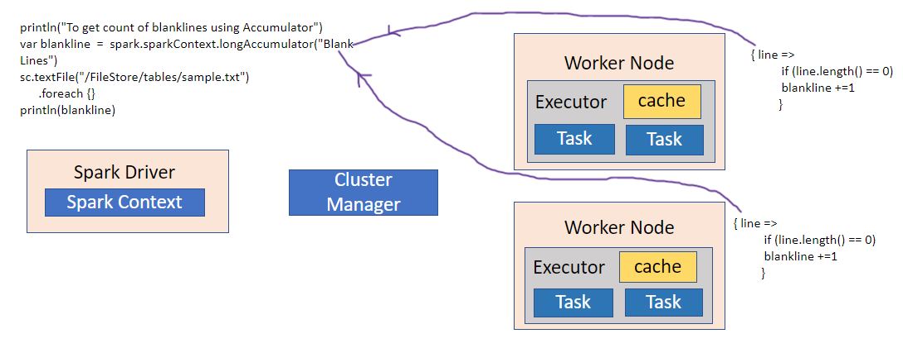

# overview


<!-- @import "[TOC]" {cmd="toc" depthFrom=1 depthTo=6 orderedList=false} -->

<!-- code_chunk_output -->

- [overview](#overview)
    - [基本使用](#基本使用)
      - [1.配置](#1配置)
      - [2.创建RDD](#2创建rdd)
        - [(1) 指定分区数](#1-指定分区数)
        - [(2) 使用序列](#2-使用序列)
        - [(2) 从文件读取数据](#2-从文件读取数据)
      - [3.常用Operator (算子)](#3常用operator-算子)
        - [(1) transformation operators](#1-transformation-operators)
        - [(2) action operators](#2-action-operators)
      - [3.分区相关Operator](#3分区相关operator)
        - [(1) transformation operators](#1-transformation-operators-1)
        - [(2) action operators](#2-action-operators-1)
      - [4.rdd缓存](#4rdd缓存)
      - [5.rdd checkpoint](#5rdd-checkpoint)
      - [5.常用库](#5常用库)
        - [(1) operator库中（包含了常用的函数）](#1-operator库中包含了常用的函数)
      - [6.broadcast 和 accumaltor](#6broadcast-和-accumaltor)
        - [(1) copy variable（默认）](#1-copy-variable默认)
        - [(2) broadcast变量（只读）](#2-broadcast变量只读)
        - [(3) accumaltor（数值）](#3-accumaltor数值)
        - [(4) 适用场景](#4-适用场景)

<!-- /code_chunk_output -->


### 基本使用

```python
from pyspark import SparkConf
from pyspark.sql import SparkSession
import operator

#创建SparkContext对象
conf  = SparkConf().setAppName("WordCount")

spark  = SparkSession.builder.\
    config(conf=conf).\
    getOrCreate()

sc = spark.sparkContext

#创建RDD，指定分区数为3
rdd = sc.parallelize([1,2,3,4,5,6,7,8,8,10], 3)

#将RDD各个分区的数据，统一收集到driver中，形成一个List对象
result = rdd.collect()
```

#### 1.配置

```python
conf  = SparkConf().setAppName("WordCount")
#使用hostname连接hdfs
conf.set("spark.hadoop.dfs.client.use.datanode.hostname", "true")
#可以迭代读取某个目录下的文件
conf.set("spark.hadoop.mapreduce.input.fileinputformat.input.dir.recursive", "true")
```

#### 2.创建RDD

##### (1) 指定分区数
如果指定的分区数过大，spark也不会采用

* 数据是怎么进行分区的
```python
print(rdd.glom().collect())
```

##### (2) 使用序列
```shell
rdd = sc.parallelize([1,2,3,4,5,6,7,8,8,10], 3)
```

##### (2) 从文件读取数据

* textFile
    * item: 文件的一行内容 就是 列表的一个item
    * 分区：将列表划分为一定数量的子集
```python
rdd = sc.textFile("hdfs://hadoop-01:9000/user/hdfs/input")
```

* wholeTextFile
    * item: 二元组，元组的第一部分是文件的路径，元组的第二部分是文件的内容
    * 分区：将列表划分为一定数量的子集

#### 3.常用Operator (算子)
* 算子: 分布式集合对象的API

##### (1) transformation operators

* 特点
    * old RDD -> new RDD
    * Lazy Evaluation
        * 只有调用了Action算子，才会对之前的 转换算子进行调用

* `map(func: Callable[[T], U])`
    * 遍历item，执行`func(item)`（返回任意类型）

    ```python
    def add(input):
        return (input,1)
        #return input+10

    rdd = sc.parallelize([0,1,2,3,4,5,6,7,8,9,10])
    rdd1 = rdd.map(add)
    #或者rdd1 = rdd.map(operator.add)
    ```

* `flatMap(func: Callable[[T], Iterable[U]])`
    * 遍历item，执行`func(item)`（返回可迭代类型），再对结果进行flat
        * 如果内嵌的是列表，则flat所有列表元素，如果内嵌的是dict，flat的是key，value会被丢弃
    ```python
    def add(input):
        return [input, input + 1]
    rdd = sc.parallelize([0,1,2,3,4,5,6,7,8,9,10])
    rdd1 = rdd.flatMap(add)
    #rdd1: [0, 1, 1, 2, 2, 3, 3, 4, 4, 5, 5, 6, 6, 7, 7, 8, 8, 9, 9, 10, 10, 11]
    ```

* `reduceByKey(func: Callable[[V, V], V])`
    * 针对 二元组 （即能够`for k,v in item`）
    * 根据key进行分组，每组中迭代执行`func(group[0], group[1])`，直至该group中只有一个item
    ```python
    def add(x, y):
        return x + y
    rdd = sc.parallelize([("a",1),("b",1),("a",2),("a",1),("c",5)])
    rdd1 = rdd.reduceByKey(add)
    #rdd1: [('b', 1), ('a', 4), ('c', 5)]
    ```
    * 性能远高于 groupByKey + reduce
        * 因为就近就行了reduce，避免了groupByKey导致的数据传输

* `groupByKey()`
    * 针对 二元组 （即能够`for k,v in item`）
    * 根据key进行分组，可以通过keyfunc**先对key进行处理**

* `groupBy(func: Callable[[T], K])`
    * 遍历item，func(item)的返回值作为key，然后将这个item放入这个key对应的序列中
    ```python
    def div(x):
        return x % 2
    rdd = sc.parallelize([1, 1, 2, 3, 5, 8])
    rdd1 = rdd.groupBy(div)
    rdd2 = rdd1.map(lambda t: (t[0], list(t[1])))
    #rdd1: [(0, <pyspark.resultiterable.ResultIterable object at 0x7f42a812b590>), (1, <pyspark.resultiterable.ResultIterable object at 0x7f42a812b610>)]
    #rdd2: [(0, [2, 8]), (1, [1, 1, 3, 5])]
    ```

* `mapValues(func: Callable[[V], U])`
    * 针对 二元组 （即能够`for k,v in item`）
    * 遍历二元组，执行`func(item[1])`的操作
    ```python
    def add(input):
        return input+10
    rdd = sc.parallelize([("a",1),("b",1),("a",2),("a",1),("c",5)])
    rdd1 = rdd.mapValues(add)
    #rdd1: [('a', 11), ('b', 11), ('a', 12), ('a', 11), ('c', 15)]
    ```

* `filter(func: Callable[[T], bool])`
    * 遍历item，保留func(item)为true的

* `distinct()`
    * 去重

* `union(<rdd>)`
    * 合并两个rdd，不去重
* `intersection(<rdd>)`
    * 求交集

* `join(<rdd>)`
    * <rdd>的item必须是 二元组
    * 内连接
    * 全外连接: `fullOuterJoin(<rdd>)`
    * 左外连接: `leftOuterJoin(<rdd>)`
    * 右外连接: `rightOuterJoin(<rdd>)`
    ```python
    rdd1 = sc.parallelize([("1", "liyi"), ("2","lier"), ("3", "lisan")])
    rdd2 = sc.parallelize([("1", "20"), ("2", "21"), ("4", "19")])

    rdd3 = rdd1.join(rdd2)
    rdd4 = rdd1.fullOuterJoin(rdd2)
    rdd5 = rdd1.leftOuterJoin(rdd2)

    #rdd3: [('2', ('lier', '21')), ('1', ('liyi', '20'))]
    #rdd4: [('2', ('lier', '21')), ('3', ('lisan', None)), ('4', (None, '19')), ('1', ('liyi', '20'))]
    #rdd5: [('2', ('lier', '21')), ('3', ('lisan', None)), ('1', ('liyi', '20'))]
    ```

* `sortBy(func: Callable[[T], S], ascending=True)`
    * 只能保证**一个分区**内的数据是有序的
    * 遍历item，根据func(item)的返回值进行排序

* `sortByKey(ascending=True)`
    * 只能保证**一个分区**内的数据是有序的
    * 针对 二元组 （即能够`for k,v in item`）
    * 按照key进行排序，可以通过keyfunc**先对key进行处理**

##### (2) action operators

* 特点
    * RDD -> 非RDD

* `collect()`
    * 将RDD各个分区的数据，统一收集到driver中，形成一个List对象
    * 如果集太大，就会有问题，因为内存不够用
* `countByKey()`
    * 计算同一个key的数量
* `reduce(func(Callable[[T, T], T]))`
    * 迭代执行`func(list[0], list[1])`，直至该list中只有一个item
* first()、take()、top()、count()
* `takeSample(withReplacement: bool, num: int)`
    * with replacement 表示一个对象可以重复采样（而不是对象的值）
        * 比如： 数据[1,1,2,3,4]，如果不允许replacement，则采出的样本最多只有两个1，如果允许，采出的样本可能为[1,1,1,1,1,4]
* `takeOrdered(num: int, key: Optional[Callable[[T], S]] = None)`
    * 先对数据进行变换（可以不变），然后进行升序排序，最后取出前n个（取出的数据是原始数据，而不是变换后的数据）
* `foreach(func: Callable[[T], None])`
    * 和map类似，只是没有返回值
    * 所以数据不会收集到driver中
* `saveAsTextFile(path)`
    * 有几个分区就写入几个文件（所以数据没有收集到driver中）
    * 支持写入hdfs中

#### 3.分区相关Operator

##### (1) transformation operators
* `mapPartitions(func: Callable[[Iterable[T]], Iterable[U]])`
    * 与map本质是一样，只不过一次性将整个分区数据传入到函数中，当数据比较分散时，能够提高性能
    * 只不过func接受的参数是整个partition数据，然后的也是整个partition数据

* `partitionBy(numPartitions: Optional[int], partitionFunc: Callable[[K], int] = <function portable_hash>)`
    * 针对 二元组 （即能够`for k,v in item`）
    * numPartitions表示分区数，比如设为3时，则分区号就为0、1、2
    * partitionFunc将key作为参数传入，返回一个int（即分区号）

* `coalesce(numPartitions: int, shuffle: bool = False)`
    * 调节数据使分区数为n，是否进行shuffle，当为False时，表示不进行shuffle（即不增加分区）
        * 当分区数减少时，属于narrow dependencies，所以不进行reshuffle

##### (2) action operators
* `foreach(func: Callable[[Iterable[T]], None])`

#### 4.rdd缓存

* 使用内存缓存
```python
rdd.cache()
#本质调用的是 rdd.persist(MEMORY_ONLY)
```

* 使用其他方式
```python
rdd.persist(DISK_ONLY)
rdd.persist(MEMORY_AND_DISK)
#等等
```

* 取消缓存
```python
rdd.unpersist()
```

#### 5.rdd checkpoint
```python
#必须是hdfs的路径
sc.setCheckpointDir("hdfs://hadoop-01:9000/user/hdfs/input")
result_rdd.checkpoint()
```

#### 5.常用库

##### (1) operator库中（包含了常用的函数）

* 比如: add、sub等

#### 6.broadcast 和 accumaltor

##### (1) copy variable（默认）
* 代码首先都是运行在driver中的
* driver会分发rdd到各个executor
* **task**如果需要在driver中定义的变量，则会找driver申请，driver会**拷贝**一份给task
    * 所以不会影响driver中那个变量的值



* 示例代码
```python
conf  = SparkConf().setAppName("WordCount")
sc = SparkContext(conf=conf)

count=0
def accu(x):
    global count
    count += 1
    print(count)
rdd1 = sc.parallelize(range(1,10),3)
rdd2 = rdd1.map(accu)
rdd2.collect()
print(count)

'''
输出结果:

1
2
3
1
2
3
1
2
3
0
'''
```

##### (2) broadcast变量（只读）
* executor会会在本地缓存中查看有没有这个变量，没有会找driver申请
* driver然后会将这个变量广播到各个worker node（一个worker node可能会有多个executor）
* 所有broadcast**只读**，不能修改，否则会导致数据不一致


* 示例代码
```python
count=0
broadcast = sc.broadcast(count)
def accu(x):
    a = broadcast.value
    a+=1
    print(a)
rdd1 = sc.parallelize(range(1,10),3)
rdd2 = rdd1.map(accu)
rdd2.collect()
print(broadcast.value)

'''
输出结果:
1
1
1
1
1
1
1
1
1
0
'''
```

##### (3) accumaltor（数值）


* 示例代码一
```python
#只能是数值类型
count=sc.accumulator(0)
def accu(x):
    global count
    count+=1
    print(count)
rdd1 = sc.parallelize(range(1,10),3)
rdd2 = rdd1.map(accu)
rdd2.collect()
print(count)

'''
输出结果:
1
2
3
1
2
3
1
2
3
9
'''
```

* 示例二
```python
count=sc.accumulator(0)
def accu(x):
    global count
    count+=1
rdd1 = sc.parallelize(range(1,10),3)
rdd2 = rdd1.map(accu)
rdd2.collect()
rdd3 =rdd2.map(lambda x: x)
rdd3.collect()
print(count)

'''
输出结果:
18

解释:
因为rdd2被调用了两次
'''
```

* 示例三
```python
count=sc.accumulator(0)
def accu(x):
    global count
    count+=1
rdd1 = sc.parallelize(range(1,10),3)
rdd2 = rdd1.map(accu)
rdd2.cache()
rdd2.collect()
rdd3 =rdd2.map(lambda x: x)
rdd3.collect()
print(count)

'''
输出结果:
9

解释:
因为rdd2被调用了一次
'''
```

##### (4) 适用场景
* broadcast
    * 需要共享的数据大
        * 几兆，如果太大就适合使用rdd的join方式
    * 数据需要被大部分executor使用
    * 数据会被频繁访问