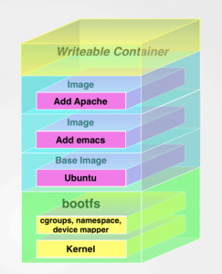

# docker镜像

<!-- @import "[TOC]" {cmd="toc" depthFrom=1 depthTo=6 orderedList=false} -->
<!-- code_chunk_output -->

- [docker镜像](#docker镜像)
    - [概述](#概述)
      - [1.image: a JSON manifest(包含files的信息) + files(config、layer)](#1image-a-json-manifest包含files的信息--filesconfig-layer)
        - [（1）index（在registry中存储会有index）](#1index在registry中存储会有index)
        - [（2）image content: a JSON manifest(包含files的信息) + files(config、layer)](#2image-content-a-json-manifest包含files的信息--filesconfig-layer)
        - [（3）snapshot（对于containerd）](#3snapshot对于containerd)
        - [（4）利用ctr查看镜像的content](#4利用ctr查看镜像的content)
      - [2.container](#2container)
      - [3.镜像采用分层构建机制](#3镜像采用分层构建机制)
        - [3.1 概述](#31-概述)
        - [3.2 分层的优点](#32-分层的优点)
      - [4.docker支持的存储驱动](#4docker支持的存储驱动)
      - [5.overlay2驱动](#5overlay2驱动)
        - [（1） 特点](#1-特点)
        - [（2）`/var/lib/docker/overlay2/<id>/`目录下可能有的内容](#2varlibdockeroverlay2id目录下可能有的内容)
        - [（3）根据overlay2的`<id>`获取`<container_id>`](#3根据overlay2的id获取container_id)
      - [6.docker目录说明: `/var/lib/docker/`](#6docker目录说明-varlibdocker)
      - [7.containerd目录说明](#7containerd目录说明)
      - [8.docker registry](#8docker-registry)
      - [9.打包镜像](#9打包镜像)

<!-- /code_chunk_output -->

### 概述

#### 1.image: a JSON manifest(包含files的信息) + files(config、layer)
是一个只读模板，[参考](https://github.com/containerd/containerd/blob/main/docs/content-flow.md)

##### （1）index（在registry中存储会有index）
* 一个镜像有多个manifest（因为每个平台对应一个manifest，比如linux-adm64平台需要使用相应的manifest）
* index为manifest的哈希
```shell
#aiops/data-cleaning:zdgt这个镜像只有一个manifest（即e7c...）
$ ls /data/registry/docker/registry/v2/repositories/aiops/data-cleaning/_manifests/tags/zdgt/index/sha256/

e7cb24b1b1d23063777027fa448821b89e334e36e2505bf36d0047a74723f20b
```


##### （2）image content: a JSON manifest(包含files的信息) + files(config、layer)

* a JSON manifest（用于描述该镜像的信息）
```json
{
   "schemaVersion": 2,
   "mediaType": "application/vnd.docker.distribution.manifest.v2+json",

   //config文件（根据digest去查找config），即镜像的启动命令等等
   "config": {
      "mediaType": "application/vnd.docker.container.image.v1+json",
      "size": 3834,
      "digest": "sha256:4c5c325303915ea5cad48921922fae6f7d877aa7b1bafde068225dc36e5e3468"
   },

   //layers文件（根据digest去查找layer）
   "layers": [
      {
         "mediaType": "application/vnd.docker.image.rootfs.diff.tar.gzip",
         "size": 18093,
         "digest": "sha256:637e7e7d198ccf674d454ac31556613afc10283292bc05325cc8a185f7aeca3e"
      }

      //...
   ]
}
```

* `docker inspect <image>`的id说明
```json
{

  //这个id是该镜像config file的哈希
  "id": "sha256:4c5c325303915ea5cad48921922fae6f7d877aa7b1bafde068225dc36e5e3468",

  //这个镜像后的id是manifest的哈希
  "repoDigests": [
    "10.10.10.250/library/calico/cni@sha256:7aa6c97fc5f6a6959f8b06bacc12e6f593c68e6e0839e1f454ba0b9523255a79"
  ]
}
```

##### （3）snapshot（对于containerd）
[参考](https://blog.mobyproject.org/where-are-containerds-graph-drivers-145fc9b7255)
* 容器的只读层和可写层
  * 因为content是压缩过的镜像内容，且不允许修改，所以需要snapshot来管理只读层和可写层
  * 内部整合之后，挂载到`/run/containerd/io.containerd.runtime.v2.task/k8s.io/<container_id>/rootfs`目录下，文件系统类型为overlay

##### （4）利用ctr查看镜像的content
```shell
$ ctr -n k8s.io content ls | grep kube-controller

DIGEST									SIZE	AGE		LABELS
#这个label中有containerd.io/uncompressed，表示这个layer 没有压缩时的哈希
#  find / -iname '31faef45b5465d0e4a613ea5d7398a431f1964dadb129aa214d2ba6b4955c8b2'
sha256:31faef45b5465d0e4a613ea5d7398a431f1964dadb129aa214d2ba6b4955c8b2	28.08MB	7 months	containerd.io/uncompressed=sha256:e762f80a5ad3e5009de92a6cb3418de4e0266e7451276e742bb793df9225f4bb,containerd.io/distribution.source.10.10.10.250=library/k8s.gcr.io/kube-controller-manager

#这个label中有containerd.io/gc.ref.content，表示这个是manifest的哈希
# find / -iname '4383e498ee2eb0cbbf56a415b382ede538acff8aec6366a589d0e9bb12723922'
sha256:4383e498ee2eb0cbbf56a415b382ede538acff8aec6366a589d0e9bb12723922	949B	7 months	containerd.io/gc.ref.content.l.2=sha256:31faef45b5465d0e4a613ea5d7398a431f1964dadb129aa214d2ba6b4955c8b2,containerd.io/gc.ref.content.l.1=sha256:15663828260b844f6fd9637195bf716ca809a9020b913a032f03ff06c31cf985,containerd.io/gc.ref.content.l.0=sha256:ab2f6dae3b543cfb15c6bbc4ce6368bb84fd76fcb08efb54fb9345240e9f4e34,containerd.io/gc.ref.content.config=sha256:790d6af1dbdc34750316956467c9713468594ee9ec35d7e5b25bdd71841dac1b,containerd.io/distribution.source.10.10.10.250=library/k8s.gcr.io/kube-controller-manager

#这个label中有containerd.io/gc.ref，表示这个可能是config file的哈希（通过下面方式查看里面内容可以确认）
# find / -iname '790d6af1dbdc34750316956467c9713468594ee9ec35d7e5b25bdd71841dac1b'
sha256:790d6af1dbdc34750316956467c9713468594ee9ec35d7e5b25bdd71841dac1b	1.618kB	7 months	containerd.io/gc.ref.snapshot.overlayfs=sha256:dfdeb512861694ed17c8df616fd704108c065901346778688f7b4d3db4c9ceb8,containerd.io/distribution.source.10.10.10.250=library/k8s.gcr.io/kube-controller-manager
```

#### 2.container
容器是镜像的可运行实例

#### 3.镜像采用分层构建机制


##### 3.1 概述

* 最底层为bootfs
```
用于系统引导的文件系统，包括bootloader和kernel，
容器启动后会被卸载以节省内存
```

* 上面的所有层整体称为rootfs
```
表现为容器的根文件系统，
在docker中rootfs只挂载为"只读"模式，
而后通过"联合挂载"技术额外挂载一个"可写"层
```

* 最上层为"可写"层
```
所有的写操作，只能在这一层实现，
如果删除容器，这个层也会被删除，即数据不会发生变化
```

##### 3.2 分层的优点
某些层可以进行共享，所以减轻了分发的压力（比如，底层是一个centos系统，可以将底层与tomcat层或nginx层联合，提供相应的服务）

#### 4.docker支持的存储驱动
|storage driver|支持的后端文件系统|
|-|-|
|overlay2，overlay|xfs，ext4|
|aufs|xfs，ext4|
|devicemapper|direct-lvm|
|btrfs|btrfs|
|zfs|zfs|
|vfs|所有文件系统|

#### 5.overlay2驱动

##### （1） 特点
* image的每一层，都会在`/var/lib/docker/overlay2/`目录下生成一个目录
* 启动容器后，会在`/var/lib/docker/overlay2/`目录下生成一个目录（即**可写层**），会将**overlay文件系统** **挂载** 在该目录下的`merged`目录上

##### （2）`/var/lib/docker/overlay2/<id>/`目录下可能有的内容

|目录或文件|说明|
|-|-|
|diff（目录）|目录里存储 **可写层的内容**，即发生了变化的内容</br>目录层级，与容器内目录层级一样|
|merged（目录）|目录里存储 **下面所有的层** 和 **可写层** **合并**后的内容，即容器内的文件系统|
|lower（文件）|记录 下面所有层的 id</br>根据层的id，查看层的内容：`ll /var/lib/docker/overlay2/l/`|
|link（文件）|记录 当前层的 id</br>根据层的id，查看层的内容：`ll /var/lib/docker/overlay2/l/`|

##### （3）根据overlay2的`<id>`获取`<container_id>`
```shell
docker inspect `docker ps -qa` > /tmp/a.txt
#然后去/tmp/a.txt中查找`<id>`
```

#### 6.docker目录说明: `/var/lib/docker/`

|目录|说明|
|-|-|
|`overlay2`|存储各层的数据（包括只读层、可写层）|
|`containers`|存储各容器的metadata（包括`resolve.conf`、`hostname`等|

#### 7.containerd目录说明
|目录|说明|
|-|-|
|`/run/containerd/io.containerd.runtime.v2.task/k8s.io/<container_id>/rootfs/`|只读和可写层merge之后的目录|
|`/var/lib/containerd/io.containerd.grpc.v1.cri/sandboxes/<sandbox(pod)_id>/`|把pod的共享数据放里面（比如网络数据: `resolve.conf`、`hosts`等|

#### 8.docker registry
一个registry可以存在多个repository（一般一个软件有一个repository，里面存储该软件不通版本的镜像）
repository可分为"顶层仓库"和"用户仓库"
用户仓库名称格式：用户名/仓库名


#### 9.打包镜像
可以打包多个镜像
打包镜像只指定仓库，会将该仓库所有的镜像都打包
打包镜像指定仓库和标签，只会打包指定镜像
打包镜像指定镜像id，只会打包该镜像，不会包括该镜像的仓库和标签
