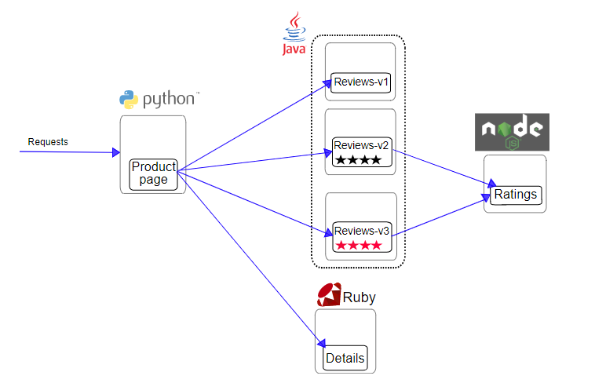

# Bookinfo Demo
### 概述
#### 1.Bookinfo应用被分解为4个微服务
* productpage
会调用details和reviews微服务来填充页面
* details
details微服务包含书的详情
* reviews
reviews微服务包含书的评价，并且会调用ratings微服务
* ratings
ratings微服务包含书的评分
#### 2.reviews微服务有3个版本
* v1版本不调用ratings微服务
* v2版本调用ratings微服务，显示成黑色
* v3版本调用ratings微服务，显示成红色
### 整体架构
#### 1.未使用istio时的架构

#### 2.使用istio时的架构

### 具体说明
#### 1.外部流量控制（GateWay)
准许所有访问80端口的http流量进入
```yaml
apiVersion: networking.istio.io/v1beta1
kind: Gateway
metadata:
  name: bookinfo-gateway
spec:
  selector:
    istio: ingressgateway
  servers:

#准许所有访问80端口的http流量进入
  - hosts:
    - '*'
    port:
      name: http
      number: 80
      protocol: HTTP

```
#### 2.外部流量和内部流量的路由（VirtualService）
将访问指定url的流量都路由到productpage这个service上的9080端口
```yaml
apiVersion: networking.istio.io/v1beta1
kind: VirtualService
metadata:
  name: bookinfo
spec:

#指定用于哪些GateWay
  gateways:
  - bookinfo-gateway

  hosts:
  - '*'
  http:
  - match:
    - uri:
        exact: /productpage
    - uri:
        prefix: /static
    - uri:
        exact: /login
    - uri:
        exact: /logout
    - uri:
        prefix: /api/v1/products
    route:
    - destination:
        host: productpage
        port:
          number: 9080
```

#### 3.productpage这个service将所有流量路由到productpage这个应用上（只有一个)
```yaml
apiVersion: v1
kind: Service
metadata:
  name: productpage
spec:
  clusterIP: 10.110.232.42
  ports:
  - name: http
    port: 9080
    protocol: TCP
    targetPort: 9080
  selector:
    app: productpage
  sessionAffinity: None
  type: ClusterIP
```

#### 4.productpage应用会发送请求到details和reviews这两个服务

#### 5.reviews应用会发送请求到ratings这个服务

#### 6.ratings应用会发送请求到productpage这个服务
