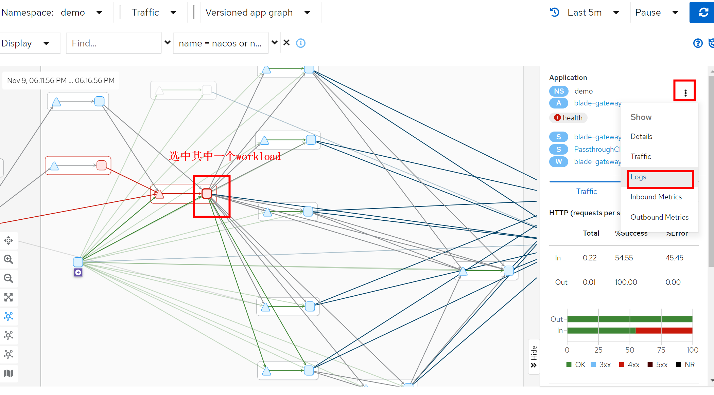
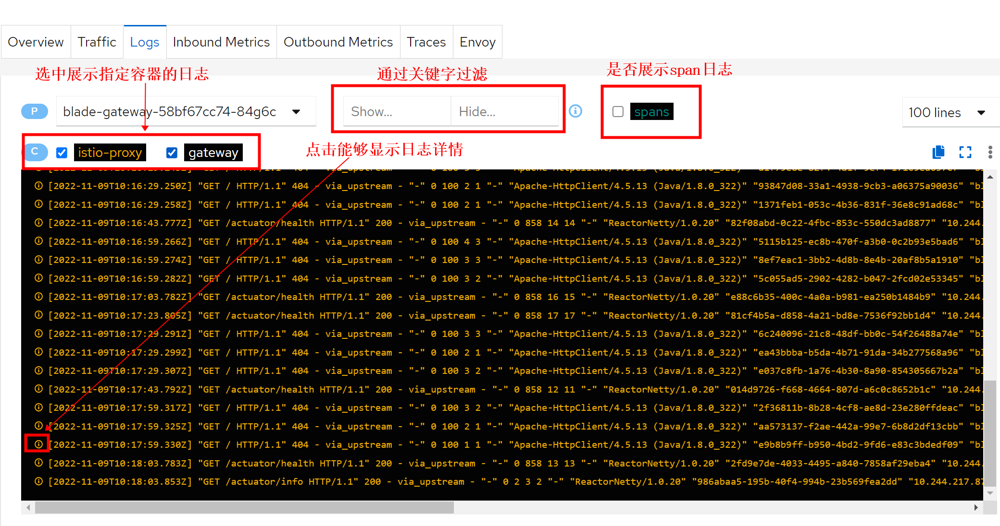
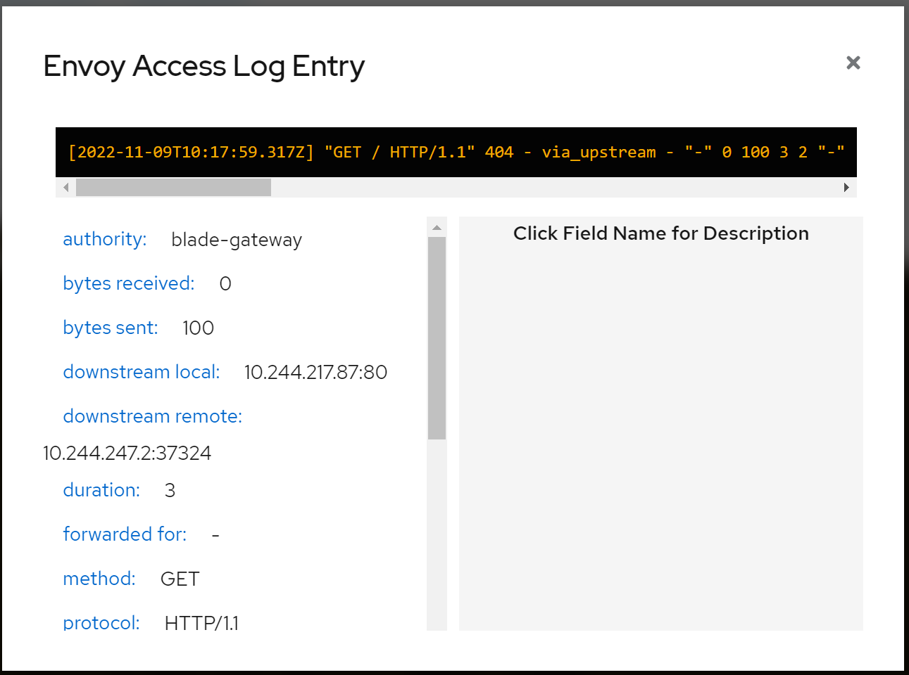

# kiali

<!-- @import "[TOC]" {cmd="toc" depthFrom=1 depthTo=6 orderedList=false} -->
<!-- code_chunk_output -->

- [kiali](#kiali)
    - [概述](#概述)
      - [1.图的基本元素](#1图的基本元素)
      - [2.图示说明](#2图示说明)
      - [3.日志功能使用](#3日志功能使用)

<!-- /code_chunk_output -->

### 概述

#### 1.图的基本元素

|元素|说明|
|-|-|
|edge|连接|
|service|即k8s的service|
|app、workload|即controller|

#### 2.图示说明

* 指标说明

|指标|单位|适用的流量|说明|
|-|-|-|-|
|Response Time|ms s|基于请求的流量（不包括TCP和gRPC）|响应时间|
|Throughput|bps（bytes per second） kps（kilobytes per second）|HTTP|吞吐量（每秒的请求或接收的字节数）|
|Traffic Distribution|%|HTTP、gRPC|流量分布|
|Traffic Rate|HTTP: rps（requests per second） gRPC: rps、mps（messages per second） TCP: bps（bytes per second）||流量的速率|

* 展示说明
[参考](https://kiali.io/docs/features/topology/#graph)

|展示|说明|
|-|-|
|Compressed Hide|当hide匹配时，则隐藏匹配的内容|
|Idle Edges|展示空闲的连接（即当前时间段可能没有连接，其他时间段有，就展示出来）|
|Idle Nodes|展示空闲的节点|
|Operation Nodes|展示操作节点（istio通过Classifying Metrics划分的，具体参考istio内容）
|Service Nodes|展示service|
|Rank|结合find和hide使用，rank对node进行排序（有两个指标：inbound edges和outbound edges，比如按照inbound edges进行排序，有最多inbound edges的node的rank=1，然后结合find和hide设置rank条件，从而过滤相应的node）|
|Traffic Animation|开启流量的动态效果|

#### 3.日志功能使用

* 日志详情

