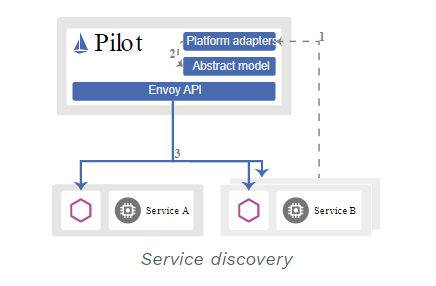

# overview

[toc]

### Prerequisites

#### 1.sidecar模式
边车部署模式，一个单节点有两个容器组成，一个是应用容器，一个是配件容器，配件容器**共享**应用容器的**资源**和**生命周期**，即配件容器不能单独存活
* 这里指的是把一个**微服务**和一个**proxy**部署在一起  

#### 2.service mesh

* 定义
  * 一个service mesh是一个可配置的**infrastructure layer**，能够处理在此mesh中所有服务之间的通信（包括进入和外出的）
* 实现方式
  * sidecar proxy

***

### Concepts

#### 1.Architecture

##### （1）envoy
* 与控制平面通信，获取配置
* 所有流量进出pod之前，都需要经过envoy
* istio使用envoy实现了以下功能:
  * Traffic control features
    * enforce fine-grained traffic control with rich routing rules for HTTP, gRPC, WebSocket, and TCP traffic.
  * Network resiliency features
    * setup retries, failovers, circuit breakers, and fault injection.
  * Security and authentication features
    * enforce security policies and enforce access control and rate limiting defined through the configuration API.
  * Pluggable extensions model based on WebAssembly that allows for custom policy enforcement and telemetry generation for mesh traffic.
* 启动envoy时，会设置iptables，将所有进入流量转到15006端口，所有外出流量转到15001端口

##### （2）istiod
* service discovery（pilot）
* configuration（galley）
* certificate management（citadel）
  * Istiod acts as a Certificate Authority (CA) and generates certificates to allow secure mTLS communication in the data plane.

#### 2.与k8s的对应

|envoy中|k8s中|
|-|-|
|workload|deployment|
|workload instance|pod|
|endpoint（不是k8s中的endpoints资源，而是endpoints中的一个个endpoint，所以可以理解为一个endpoint就是一个pod）||
|service（包含k8s中的serivce）||

* service discovery
发现service，然后注入到envoy配置中

* traffic management
istio维护了一个内部的**服务注册表**
该表是**services**和**其endpoints**的集合
表中的内容是由 pilot组成 自动发现生成的

* resiliency
弹性设置（比如超时时间、重试次数）

##### （3）citadel
利用**身份管理**和**凭证管理**实现服务到服务和终端用户的认证

##### （4）galley
负责配置验证、配置提取、配置处理和配置分发

#### 2.核心功能
* traffic management
依赖以sidecar模式部署envoy，所有流量由envoy转发
无需对服务做任何更改
* security
* observability
