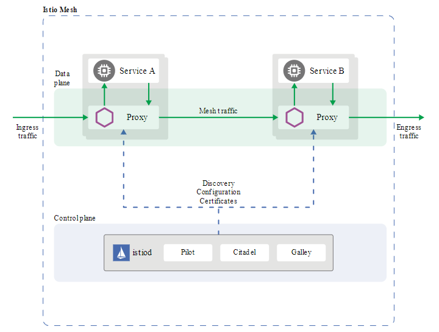

# overview

<!-- @import "[TOC]" {cmd="toc" depthFrom=1 depthTo=6 orderedList=false} -->
<!-- code_chunk_output -->

- [overview](#overview)
    - [Prerequisites](#prerequisites)
      - [1.sidecar模式](#1sidecar模式)
      - [2.service mesh](#2service-mesh)
    - [概述](#概述)
      - [1.Architecture](#1architecture)
        - [（1）istio-proxy](#1istio-proxy)
        - [（2）istiod](#2istiod)
        - [（3）监控体系架构说明](#3监控体系架构说明)
      - [2.istio使用的端口](#2istio使用的端口)

<!-- /code_chunk_output -->

### Prerequisites

#### 1.sidecar模式
边车部署模式，一个单节点有两个容器组成，一个是应用容器，一个是配件容器，配件容器**共享**应用容器的**资源**和**生命周期**，即配件容器不能单独存活
* 这里指的是把一个**微服务**和一个**proxy**部署在一起  

#### 2.service mesh

* 定义
  * 一个service mesh是一个可配置的**infrastructure layer**，能够处理在此mesh中所有服务之间的通信（包括进入和外出的）
* 实现方式
  * sidecar proxy

***

### 概述

#### 1.Architecture

##### （1）istio-proxy
* 包含下面组件：
  * **envoy**
  * **pilot-agent**（也叫istio agent, 用于envoy连接istiod）
* 启动envoy时，会设置iptables，将所有进入流量转到15006端口，所有外出流量转到15001端口
  * 所有流量进出pod之前，都需要经过envoy

##### （2）istiod
* service discovery（pilot）
* configuration（galley）
* certificate management（citadel）
  * Istiod acts as a Certificate Authority (CA) and generates certificates to allow secure mTLS communication in the data plane.

##### （3）监控体系架构说明
* istiod本身不存储任何数据
* 配置provider后，数据会推送到相应的provider
  * metrics（包括服务间的调用关系） 存储在prometheus中，由于不是主动推送的，而是prometheus主动拉取的，所以prometheus provider不需要配置
  * tracing 通过zipkin等接口进行存储，需要配置tracing provider，将数据推送到此接口
  * log 默认provider为envoy，即打印到/dev/stdout
* 监控展示(kiali)
  * 需要配置相应的provider地址，才能展示数据
  * metric 需要配置prometheus地址，才能获取metric数据进行展示
  * tracing 需要配置tracing provider地址，才能获取tracing数据进行展示

#### 2.istio使用的端口
[参考](https://istio.io/latest/docs/ops/deployment/requirements/)
