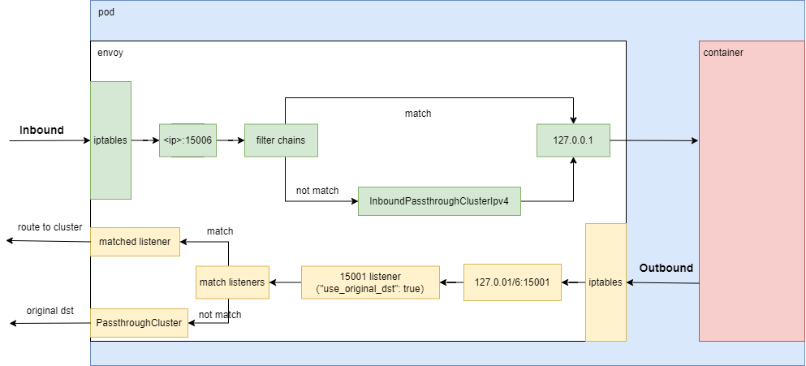

# usage


<!-- @import "[TOC]" {cmd="toc" depthFrom=1 depthTo=6 orderedList=false} -->
<!-- code_chunk_output -->

- [usage](#usage)
    - [预备知识](#预备知识)
      - [1.server first protocol](#1server-first-protocol)
    - [概述](#概述)
      - [1.istio的基本概念（与k8s的关联）](#1istio的基本概念与k8s的关联)
      - [2.工作原理](#2工作原理)
        - [（1）工作原理](#1工作原理)
        - [（2）两个特殊的listener 和 配置原理](#2两个特殊的listener-和-配置原理)
        - [（3）magical  number: 6](#3magical-number-6)
      - [3.支持转发的流量](#3支持转发的流量)
        - [（1）自动识别协议（当没有指定协议时，默认自动识别）（不建议开启）](#1自动识别协议当没有指定协议时默认自动识别不建议开启)
        - [（2）明确指定协议（server first protocol需要明确指定）](#2明确指定协议server-first-protocol需要明确指定)
    - [在k8s中使用](#在k8s中使用)
      - [1.以sidecar形式注入到pod中](#1以sidecar形式注入到pod中)
        - [（1）使用限制（以下情况无法使用）](#1使用限制以下情况无法使用)
        - [（2）会对健康检查进行修改](#2会对健康检查进行修改)
      - [2.对pod的要求](#2对pod的要求)
        - [（1）必须与service关联（流量管理的需求）](#1必须与service关联流量管理的需求)
        - [（2）uid`1337`必须预留](#2uid1337必须预留)
        - [（3）NET_ADMIN 、NET_RAW 能力 或者 使用istio cni插件](#3net_admin-net_raw-能力-或者-使用istio-cni插件)
        - [（4） 设置标签（不是必须）：](#4-设置标签不是必须)
        - [（5）service port使用的协议是server first protocol，必须明确指定协议（比如：TCP）](#5service-port使用的协议是server-first-protocol必须明确指定协议比如tcp)
        - [（6）不能设置` hostNetwork: true`](#6不能设置-hostnetwork-true)
      - [3.对service的要求](#3对service的要求)
        - [（1）明确指定协议：`<protocol>[-<suffix>]`](#1明确指定协议protocol-suffix)
        - [（2）支持的协议：](#2支持的协议)

<!-- /code_chunk_output -->


### 预备知识

#### 1.server first protocol
* 由server发送第一个字节，会影响 PERMISSIVE mTLS 和 协议自动识别
* 常见的server first protocol:
  * SMTP
  * DNS
  * MySQL
  * MongoDB

***

### 概述

#### 1.istio的基本概念（与k8s的关联）

* 注意envoy中的概念 > k8s中的

|envoy中|说明|自动发现k8s中的资源（生成istio中的资源）|
|-|-|-|
|application|一个应用是一个复杂的组合，包含多个workload组成|属于同一个application: 同一个ns下，有相同`app`标签的pods的controller </br> application名称就是`app`标签的值 </br> application由workload（即controller）组成|
|workload|一个worklod提供某些功能|controller（比如:deployment等）|
|workload instance|一个workload下的实例功能都相同|pod|
|service|代理，关联多个endpoint|service|
|endpoint|访问点|是endpoints中的一个个endpoint，每个endpoint还会关联pod的相关信息（比如：labels等，所以可以理解为一个endpoint就是一个pod）|

#### 2.工作原理

##### （1）工作原理

* 这个listener不代表实际监听的port，而是用来匹配数据包的目的地址
* 注意在istio中：
  * 启动envoy之前，都会先设置**iptables**
  * 将所有 **进入流量** 转到envoy的 **15006** 端口
      * 流量到达了15006这个listener上
        * 会根据 元数据（目标地址、端口、协议等）匹配一个最佳的 **filter chain**
        * 如果没有匹配到，则发送到 InboundPassthroughClusterIpv4 这个cluster上
  * 将所有 **外出流量** 转到envoy的 **15001** 端口
    * 流量到达了15001这个listener上（设置了`"use_original_dst": true`）
      * 该listner根据 **元数据**（原始的目标地址即`ip+port`、协议等信息） 匹配最佳的 **listener** 去处理
        * 发往："1.1.1.1:9080"，经过iptables转发到15001这个端口上（则15001这个listener进行处理）
        * 如果存在"1.1.1.1:9080"这个listener，则会转交给这个listener，不存在的话继续
        * 如果存在"0.0.0.0:9080"这个listener（0.0.0.0表示匹配所有），则会转交给这个listener
      * 如果未匹配到则自己处理（即15001这个listener自己处理）
        * 会将外出的流量发送到 PassthroughCluster 这个cluster上
        * 其他流量则发送到 BlackHoleCluster 这个cluster上

##### （2）两个特殊的listener 和 配置原理

* virtualInbound
  * 所以 **进入**流量都要经过这个listener
* virtualOutBound
  * 所有 **外出**流量都要经过这个listener

* 所有关于Inbound的配置，是在VirtualInbound这个listener上配的
* 所有关于Outbound的配置，是在所有listener上配的（不包括两个特殊的listener）

##### （3）magical  number: 6

* 15006
  * 所有流量入口
* `127.0.0.6` 和 `::6`（[参考](https://github.com/istio/istio/issues/29603)）
  * 用于标记入站流量，且永远不会命中出站流量的iptables规则
  * istio proxy用于和upstream（即后端代理的服务）建立连接的地址

#### 3.支持转发的流量
[参考](https://istio.io/latest/docs/ops/configuration/traffic-management/protocol-selection/)
* 支持转发所有TCP的流量
* 不支持转发非TCP的流量（比如UDP），即istio proxy不会拦截该流量（即该流量不经过istio proxy）

##### （1）自动识别协议（当没有指定协议时，默认自动识别）（不建议开启）
* 注意：
  * server first protocol与此种方式不兼容，所以必须明确指定协议（比如：TCP、Mysql等）
  * 不建议开启
    * 原因：可能会把http协议检测成http2，导致流量不通
    * 关闭后，没有指定的默认都是tcp协议
* istio能够自动识别的协议：http 和 http2
* 如果无法识别协议，则认为是纯TCP流量
* 底层原理：通过设置http_inspector（listener filter）

##### （2）明确指定协议（server first protocol需要明确指定）
* 两种方式
  * 通过端口的名称：`svc.spec.ports.name: <protocol>[-<suffix>]`
  * 通过字段明确指定：`svc.spec.ports.appProtocol: <protocol>`
* 底层原理：直接设置相关协议的filter（network filter），比如明确指定是http协议，就设置http_manager等filter

***

### 在k8s中使用

#### 1.以sidecar形式注入到pod中

利用admission controller实现注入的

##### （1）使用限制（以下情况无法使用）
* 不能注入到kube-system和kube-public这两个命名空间
* pod不能设置` hostNetwork: true`

##### （2）会对健康检查进行修改
因为http和tcp健康检查是kubelet发送健康检查请求到相应的pod，如果加上了sidecar，
如果进行http检查，且开启了mTLS，kubelet无法知道证书，所以会失败
如果进行tcp检查，因为sidecar进行转发，所以不管目标容器有没有开启这个端口，一定会成功
* 对exec检查不修改
* 对httpGet和tcpSocket进行修改
  * 修改前
  ```yaml
  tcpSocket:
    port: 8001

  #或者

  httpGet:
    path: /foo
    port: 8001
  ```
  * 修改后
  ```yaml
  httpGet:
    path: /app-health/<container_name>/livez
    port: 15020
    scheme: HTTP
  ```

#### 2.对pod的要求

##### （1）必须与service关联（流量管理的需求）
虽然不关联，不影响访问和拓扑的生成，但是流量管理时需要
* 当与多个service关联时，同一个端口不能使用多种协议

##### （2）uid`1337`必须预留
* 应用不能使用`1337`这个uid运行，这个是个sidecar proxy使用的

##### （3）NET_ADMIN 、NET_RAW 能力 或者 使用istio cni插件
* 当需要用到security功能时，需要具备以上的条件

##### （4） 设置标签（不是必须）：
这样能够划分应用、版本
* `app: <app>`
* `version: <version>`

#####（5）service port使用的协议是server first protocol，必须明确指定协议（比如：TCP）

#####（6）不能设置` hostNetwork: true`
* 自动注入sidecar会忽略这种pod


#### 3.对service的要求

##### （1）明确指定协议：`<protocol>[-<suffix>]`
* 比如：
```yaml
apiVersion: v1
kind: Service
metadata:
  name: xx
spec:
  selector:
    xx: xx
  ports:
  - name: http      #这里需要命名规范
    port: xx
```

##### （2）支持的协议：
* grpc
* grpc-web
* http
  * 不支持1.0，nginx（proxy时，默认使用的是1.0，所以需要明确指定为1.1）
* http2
* https
* mongo
* mysql
  * 默认关闭，需要在pilot配置文件中开启
* redis
  * 默认关闭，需要在pilot配置文件中开启
* tcp
* tls
* udp
