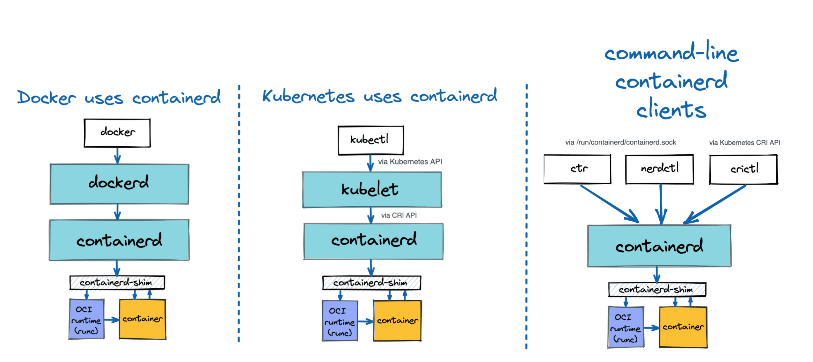

# changes

[toc]

### container runtime

#### 1.说明


##### （1）[why kubelet deprecates dockershim used to be container runtime](https://kubernetes.io/blog/2022/02/17/dockershim-faq/)

* 因为kubelet需要 实现了cri（container runtime interface）接口的 容器运行时，
* 然而docker没有实现，所以需要dockershim来转换一下（由于需要额外维护dockershim是有成本的，所以决定弃用）
* dockershim 在1.20版本弃用，在1.24版本移除

##### （2）影响

* docker的images和container对containerd不可见
* 相关配置就不需要了比如`--cni`，
* containerd需要使用单独的客户端命令：`crictl`

#### 2.migrate from dockershim to containerd

##### （1）准备工作

* 查看当前使用的container runtime
```shell
$ kubectl get nodes -o wide

# For dockershim
NAME         STATUS   VERSION    CONTAINER-RUNTIME
node-1       Ready    v1.16.15   docker://19.3.1
node-2       Ready    v1.16.15   docker://19.3.1
node-3       Ready    v1.16.15   docker://19.3.1

# For containerd
NAME         STATUS   VERSION   CONTAINER-RUNTIME
node-1       Ready    v1.19.6   containerd://1.4.1
node-2       Ready    v1.19.6   containerd://1.4.1
node-3       Ready    v1.19.6   containerd://1.4.1
```

##### （2）migrate

* 将node置于维护状态
```shell
kubectl drain <node> --ignore-daemonsets
```

* 停止docker运行的容器
```shell
systemctl stop kubelet
systemctl restart docker

#如果后面不需要使用docker：systemctl disable docker
```

* 配置containerd
```shell
$ mkdir -p /etc/containerd
$ containerd config default | tee /etc/containerd/config.toml

#将cgroup设为systemd
$ vim /etc/containerd/config.toml

[plugins."io.containerd.grpc.v1.cri".containerd.runtimes.runc]
  ...
  [plugins."io.containerd.grpc.v1.cri".containerd.runtimes.runc.options]
    SystemdCgroup = true

$ systemctl restart containerd
```

* 修改node
```shell
$ kubectl edit node <node>

kubeadm.alpha.kubernetes.io/cri-socket: unix:///run/containerd/containerd.sock
```

* 配置kubelet
```shell
$ vim /var/lib/kubelet/kubeadm-flags.env

#添加以下内容
--container-runtime=remote --container-runtime-endpoint=unix:///run/containerd/containerd.sock

$ systemctl restart kubelet
```

* 修改crictl的配置
```shell
cat <<EOF | tee /etc/crictl.yaml
runtime-endpoint: unix:///run/containerd/containerd.sock
EOF
```

* 验证
```shell
kubectl get nodes -o wide

crictl ps
```

***

### containerd runtime



#### 1.预备知识

##### （1）container和task

* container是隔离的运行环境
* task是进程

##### （2）namespace
用于区分不同的客户端，比如：docker(moby)和kubelet(k8s.io)使用不同的namespace
不同的namespace，用于隔离image、container、task、snapshot等
* 注意docker的image和container是自己管理的（存在在单独的目录下），不是通过containerd进行管理的（但是task必须要通过containerd才能运行）

* 查看namespace: `ctr namespace ls`


#### 2.配置
```shell
mkdir -p /etc/containerd
containerd config default | tee /etc/containerd/config.toml
vim /etc/containerd/config.toml
```

```toml
...
[plugins."io.containerd.grpc.v1.cri".registry.mirrors]
  [plugins."io.containerd.grpc.v1.cri".registry.mirrors."10.10.10.250"]
    endpoint = ["http://10.10.10.250"]
[plugins."io.containerd.grpc.v1.cri".registry.configs]
  [plugins."io.containerd.grpc.v1.cri".registry.configs."10.10.10.250".tls]
    #配置该仓库为insecure
    insecure_skip_verify = true

...

[plugins."io.containerd.grpc.v1.cri".containerd.runtimes.runc.options]
  #设置cgroup使用systemd
  SystemdCgroup = true
...
```

* 验证
```shell
cat <<EOF | tee /etc/crictl.yaml
runtime-endpoint: unix:///run/containerd/containerd.sock
EOF

crictl info
crictl pull <images_from_insecure_registry>
```

#### 3.客户端

|客户端|`crictl`|`ctr`|
|-|-|-|
|用途|给kubelet进行debug|给containerd进行debug|
|namespace|`k8s.io`|所有|
|配置|直接操作的contained</br>（比如在containerd里配置了insecure仓库，则crictl就能直接拉取该仓库的镜像）|不是直接操作的containerd</br>（比如需要拉取insecure仓库的镜像，需要使用命令参数：--plain-http）|
|镜像|不能导入镜像等|可以导入镜像等|

##### （1）ctr

* images相关
```shell
#列出所有images
ctr images ls

#pull images：必须将镜像的地址写全，比如：docker.io/library/busybox:latest
#--plain-http 拉取的是insecure的仓库
ctr images pull --plain-http <image>

#导入镜像
ctr images import <xx.tar.gz>
```

* container和task相关
```shell
ctr container ls
ctr task ls
```
