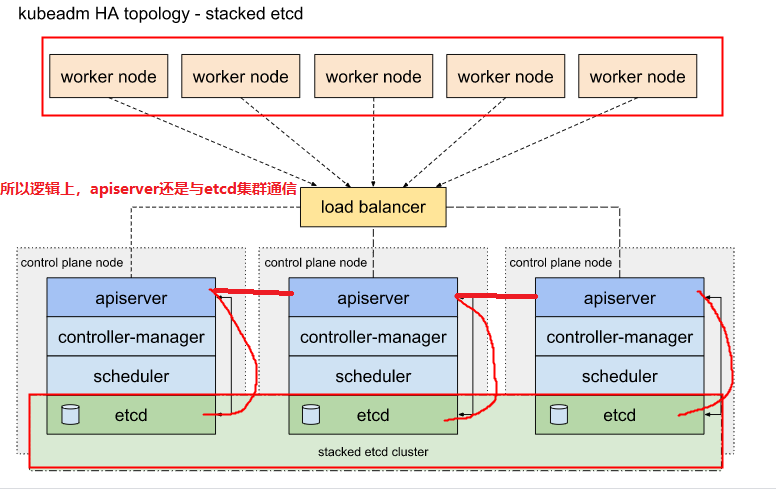
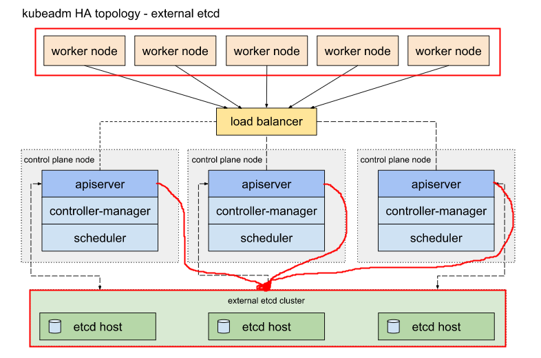

# 部署k8s集群
[toc]
### 概述

#### 1.两种架构模式
##### （1）内部etcd


##### （2）外部etcd


#### 2.kube-apiserver、kube-scheduler和kube-controller-manager的清单文件
```shell
/etc/kubernetes/manifeasts

#可以查看apiserver等的配置，包括etcd的地址等
#修改清单文件保存后，立即生效（不需要再apply）
```

***

### 安装步骤

#### 1.做好前提准备并且配置好yum源

##### （1）时间同步（非常重要）
因为有些跑在k8s集群中的服务，依赖时间同步，如果时间不同步，会导致该服务出现问题
比如：token具有时效性，当时间不同步时，token就会失效

##### （2）设置主机名（必须要设置好）
* 主机名之后要保证不变，如果变化了，重启apiserver，该节点就无法加入集群
* 主机名必须能够反向解析
  * 所以在hosts文件中，一个ip最好只对应一个host
  * 否则，反向解析成其他主机名，重启apiserver，该节点也无法加入集群
```shell
/etc/hostname       #必须要修改主机名，因为节点的名字默认是主机名
/etc/hosts
```
##### （3）防火墙关闭
##### （4）卸载swap
```shell
#注释/etc/fstab中swap项
swapoff -a
```

##### （5）设置网络参数
```shell
cat << EOF >> /etc/sysctl.conf
net.bridge.bridge-nf-call-iptables=1
net.bridge.bridge-nf-call-ip6tables=1
net.ipv4.ip_forward=1
EOF

sysctl -p
```

#### 2.在所有节点上安装组件
```shell
#设置docker-ce的yum源
docker-ce     

#下面三个包都在k8s的yum源中
kubelet				
kubeadm
kubectl
```

#### 3.修改docker配置

`vim /etc/docker/daemon.json`
```json
{
  //修改cgroup driver，默认使用的是cgroupfs，当系统的init进程是systemd，建议使用systemd，这样更稳定
  //注意：/var/lib/kubelet/kubeadm-flags.env中的--cgroup-driver=systemd必须设置成systemd
  "exec-opts": ["native.cgroupdriver=systemd"],

  //防止日志量越来越大，导致存储耗尽
  "log-driver": "json-file",
  "log-opts": {
    "max-size": "10m",
    "max-file": "5"
  }
}
```

#### 4.设置相关服务开机自启（而不是现在就启动）
```shell
systemctl restart docker
systemctl enable docker kubelet
```

#### 5.初始化master节点
```shell
##kubeadm config images list --kubernetes-version=<kubeadm-version>
##可以先拉取镜像，再初始化

kubeadm init --control-plane-endpoint=<VIP_OR_DNS>:<PORT> \   
             --apiserver-advertise-address=<IP> \
             --apiserver-bind-port=<PORT> \
             --upload-certs \
             --pod-network-cidr=10.244.0.0/16 \
             --service-cidr=10.96.0.0/12 \
             --kubernetes-version=v1.17.3

#如果要添加多个master节点，必须设置--control-plane-endpoint和--upload-certs

#control-plane-endpoint是kubelet等组件访问apiserver的访问点
#所以要实现服务的高可用，这个endpoint需要是个vip，不然无法实现高可用

#还有其他设置：
#  --service-dns-domain=cluster.local
# ...

mkdir -p $HOME/.kube
cp -i /etc/kubernetes/admin.conf $HOME/.kube/config
```

#### 6.修改所有的kubelet配置然后重启

* 下面的预留资源一定要配置，能够保证k8s节点不会因为资源使用过量，而导致卡死等情况
```yaml
#1.20版本之前需要这样设置
featureGates:
  SupportNodePidsLimit: true
  SupportPodPidsLimit: true

#一个pod最多使用多少pid
PodPidsLimit: 1000

#为k8s组件预留资源
kubeReserved:
  cpu: 1000m
  memory: 1Gi
  pid: "100"    #注意必须要加引号
#为系统（非k8s组件）预留资源
systemReserved:
  cpu: 1000m
  memory: 1Gi
  pid: "100"    #注意必须要加引号

#日志的默认配置
containerLogMaxSize: 10Mi
containerLogMaxFiles: 5
```

#### 7.安装网络插件
**注意**：
* 安装后需要通过`ip r`去**检查路由**（因为可能pod网络不通，也不报错）
* 使用**calico**时，一定要**指定网卡**（具体参考calico的自动发现网卡配置）

参考官网的安装步骤

**注意要修改pod cidr同上面我们设置的**
```shell
wget https://raw.githubusercontent.com/coreos/flannel/master/Documentation/kube-flannel.yml
vim kube-flannel.yml
kubectl apply -f kube-flannel.yml  
```

#### 8.添加node节点

（1）获取token用于加入该集群（在初始化节点上执行）
```shell
kubeadm token create --print-join-command
```
（2）加入该集群
```shell
#这个命令来自上面的结果
kubeadm join ...			
```

（3）如果需要在node上操作集群
```shell
cp -r ~/.kube ip:~
```

#### 9.添加mster节点
（1）获取token和证书（在初始化节点上执行）
```shell
kubeadm token create --print-join-command
kubeadm init phase upload-certs --upload-certs
```

（2）加入该集群
```shell
kubeadm join xx --token xx --discovery-token-ca-cert-hash xx \
                --control-plane --certificate-key xx \
                --apiserver-advertise-address=<IP> \
                --apiserver-bind-port=<PORT>

mkdir -p $HOME/.kube
cp -i /etc/kubernetes/admin.conf $HOME/.kube/config
```

#### 10.删除节点
（1））还原节点（需要到该节点上执行，执行kubeadm init或join等后想要还原）
```shell
kubeadm reset

#该节点要清理干净的话：
rm -rf /etc/cni/net.d
iptables -F
ipvsadm --clear
rm -rf $HOME/.kube/config

#删除虚拟网卡
ip link delete <INTERFACE>

#重启相关服务
systemctl restart docker kubelet

#最好重启一下主机，否则可能会有些其他问题
```

（2）删除节点
```shell
kubectl delete node NODENAME

#注意如果是master节点：可能会有问题
#可能需要先通过etcdctl删除etcd中的成员
```

***

### FAQ

#### 1.从其他节点无法访问该节点上开放的NodePort
```shell
iptables -A FORWARD -j ACCEPT
#是iptables的规则问题
```

#### 2.配置kube-proxy
```shell
kubectl edit configmap kube-proxy -n kube-system
```
比如：修改kube-proxy的mode（默认是ipvs）
```shell
kubectl edit configmap kube-proxy -n kube-system
#找到mode这个选项，改成ipvs即可
```

#### 3.centos7和flannel的vxlan模式存在bug（ubuntu也存在bug）

##### （1）存在的问题
在centos上，宿主机访问pod的ip地址很慢
在ubuntu上，hostNetwork: true和clusterPolicy: ClusterFirstWithHostNet，service域名解析失败

##### （2）几种解决方案：
* 使用host-gw模式替换vxlan模式
* 在每台机器上执行（重启就失效了）
```shell
ethtool --offload flannel.1 rx off tx off
#查看ethtool --show-offload rx off tx off
```
* 或者换网络插件

#### 4.更换网络插件的操作

##### （1）需要清空原先网络插件的配置
* `rm -rf /etc/cni/net.d`
* `ip link delete <INTERFACE>`
* `systemctl restart network`

##### （2）安装新的网络插件

##### （3）安装后
* 重启所有pods 或者 重启主机
  * 这样pod的ip就会重新分配
