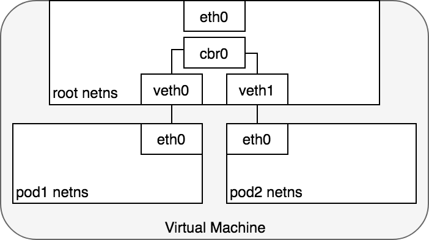

# network

[toc]

### 概述

#### 1.需要实现的目标
|目标|方式|
|-|-|
| 同一个pod的内的容器通信 | 共享netns |
| 不同主机上的pods可以直接通信，无需NAT | 通过tunnel |
| pod与service的可以直接通信 | 通过iptables |
| 所有nodes可以通信 | 本身node就需要可以通信 |

#### 2.需要考虑的网络模型

##### （1）container-to-container 网络
同一个pod内的containers共享同一个netns，所以没有container-to-container的网络，而是pod-to-pod的网络

##### （2）pod-to-pod 网络
* 同一台宿主机上的pod
  * 通过cni实现间pod通信
    即在root netns中创建一个bridge，其他netns添加veth，连接到该bridge上



* 跨宿主机间的pod
  * 可以通过 **overlay网络（即tunnel）**（比如：vxlan）


##### （3）pod-to-service 网络
```shell
#需要设置数据包经过bridge，调用iptables时进行处理

echo 1 > /proc/sys/net/bridge/bridge-nf-call-iptables
```

* 数据包经过cbr0 bridge，会经过iptables处理
  * 比如：目标ip为某个service的ip，会转换成pod的ip
* 当数据包返回时，经过cbr0 bridge，由于iptables contrack保留了之前的状态，所以这边也会做相应转换
  * 比如：将pod的ip，转换成某个service的ip

##### （4）node-to-node 网络
本身就需要能够通信

#### 3.实现cross-node pods的通信方式

|方式|特点|优点|缺点|
|-|-|-|-|
|overlay network|封装数据包|不依赖底层网络，只需要底层网络能通就行|1.轻微的性能影响</br>2.在cluster外部的网络，没有到pod的ip的路由|
|none-overlay network|不封装数据包（直接路由）|1.性能更好</br>2.在cluster外部的网络能够直接访问pod ip，不需要通过service、ingress等|1.依赖底层网络，需要构建路由表（通过BGP）</br>2.pod的ip必须在整个网络中是唯一的  |
|cross-subnet overlay network|跨subnet时，才进行封装|性能优于overlay network|需要构建路由表（通过BGP）|

* cross-subnet overlay实现的方式
```shell
$ ip r

...

#这些node都是在3.1.4.0/24这个网段，所以这些node上的pod网络，不需要经过封装，而是直接走ens192这个网卡
10.244.49.192/26 via 3.1.4.231 dev ens192 proto 80 onlink
10.244.84.128/26 via 3.1.4.232 dev ens192 proto 80 onlink
...

#不在同一个网段的node上的pod网络，需要经过封装，走的是vxlan.calico这个网卡
#bridge fdb show，能看出这个node的地址为3.1.4.214
#66:0a:21:41:0a:c1 dev vxlan.calico dst 3.1.4.214 self permanent
10.244.150.64/26 via 10.244.150.64 dev vxlan.calico onlink
...

```

***

### 网络配置

#### 1.网络插件的对比
|插件名|flannel|calico|cannel|
|-|-|-|-|
|特点|简单|性能好，可以设置网络策略|结合flannel和calico（不再维护）|
|实现方式|叠加网络（即封装）|通过BGP协议，没有进行封装，所以性能更好||

#### 1.flannel采用的技术

##### （1）vxlan
  叠加网络，利用隧道技术封装数据帧，从而能够实现很好的网络隔离

##### （2）host-gw（也就是虚拟网桥）
  物理网卡作为网关，当跨主机通信时，通过物理网卡路由
  特点：性能最好，但是需要物理主机都必须在同一网络内

##### （3）udp（性能差，现在已经不用）

#### 2.利用calico实现网络策略
安装calico后，会创建crd资源：NetworkPolicy
用户可以自动该资源创建规则，从而实现网络策略
