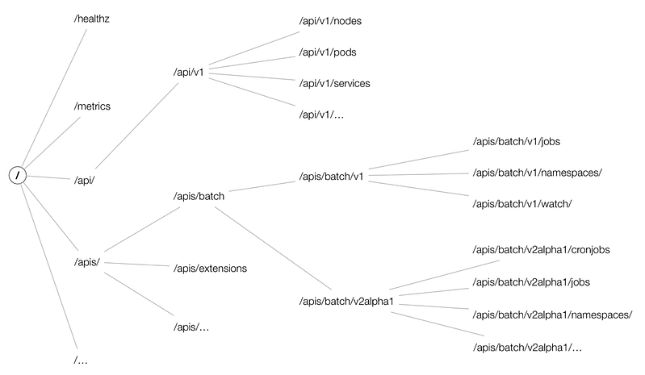
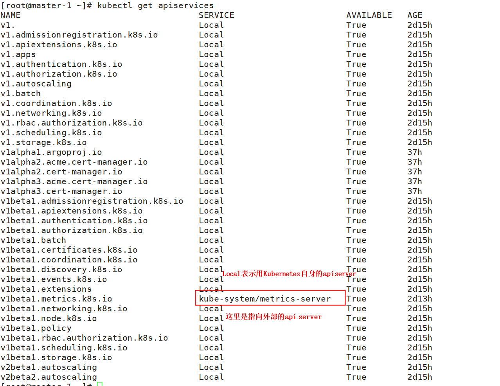

# API

<!-- @import "[TOC]" {cmd="toc" depthFrom=1 depthTo=6 orderedList=false} -->
<!-- code_chunk_output -->

- [API](#api)
    - [预备知识](#预备知识)
      - [1.声明式（declarative）和 命令式（imperative ）](#1声明式declarative和-命令式imperative)
    - [概述](#概述)
      - [1.在top-level分类](#1在top-level分类)
        - [（1）核心组（没有group name）](#1核心组没有group-name)
        - [（2）命名组](#2命名组)
        - [（3）系统范围的实体](#3系统范围的实体)
      - [2.有三类api version](#2有三类api-version)
        - [（1）Alpha (experimental)](#1alpha-experimental)
        - [（2）Beta (pre-release)](#2beta-pre-release)
        - [（3）	GA (generally available, stable)](#3ga-generally-available-stable)
      - [3.扩展api的两种方式](#3扩展api的两种方式)
        - [（1）通过CRD](#1通过crd)
        - [（2） API Aggregation](#2-api-aggregation)
    - [查看](#查看)
      - [1.列出所有的api](#1列出所有的api)
      - [2.列出所有apiReousrces](#2列出所有apireousrces)
      - [3.访问api](#3访问api)
      - [4.watch api](#4watch-api)

<!-- /code_chunk_output -->

### 预备知识

#### 1.声明式（declarative）和 命令式（imperative ）
* 声明式api
告诉服务器我想要的状态，然后服务器自己决定怎么做

* 命令式api
告诉服务器具体怎么做

***

### 概述



#### 1.在top-level分类

##### （1）核心组（没有group name）
* 由于历史原因，核心组没有按照`/apis/<GROUP_NAME>/<VERSION>`这样的格式
`/api/v1`

##### （2）命名组
`/apis/<GROUP_NAME>/<VERSION>`

##### （3）系统范围的实体
比如：`/metrics`


#### 2.有三类api version

##### （1）Alpha (experimental)
未来可能丢弃这个api（比如`v1alpha1`）

##### （2）Beta (pre-release)
该api在测试阶段，未来可能发生改变（比如`v2beta3`）

##### （3）	GA (generally available, stable)
该api是稳定的（比如`v1`）

#### 3.扩展api的两种方式



##### （1）通过CRD
[参考](https://kubernetes.io/docs/concepts/extend-kubernetes/api-extension/custom-resources/)
* 通过CRD定义custome resource，即能够在etcd中存储和提取指定结构的数据
* custome controllers能够根据这些数据，从而进行某些操作
* 通过operator将custome resource和custome controllers结合起来

##### （2） API Aggregation
需要使用自己的api server，将自定义的api发送到这个api server（比如metrics-server就是这种方式）
```shell
kubectl get apiservice xx
#可以查看metrics-server，就是将api发送到指定的api server
```
```yaml
apiVersion: apiregistration.k8s.io/v1
kind: APIService
metadata:
  name: v1beta1.metrics.k8s.io
spec:
  group: metrics.k8s.io
  service:
    name: metrics-server
    namespace: kube-system
    port: 443
  version: v1beta1
  versionPriority: 100
```

***

### 查看

#### 1.列出所有的api
```shell
#列出的形式是apiVersion：<group_name>/<version>
kubectl api-versions

#列出的形式是apiService：<version>.<group_name>
kubectl get apiservices
```

#### 2.列出所有apiReousrces
```shell
kubectl api-resources

#NAME             资源的名称                              
#SHORTNAMES       缩写
#APIGROUP         api所在group             
#NAMESPACED       是否是命名空间内的资源
#KIND             资源类型
```

#### 3.访问api
* 核心组：`/api/v1/`
* 非核心组：`/apis/<group_name>/<version>/`
```shell
kubectl get --raw "<url>"

#比如查看所有namespace
kubectl get --raw "/api/v1/namespaces"

#查看cadvisor中的指标
kubectl get --raw "/api/v1/nodes/node-1/proxy/metrics/cadvisor"

#比如：apis/apps/v1/namespaces/default/deployment
#列出default命名空间中的所有deployment控制器

#比如：查看metrics.k8s.io
kubectl get --raw '/apis/metrics.k8s.io/v1beta1'
kubectl get --raw '/apis/metrics.k8s.io/v1beta1/namespaces/default/pods'
```

#### 4.watch api
只要加上参数`?watch=true`
```shell
#比如watch pods资源
kubectl get --raw "/api/v1/pods?watch=true"
```
