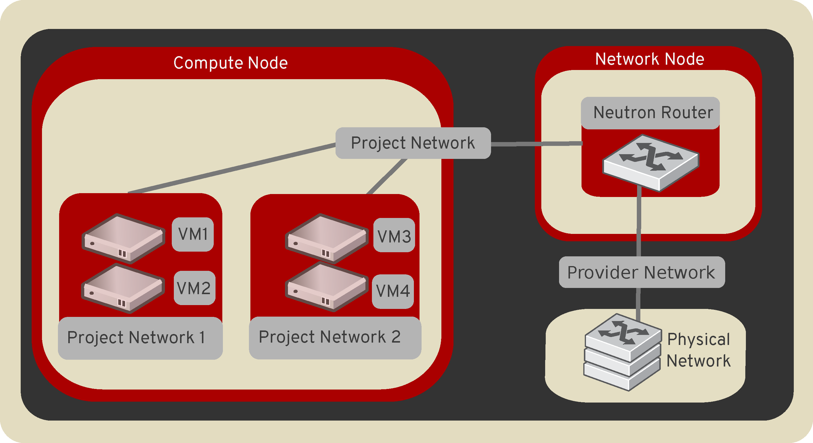
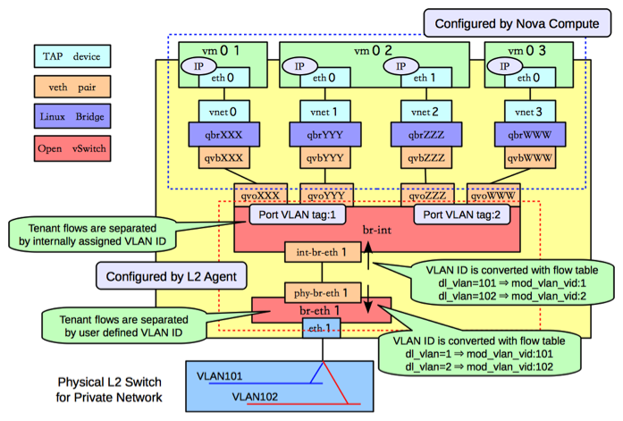
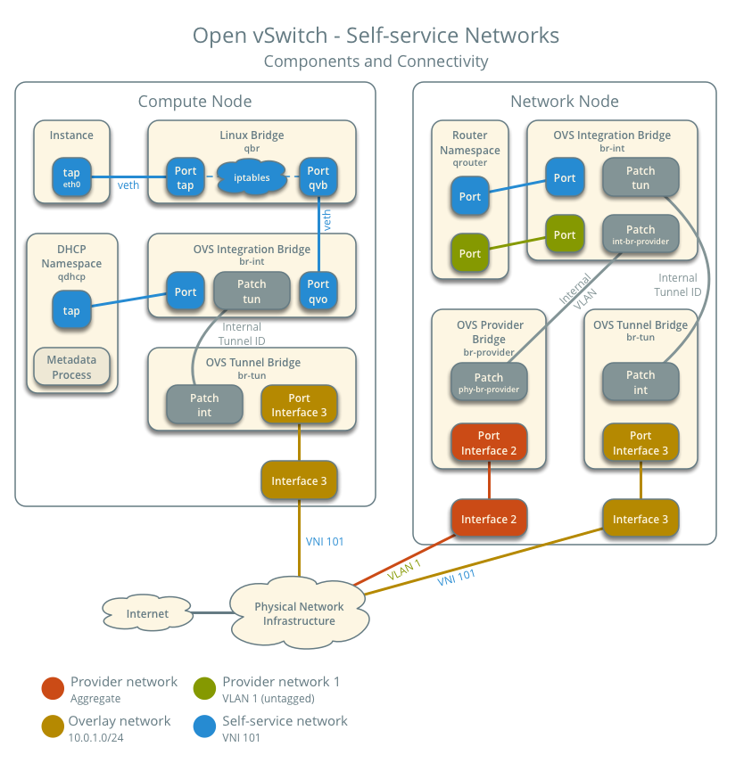
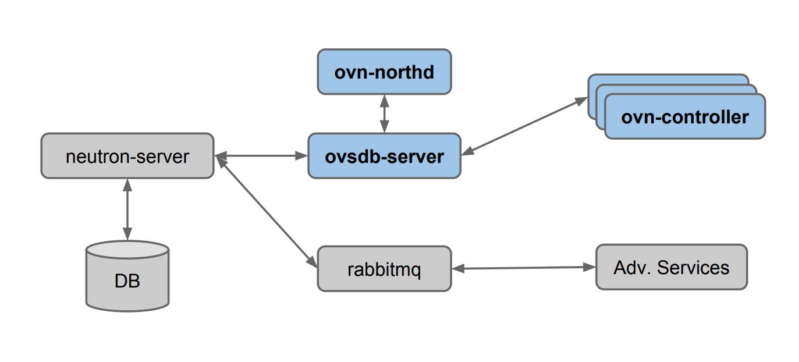

# network

<!-- @import "[TOC]" {cmd="toc" depthFrom=1 depthTo=6 orderedList=false} -->
<!-- code_chunk_output -->

- [network](#network)
    - [概述](#概述)
      - [1.neutron组件](#1neutron组件)
      - [2.基本术语](#2基本术语)
      - [3.用到的虚拟网络设备](#3用到的虚拟网络设备)
      - [4.网络架构](#4网络架构)
        - [（1）虚拟机之间的通信](#1虚拟机之间的通信)
      - [5.ovs虚拟交换机](#5ovs虚拟交换机)
      - [6.网络的组成](#6网络的组成)
        - [（1）external（provider）networks](#1externalprovidernetworks)
        - [（2）project（tenant）networks](#2projecttenantnetworks)
        - [（3）routers](#3routers)
      - [7.network type](#7network-type)
      - [8.neutron的架构](#8neutron的架构)
        - [（1）目前的（使用OVS）](#1目前的使用ovs)
        - [（2）之后的（使用OVN，包含OVS的能力）](#2之后的使用ovn包含ovs的能力)
    - [配置](#配置)
      - [1.重要配置文件：`/etc/kolla/neutron-openvswitch-agent/ml2_conf.ini`](#1重要配置文件etckollaneutron-openvswitch-agentml2_confini)
    - [debug](#debug)
      - [1.查看虚拟的网络设备（OVN，参考OVN章节）](#1查看虚拟的网络设备ovn参考ovn章节)

<!-- /code_chunk_output -->

### 概述



#### 1.neutron组件

|组件|说明|
|-|-|
|neutron server|neutron的后端服务|
|neutron openvswitch agent（L2 agent）|实现二层虚拟网络（project networks 和 provider networks）|
|neutron l3 agent|连接二层虚拟网络（即连接project networks和provider networks），包括路由、浮动ip分配、地址转换和安全组管理（通过iptables实现安全组、路由以及地址转换）|
|neutron dhcp agent|为虚拟机提供dns和dhcp服务（有几个租户网络，在network节点上就有几个dnsmasq进程）|

* controller-node：neutron-server
* compute-node：L2 agent
* network-node：L2 agent，L3agent，DHCP agent

#### 2.基本术语


|术语|说明|用途|查看命令|
|-|-|-|-|
|tap|虚拟网卡|**虚拟机的网卡**（不是成对的，只有一个，类似于物理网卡）|参考linux_os目录下的tap相关文档|
|qbr|linux bridge| 一个 **虚拟机** 连接到 **单独的** 一个linux bridge上; 利用iptables实现 **security groups**（为什么这么设计的原因）|brctl show|
|OVS|open virtual switch|提供SDN能力，所有 **linux bridge 和 qr、qg、dhcp的tap 和 物理网卡** 连接到OVS上|ovs-vsctl show|
|qvb|veth pair bridge side（master qbr）|linux虚拟交换机上的端口，对应的veth（即qvo）是OVS上的端口，**连接 linux bridge 和 OVS**|ip link|
|qvo|veth pair openvswitch side（master ovs）|OVS上的端口，对应的veth（即qvb）是linux虚拟交换机上的端口，**连接 linux bridge 和 OVS**|ip link|
|qg|l3 agent managed port, gateway side|在另一个netns中，是OVS上的一个端口，所有 **浮动ip** 都配置在该网卡上|ip netnes exec <ns_name> ip link|
|qr|l3 agent managed port, router side|在另一个netns中，是OVS上的一个端口，用于 **路由** |ip netnes exec <ns_name> ip link|

#### 3.用到的虚拟网络设备
|虚拟网络设备|说明|对应的命名|
|-|-|-|
|linux bridges|linux虚拟交换机|qbr|
|tap device|虚拟网卡，跟物理网卡一样，一端连着协议栈（内核空间），另一端连着用户空间|tap|
|veth pairs|虚拟的网线，用于连接虚拟网络设备（可以跨越网络命名空间）|qvb、qvo|
|OVS|open virtual switch，能够做更高级的配置（比如vlan等）|br-|

#### 4.网络架构



* tap: 虚拟的网卡，是虚拟机的网卡（master qbr）
* qbr: linux bridge
* veth: veth pairs
* patch port: 是OVS中的veth pairs
* qvb: veth pair bridge side（master qbr）
* qvo：veth pair openvswitch side（master ovs-system）
* br-int（integration)
  * 集成网桥，每个compute-node上都有一个
  * 该节点的vm都通过linux bridge连到该网桥上
  * br-int和br-tun连接
* br-tun（tunnel）
  * 隧道网桥，基于隧道技术的 VxLAN 和 GRE 网络将使用该网桥进行通信
  * 能够实现跨节点通信
* br-ex（external）
  * 只在network node上，用于连接外部网络，会与一个混杂模式的网卡绑定，作为外出的出口
  * 在图中就是interface2
  * br-ex与br-int连接

##### （1）虚拟机之间的通信

* qbr: linux bridge
* tap: 虚拟的网卡，是虚拟机的网卡（master qbr）
* qvb: veth pair bridge side（master qbr）
* qvo：veth pair openvswitch side（master ovs-system）


#### 5.ovs虚拟交换机
通过ovs创建的虚拟交换机机，用linux自带命令查不出有用信息，而且看起来都是down的
因为所有的功能都是通过ovs这个软件实现的 ，所以需要通过ovs客户端去查看相关信息

#### 6.网络的组成

##### （1）external（provider）networks
供应商网络，用于连接公网

##### （2）project（tenant）networks
租户网络，每个租户之间的网络是隔离的

##### （3）routers
路由器，用于串通这些网络，比如使得某个租户网络能够连接外网，需要在他们之间加一个路由器


#### 7.network type

|网络类型|说明|
|-|-|
|flat|不能进行网络隔离等，通常用于external网络|
|vxlan|可以对网络进行隔离等，通常用于租户网络|

#### 8.neutron的架构

##### （1）目前的（使用OVS）


##### （2）之后的（使用OVN，包含OVS的能力）


***

### 配置

#### 1.重要配置文件：`/etc/kolla/neutron-openvswitch-agent/ml2_conf.ini`
在controller和network节点上都有这个文件
```shell
[ml2]
#设置l2层支持的类型
type_drivers = flat,vlan,vxlan
tenant_network_types = vxlan
mechanism_drivers = openvswitch,l2population
extension_drivers = port_security

[ml2_type_vlan]
network_vlan_ranges =

[ml2_type_flat]
#设置physnet1这个网络只能创建flat类型的二层虚拟网络
flat_networks = physnet1

[ml2_type_vxlan]
vni_ranges = 1:1000

[securitygroup]
firewall_driver = neutron.agent.linux.iptables_firewall.OVSHybridIptablesFirewallDriver

[agent]
#配置隧道使用vxlan类型
tunnel_types = vxlan
l2_population = true
arp_responder = true

[ovs]
#配置physnet1这个网络对应br-ex虚拟交换机（会自动创建br-ex这个虚拟交换机，并将指定的外出网卡加入到br-ex中）
bridge_mappings = physnet1:br-ex
datapath_type = system
ovsdb_connection = tcp:127.0.0.1:6640
local_ip = 10.10.10.1
```

***

### debug

```shell
#查看所有的网络名称空间（比如 路由 的网络名称空间）
ip netns ls
```

#### 1.查看虚拟的网络设备（OVN，参考OVN章节）
```shell
docker exec -it --privileged openvswitch_db /bin/bash
```
