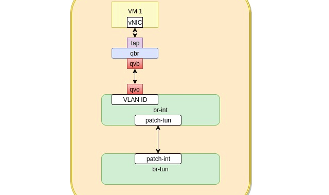

# network

[toc]

### 概述

#### 1.neutron组件

|组件|说明|
|-|-|
|neutron server|neutron的后端服务|
|neutron openvswitch agent（L2 agent）|为虚拟网络提供 二层 交换服务|
|neutron dhcp agent|为虚拟机提供dns和dhcp服务（有几个租户网络，在network节点上就有几个dnsmasq进程）|
|neutron l3 agent|为虚拟机访问外部网络提供 三层 转发服务，包括路由、浮动ip分配、地址转换和安全组管理（通过iptables实现安全组、路由以及地址转换）|

* controller-node：neutron-server
* compute-node：L2 agent
* network-node：L2 agent，L3agent，DHCP agent

#### 2.基本术语

|术语|说明|
|-|-|
|qbr|bridge|
|qvb|veth pair bridge side（master qbr）|
|qvo|veth pair openvswitch side（master ovs-system）|
|qr|l3 agent managed port, router side|
|qg|l3 agent managed port, gateway side|

#### 3.用到的虚拟网络设备
|虚拟网络设备|说明|
|-|-|
|tap device|虚拟网卡，跟物理网卡一样，一端连着协议栈（内核空间），另一端连着用户空间|
|veth pairs|虚拟的网线，用于连接虚拟网络设备（可以跨越网络命名空间）|
|linux bridges|虚拟交换机|
|openvswitch bridges|虚拟交换机，能够做更高级的配置（比如vlan等）|

#### 4.网络架构


* tap: 虚拟的网卡，是虚拟机的网卡（master qbr）
* qbr: 虚拟的bridge
* veth: veth pairs
* patch port: 是OVS中的veth pairs
* qvb: veth pair bridge side（master qbr）
* qvo：veth pair openvswitch side（master ovs-system）
* br-int（integration)
  * 集成网桥，每个compute-node上都有一个，该节点的vm都连接到该虚拟机上
  * 所有 instance 的虚拟网卡（tap）都将连接到该网桥
* br-tun（tunnel）
  * 隧道网桥，基于隧道技术的 VxLAN 和 GRE 网络将使用该网桥进行通信
  * 能够实现跨节点通信
* br-ex（external）
  * 只在network node上，用于连接外部网络，会与一个混杂模式的网卡绑定，作为外出的出口
  * 在图中就是interface2

##### （1）虚拟机之间的通信

* qbr: 虚拟的bridge
* tap: 虚拟的网卡，是虚拟机的网卡（master qbr）
* qvb: veth pair bridge side（master qbr）
* qvo：veth pair openvswitch side（master ovs-system）


#### 5.ovs虚拟交换机
通过ovs创建的虚拟交换机机，用linux自带命令查不出有用信息，而且看起来都是down的
因为所有的功能都是通过ovs这个软件实现的 ，所以需要通过ovs客户端去查看相关信息

#### 6.网络的组成

##### （1）external（provider）networks
供应商网络，用于连接公网

##### （2）project（tenant）networks
租户网络，每个租户之间的网络是隔离的

##### （3）routers
路由器，用于串通这些网络，比如使得某个租户网络能够连接外网，需要在他们之间加一个路由器


#### 7.network type

|网络类型|说明|
|-|-|
|flat|不能进行网络隔离等，通常用于external网络|
|vxlan|可以对网络进行隔离等，通常用于租户网络|

***

### 配置

#### 1.重要配置文件：`/etc/kolla/neutron-openvswitch-agent/ml2_conf.ini`
在controller和network节点上都有这个文件
```shell
[ml2]
type_drivers = flat,vlan,vxlan
tenant_network_types = vxlan
mechanism_drivers = openvswitch,l2population
extension_drivers = port_security

[ml2_type_vlan]
network_vlan_ranges =

[ml2_type_flat]
flat_networks = physnet1

[ml2_type_vxlan]
vni_ranges = 1:1000

[securitygroup]
firewall_driver = neutron.agent.linux.iptables_firewall.OVSHybridIptablesFirewallDriver

[agent]
tunnel_types = vxlan
l2_population = true
arp_responder = true

[ovs]
bridge_mappings = physnet1:br-ex
datapath_type = system
ovsdb_connection = tcp:127.0.0.1:6640
local_ip = 10.10.10.1
```

***

### debug

```shell
#查看所有的网络名称空间（比如 路由 的网络名称空间）
ip netns ls
```
