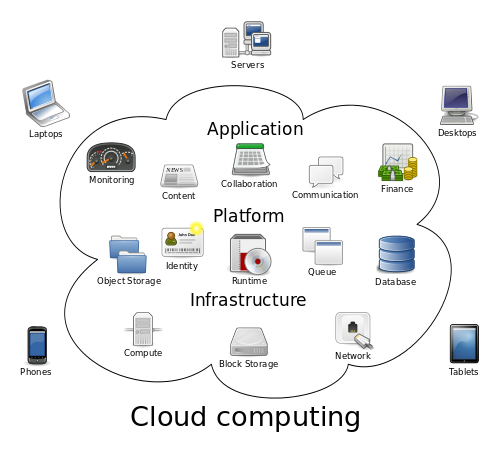

# overview

[toc]

### 概述

#### 1.cloud native

[参考](https://docs.microsoft.com/en-us/dotnet/architecture/cloud-native/definition#modern-design)

##### （1）核心特性
* 弹性
* 高可用
* 自动化
* 自愈性
* 可观测性

#### 2.grid computing vs cloud computing
|criteria|grid computing|cloud computing|
|-|-|-|
|目的|大规模的计算|降低成本，增加回报|
|管理|分散管理系统|集中管理系统（所有主机都由提供商进行集中管理）|
|访问|通过grid中间件|通过web协议|
|计算|提供最大计算能力|按需提供计算能力|
|虚拟化|数据和计算资源的虚拟化|硬件和软件平台的虚拟化|
|使用|面向应用|面向服务|

* grid computing

* cloud computing

#### 3.一个虚拟机不能跨多个物理机

#### 4.算力分为三个层次
* central cloud（中心云）
* edge cloud（边缘云）
* terminals（端）

#### 5.cloud network

* DCN（data center network）
一个数据中心内的网络，用于连接该数据中心内的所有资源
* DCI（data center interconnect）
连接多个数据中心的网络
* ECN（external conenection network）
将外部的一些网络（比如某个企业的网络）接入到我们的云
* EIN（edge interconnection network）
连接各个边缘云和中心云的网络
